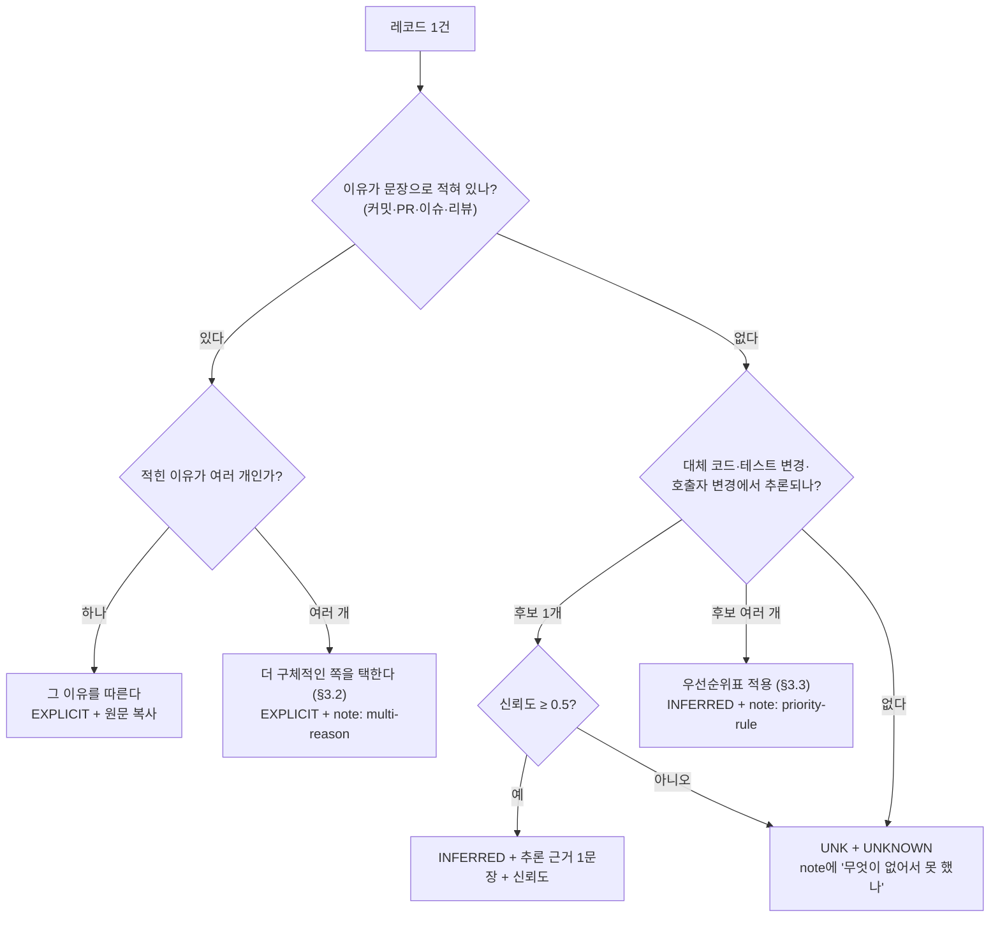

# 이유 라벨링 가이드

`guide_version: v2` · 갱신: 2026-09-23 · 담당: 성제 (sj) · 근거: CHARTER.md §4.2 ③, §4.4, §10.2, §11, ADR-004, ADR-005, ADR-012, ADR-017

> **이 문서의 목적은 정의를 나열하는 것이 아니다.** 세 사람이 같은 삭제 레코드를 보고 같은 라벨을 붙이게 만드는 것이다.
> §10.2의 목표는 라벨 일치도 kappa ≥ 0.7이고, 그 수치를 만드는 건 분류기가 아니라 이 문서다.
> 그래서 이 문서는 "판정이 갈릴 때 답을 주는" 형태로 쓰였다. 정의만 읽고 라벨하지 말고, §3 판정 순서와 §5 헷갈리는 쌍 표를 옆에 띄워 두고 라벨한다.

> **v2는 게이트 1의 낮은 일치도에 대응해 나온 것이다.** 예비 200건에서 `reason_label` kappa 0.389, `evidence_grade` kappa 0.261이었고, 등급 불일치가 88/200건(E↔I 44, I↔U 24, E↔U 20)이었다 (`docs/meetings/gate-1.md`).
> 그래서 v2가 바꾼 것은 **근거 등급의 적용 기준**이다: EXPLICIT의 도달 검사(§6.1), INFERRED로 인정되는 근거의 종류(§6.2), UNKNOWN의 적극적 정의와 원인 태그(§6.3).
> **등급 3종의 이름·개수·의미와 ADR-012의 신뢰도 경계, 이유 8종은 그대로다.** 다만 §6.2.1의 INFERRED 근거 6종은 CHARTER의 기존 열거(3종)를 넘으므로 **ADR-017로 CHARTER §4.2 ③을 정식 갱신했다** (CHARTER v1.15). 자세한 것은 §10.4.
> **v1으로 라벨한 예비 200건과는 기준이 달라진다.** 예비 200건은 본 500건에 포함하지 않는다 (§1, §11-16).

> **`[팀 확정 필요]` 표시**는 CHARTER.md에 근거가 없어 v1에서 임시로 정한 것이다. 라벨링 킥오프에서 확정한다. 전체 목록은 §11에 모아 두었다. 확정 전에도 라벨링은 시작할 수 있다 — 다만 그 건들은 `note`에 태그를 남겨 두므로, 규칙이 바뀌면 되짚을 수 있다.

**목차**

1. [목적과 사용 시점](#1-목적과-사용-시점)
2. [라벨링 단위와 라벨러가 보는 정보](#2-라벨링-단위와-라벨러가-보는-정보)
3. [판정 순서](#3-판정-순서-이-문서의-핵심)
4. [이유 8종 상세](#4-이유-8종-상세) — 예시가 실제 레코드로 바뀌었다 (§4.0)
5. [헷갈리는 쌍 판정 규칙](#5-헷갈리는-쌍-판정-규칙) — **§5.1 라벨링 중 확정한 규칙 3개 (v2 신설)**
6. [근거 등급 판정 규칙](#6-근거-등급-판정-규칙) — **§6.1.1 EXPLICIT 세 조건 / §6.2.1 INFERRED 근거 6종 / §6.3.2 원인 태그 (전부 v2 신설)**
7. [라벨 기록 형식](#7-라벨-기록-형식)
8. [라벨링 절차](#8-라벨링-절차) — **§8.4.1 500건 중간 점검 (v2 신설)**
9. [하지 말 것](#9-하지-말-것)
10. [한계와 다음 버전](#10-한계와-다음-버전)
11. [팀 확정 필요 목록](#11-팀-확정-필요-목록)

---

## 1. 목적과 사용 시점

**누가.** 3인 전원(성제 sj / 재헌 jh / 희수 hs). 라벨링은 사람이 한다. LLM은 후보 제안과 근거 문장 작성까지만 (ADR-005).

**언제.**

| 시점 | 무엇 | 1차 목적 | 근거 |
|---|---|---|---|
| 2주차 | 예비 **200건** (#7에서 추출) | **이유 회수율** = EXPLICIT+INFERRED 비율 측정 → **게이트 1** 판정 | §9 2주차, §15 |
| 5주차 | 본 라벨 **500건** (학습 300 / 검증 100 / 테스트 100) | 분류기 정확도 측정용 정답 + kappa 보고 | §10.2, §9 5주차 |

200건과 500건의 목적이 다르다는 점이 중요하다. **200건은 "이유를 회수할 수 있는 데이터인가"를 재는 것이지, 분류기 정확도를 재는 것이 아니다.** 그래서 200건에서는 UNKNOWN이 많이 나오는 것이 실패가 아니라 측정 결과다 (게이트 1: ≥ 60% 진행 / 40~60% 저장소 기준 강화 / < 40% 축 이동).

> **예비 200건은 본 500건에 포함하지 않는다 (v2에서 변경).** 이유 둘이다.
> 1. **저장소 편중.** 200건은 `pydantic/pydantic` 한 저장소다. 500건은 20개 저장소에서 층화 표집한다. 섞으면 500건의 40%가 한 저장소가 된다.
> 2. **기준이 다르다.** 200건은 v1 기준으로 라벨했고, v2는 근거 등급의 적용 기준을 바꿨다 (§6.1.1, §6.2.1, §6.3.1). §10.3의 재검토 범위표로는 "영향받는 건만" 재검토인데, 등급 규칙이 바뀌었으므로 실질적으로 200건 전건이 대상이다. 그럴 바에는 500건을 새로 뽑는 편이 싸다.
>
> **합의 102건은 분류기 개발용으로만 쓴다.** `final.reason_label`이 채워진 102건(`datasets/labels/gate1_pre200_merged.jsonl`)은 규칙·특징 만들기와 코드 점검에 쓰고, **정확도 측정(§10.2)이나 kappa 보고에는 쓰지 않는다.** v1 기준이고 한 저장소이기 때문이다. 불일치 98건은 §8.3 토론으로 확정하지 않는다 — 500건에 안 들어가므로 확정할 이유가 없다.

**무엇을 산출하는지.**
- 레코드마다: 이유 1종(8종 중) + 근거 등급 1종(3종 중) + 근거 텍스트 + 출처 + 신뢰도
- 파일: `datasets/labels/{labeler}_{batch}.jsonl` (개인 라벨) → 병합 → `datasets/labeled_500.jsonl` (§7)
- 숫자: 이유 회수율, 라벨 일치도(kappa), 이유 분포 → `docs/evaluation.md`에 누적

---

## 2. 라벨링 단위와 라벨러가 보는 정보

**단위: `DeletionRecord` 1건** (§4.4). 함수 전체 삭제(`deletion_kind = FULL_FUNCTION`)가 1차 대상이다 (ADR-003). 레코드 1건 = 라벨 1개. 한 커밋에서 함수 3개가 삭제되면 레코드 3건이고, 라벨도 3개다 — 커밋 하나에 하나로 뭉치지 않는다.

같은 커밋의 다른 레코드를 참고하는 것은 허용한다(같은 이유일 가능성이 높다). 다만 **각 레코드의 근거는 각자 적는다.** "위와 같음"으로 적지 않는다.

### 2.1 라벨러에게 제시되는 필드

#7의 추출 스크립트는 아래 필드만 담은 라벨링 파일을 만든다.

| 필드 | 왜 보여주는가 |
|---|---|
| `record_id` | 라벨과 레코드를 연결하는 키 |
| `repo`, `file_path`, `function_name`, `function_signature` | 무엇이 삭제됐는지 식별 |
| `deleted_body` | 판정의 1차 재료 |
| `replacement.code`, `replacement.match_method` | INFERRED의 핵심 근거 (§6) |
| `context.commit_message` | EXPLICIT의 1차 출처 |
| `context.pr_title`, `context.pr_body` | EXPLICIT의 2차 출처 |
| `context.issue_titles` (+ 있으면 이슈 본문) | 왜 고쳤는지가 여기에만 있는 경우가 많다 |
| `context.review_comments` | 리뷰에서 "이거 왜 지웠나요"에 답이 달려 있는 경우 |
| `is_test_code` | 테스트 코드 삭제는 판정 기준이 다르다 (§5 특례) |
| `source_url` | GitHub 원본 확인용 (§2.3 규칙 있음) |

맥락이 **비어 있는 것도 정상이다.** #6 측정(`docs/evaluation.md`, 2026-09-12)에서 커밋에 맥락이 하나라도 붙는 비율은 194건 중 84.0%였고, 이슈 본문은 25.8%뿐이었다. sqlalchemy는 PR 회수 0%(Gerrit으로 리뷰), django는 이슈 회수 0%(`#번호`가 Trac 티켓)다. **맥락이 없는 건은 UNKNOWN이 정답일 수 있다.** 없는 맥락을 상상해서 채우지 않는다.

### 2.2 라벨러가 보면 안 되는 것

- **`reason.*` 전체** — `reason.label`, `reason.evidence_grade`, `reason.evidence_text`, `reason.confidence`, `reason.classifier_version`. 분류기·기준선·LLM의 출력이 들어가는 자리다. 보면 라벨이 그쪽으로 끌려가고(anchoring), 그 라벨로 분류기를 평가하면 §10.2가 무의미해진다. #7 스크립트는 이 필드들을 **비운 채로** 파일을 만든다 (#7 완료 조건).
- **다른 라벨러의 라벨** — 확정 토론(§8.3) 전까지. 2인 독립 라벨의 "독립"이 이것이다.
- **`filter_status` 외의 파이프라인 판단** — 필터 결과는 보여도 되지만(어떤 노이즈로 분류됐는지), 그것을 이유 판정의 근거로 쓰지 않는다.

### 2.3 GitHub 원본을 열어보는 것에 대해

`source_url`로 GitHub을 열어 후속 커밋이나 이슈 토론을 더 읽는 것은 **허용한다.** 더 정확한 라벨이 낫다.

단, 파이프라인이 수집하지 않은 정보로 판정했다면 `note`에 `off-record-evidence` 태그를 남긴다. **이유: 분류기는 수집된 맥락만 본다.** 라벨이 분류기가 볼 수 없는 정보에 의존하면 §10.2의 정확도 비교가 분류기에 불리해지고, "왜 못 맞혔나"를 분석할 수 없다. 태그가 있으면 그 건들을 뺀 정확도를 따로 낼 수 있다. `[팀 확정 필요]`

---

## 3. 판정 순서 (이 문서의 핵심)



렌더링이 안 될 때를 위한 같은 절차:

1. **(a) 명시된 이유가 있는가?** 커밋 메시지·PR 제목/본문·연결 이슈·리뷰 코멘트 중 어디든 **삭제 이유가 문장으로** 있으면 그 이유를 따른다 → 근거 등급 **EXPLICIT**, `evidence_text`에 원문 그대로 복사 (§6.1).
   - "문장으로 있다"의 기준: 읽고 나서 8종 중 하나를 고를 수 있는가. `fix: cleanup`, `refactor`, `address review comments`처럼 **키워드만 있고 무엇이 왜 잘못됐는지가 없으면 명시가 아니다** → (b)로 간다.
   - **v2: 그 문장이 이 레코드에 닿는지까지 본다.** 커밋 전체의 목표만 말하는 문장은 명시가 아니다 → §6.1.1의 세 조건과 도달 검사를 적용한다. **이것이 게이트 1에서 가장 많이 갈린 지점이다 (E↔I 44건).**
2. **(b) 명시가 없으면 추론한다.** 근거는 세 곳이다 → 근거 등급 **INFERRED**, 추론 근거를 **직접 한 문장으로** 쓰고 신뢰도 0~1을 적는다 (§6.2).
   - **v2: 인정되는 근거가 §6.2.1의 6종으로 한정된다.** "커밋이 큰 작업을 하고 이 함수가 그 영역에 있다"(주제적 근접성)는 근거가 아니다 → UNKNOWN이다 (I↔U 24건).
   - **대체 코드**: 삭제 자리(또는 호출자)에 무엇이 들어왔나 (`replacement.code`)
   - **테스트 변경**: 같은 커밋에서 테스트가 추가·수정됐나 (버그의 강한 신호)
   - **호출자 변경**: 삭제 함수를 부르던 곳이 사라졌나, 다른 것을 부르게 됐나
3. **(c) 둘 다 없으면 `UNK` + `UNKNOWN`.** 부끄러운 결과가 아니다 (§6.3).
   - **v2: UNKNOWN에는 원인 태그가 필수다** (§6.3.2). 태그 없는 UNKNOWN은 완성된 라벨이 아니다.

**순서를 지켜야 하는 이유.** (b)부터 보면 대체 코드가 눈에 먼저 들어와 명시된 이유를 덮어쓴다. 예를 들어 대체 코드가 `json.loads` 호출이면 LIB로 보이지만, PR 본문에 "our parser crashed on trailing commas"가 있으면 그건 BUG다. **명시가 추론을 항상 이긴다.**

### 3.2 명시된 이유가 여러 개일 때: 더 구체적인 쪽

같은 문장에 두 이유가 겹치면 **더 구체적인(= 더 좁은 주장을 하는) 쪽**을 택한다.

| 적힌 문장 | 라벨 | 왜 |
|---|---|---|
| "refactor to fix race condition on close" | **BUG** | `refactor`는 수단, `race condition`이 이유. DESIGN이 아니다 |
| "remove insecure md5 fallback and simplify hashing" | **SEC** | `simplify`는 결과, `insecure`가 이유 |
| "replace hand-rolled retry with tenacity, also much faster" | **LIB** | 교체가 주행위, 속도는 부수 효과. PERF는 "느려서 바꿨다"일 때 |
| "drop unused helper as part of the v3 API cleanup" | **DEAD** | `unused`가 삭제 사유. API 정리는 이 삭제가 일어난 배경 |
| "remove Python 3.8 shims (unused after dropping 3.8)" | **FEAT** | `unused`는 FEAT의 결과. 지원 종료가 원인 |

판단 규칙 두 개로 요약한다.
- **수단 vs 이유**: "A해서 B했다"에서 라벨은 **A**(이유)다. `refactor`, `cleanup`, `simplify`, `move`는 대개 수단·결과 쪽 단어다.
- **원인 vs 결과**: 한쪽이 다른 쪽 때문에 생겼으면 **원인** 쪽을 택한다 (표의 마지막 두 행).

어느 쪽이 구체적인지 정말 모르겠으면 라벨을 찍지 말고 `note`에 `needs-discussion` 태그를 달고 후보 두 개를 적는다. 확정 토론(§8.3)에서 다룬다. 이런 건이 많으면 §5 표에 규칙을 추가하는 것이 가이드 개정의 기본 경로다.

### 3.3 추론뿐이고 후보가 여러 개일 때: 우선순위표 (v1 제안)

**`[팀 확정 필요]` — CHARTER.md에 우선순위가 정의된 바 없다. 아래는 v1에서 성제(sj)가 제안하는 것이고, 라벨링 킥오프에서 확정한다. 확정된 규칙이 아니다.**

**적용 조건이 좁다.** 이 표는 **(1) 명시된 이유가 전혀 없고, (2) 추론 후보가 2개 이상이며, (3) 어느 쪽도 신뢰도가 더 높다고 말할 수 없을 때**만 쓴다. 명시가 있으면 §3.2를, 후보 하나가 더 강하면 그 후보를 쓴다.

| 순위 | 라벨 | 이 순위인 이유 (v1 근거) |
|---|---|---|
| 1 | **SEC** | 삭제 코드에 위험 패턴(`eval`, `pickle.loads`, `shell=True`, MD5/SHA1 비밀번호, SQL 문자열 결합)이 실제로 있으면 diff만으로 확인된다. 놓쳤을 때 가장 아까운 정보다 |
| 2 | **LIB** | `import` 추가 + 대체 코드가 라이브러리 호출 = diff로 거의 증명된다 |
| 3 | **DEAD** | 호출자 부재는 코드베이스에서 확인 가능한 사실이다 |
| 4 | **FEAT** | 공개 표면(CLI 플래그, 공개 API, 문서·CHANGELOG 항목)에서 함께 사라졌으면 확인 가능하다 |
| 5 | **BUG** | 테스트 추가·조건문 변경은 강한 정황이지만 정황이다 |
| 6 | **PERF** | 알고리즘·복잡도 개선은 읽어서 판단해야 한다 |
| 7 | **DESIGN** | 가장 넓다. 잔여 범주로 쓰이기 쉬워 마지막에 둔다 |
| 8 | **UNK** | 위 어느 것도 근거를 못 대면 |

**정렬 원칙: diff만으로 확인 가능한 신호를 정황 신호보다 앞에, 좁은 범주를 넓은 범주보다 앞에.** 추론만 있을 때 틀린 BUG·PERF 라벨은 데이터셋 신뢰를 직접 깎는다. 확인 가능한 쪽을 먼저 소진하는 편이 안전하다.

**이 표를 쓴 건은 반드시 `note`에 `priority-rule` 태그를 남긴다.** 그러면 나중에 "우선순위표가 정확도에 어떤 영향을 줬나"를 측정할 수 있고, 킥오프에서 순위를 바꿨을 때 되짚어야 할 건이 특정된다.

**관찰 지표.** `DESIGN + UNK`가 전체의 절반을 넘으면 라벨러를 의심하기 전에 이 가이드를 의심한다. 경계 규칙이 부족하다는 신호다. `[팀 확정 필요]` (수치는 임의)

---

## 4. 이유 8종 상세

§4.2 ③의 8종을 **그대로** 쓴다. 새 라벨을 만들지 않는다. 8종이 부족하다고 판단되면 §13 절차(이슈 → 회의 → ADR → CHARTER 갱신)이고, 이미 라벨한 데이터의 재라벨 비용을 함께 계산한다.

### 4.0 예시 읽는 법 (v2)

각 라벨마다 예시가 두 층이다.

- **실제 예시** — 예비 200건(`datasets/labels/pre200_records.jsonl`)에서 고른 진짜 레코드다. `repo`·`commit_sha`·`function_name`·`source_url`·`record_id`가 붙어 있어 원본을 열어 볼 수 있다. **한 커밋에 같은 이름의 함수가 여럿 있을 수 있으므로**(예: `ecd13499`의 `check_all` 2건) 정확히 어느 건인지는 `record_id`로 찾는다. **판정이 갈렸던 건을 우선 골랐다.** 헷갈리는 건이 예시로서 값이 있고, 합의된 쉬운 건은 어차피 갈리지 않기 때문이다.
- **합성 예시** — v1에서 손으로 만든 것이다. 지우지 않고 `(합성)`으로 표시해 남긴다 (§10.2-1). 경계를 설명하는 데는 여전히 쓸모가 있지만, **진짜 커밋 메시지는 이것들보다 훨씬 짧고 모호하다**는 점을 기억하고 읽는다.

> **저장소 편중 경고.** 예비 200건은 `pydantic/pydantic` **한 저장소**다. 그래서 아래 실제 예시는 전부 pydantic이고, 본 500건은 20개 저장소에서 나온다. **pydantic의 관행에 기댄 예시에는 `[저장소 특유]`를 붙였다.** 그 표시가 붙은 예시는 규칙의 근거가 아니라 그 저장소에서 규칙이 어떻게 보이는지의 사례로만 읽는다. 특히 `tests/mypy/outputs/{버전}/…` 출력 픽스처 구조는 pydantic이 mypy 플러그인을 검증하려고 만든 것이라 다른 저장소에 그대로 없다.

### 4.0.1 실제 예시 색인

8종 × 3등급 중 실제 레코드로 채운 칸이다. 모두 `pydantic/pydantic`이다.

| 이유 | 실제 예시 | `commit_sha` | v2 등급 | 라벨러가 갈렸나 |
|---|---|---|---|---|
| BUG | `model_computed_fields` | `9915abf9` | EXPLICIT | 합의 |
| BUG | `host` | `aee60573` | INFERRED | 갈림 (E↔I) |
| PERF | `_copy_schema` | `8fe3aae8` | EXPLICIT | 합의 |
| PERF | `is_hashable` | `b75fadba` | INFERRED | 갈림 (PERF↔DESIGN, E↔I) |
| SEC | `test_pickle_ct` | `3b3f4009` | EXPLICIT | 갈림 (SEC↔FEAT) |
| LIB | `is_dataclass` | `5b7c290c` | EXPLICIT | 합의 |
| LIB | `tuple_validator` | `594effa2` | INFERRED | 합의 |
| DEAD | `diff` (benchmarks) | `8997cc59` | EXPLICIT | 합의 |
| DEAD | `test_complete_pyd` | `9f88d551` | EXPLICIT | 갈림 (E↔I) |
| DEAD | `to_snake_case` | `31f5f9c2` | **UNKNOWN** | 갈림 (E↔U) |
| DESIGN | `check_all` | `ecd13499` | EXPLICIT | 합의 |
| DESIGN | `_apply_validators` | `594effa2` | INFERRED | 갈림 (E↔I) |
| FEAT | `resolve_condecimal` | `8847c766` | EXPLICIT | 합의 |
| FEAT | `path_validator` | `aa85c3a1` | EXPLICIT | 합의 |
| UNK | `get_my_custom_validator` | `332e77ba` | UNKNOWN | 합의 |
| UNK | `path_type` | `594effa2` | UNKNOWN | 갈림 (I↔U) |

**등급 3종 모두 실제 레코드로 채워졌다.** 8종도 모두 채워졌다 — SEC는 실제 레코드가 라벨 전체에서 **단 1건**(`test_pickle_ct`)이라 그 1건을 썼다. 표본이 하나뿐이므로 SEC의 합성 예시는 그대로 두고 함께 읽는다.

### BUG — 버그 수정

- **한 줄 정의**: 코드가 **잘못된 동작**을 해서 제거했다.
- **포함**: 잘못된 결과·크래시·예외 미처리·경계 조건 실패·경쟁 조건·잘못된 상태 관리. 버그를 만들던 장치(잘못된 캐시·잘못된 최적화) 자체를 걷어낸 경우도 포함.
- **포함되지 않음**: 느린 것(PERF), 취약한 것(SEC), 안 쓰이는 것(DEAD), 동작은 맞지만 구조가 나쁜 것(DESIGN). `fix`라는 단어가 있다는 것만으로 BUG가 아니다 — **무엇이 잘못됐는지**가 기준이다.
- **텍스트 단서**: `fix`, `bug`, `broken`, `incorrect`, `wrong`, `crash`, `raises`, `regression`, `race`, `off-by-one`, `edge case`, 이슈 참조(`fixes #`, `closes #`)
- **diff 단서**: 같은 커밋에 **테스트 추가·수정**(가장 강한 신호). 대체 코드가 원본과 거의 같으면서 조건문·경계·예외 처리만 다름. 호출자는 그대로.

```diff
# 예시 A — BUG 맞음 (합성)
# commit: "fix: parse_headers raised IndexError on empty header list (#812)"
- def _first_header(headers):
-     return headers[0].split(":", 1)[1].strip()
+ def _first_header(headers):
+     if not headers:
+         return None
+     return headers[0].split(":", 1)[1].strip()
# + tests/test_headers.py: test_parse_headers_empty 추가
```
→ `BUG` / `EXPLICIT` / `evidence_text`: "parse_headers raised IndexError on empty header list" / `evidence_source`: commit

```diff
# 예시 B — 헷갈리지만 PERF (합성)
# commit: "fix slow retry loop: replace linear scan with dict lookup"
- def _find_pending(queue, task_id):
-     for t in queue:            # O(n), 큐가 커지면 초당 수만 번
-         if t.id == task_id:
-             return t
+ def _find_pending(index, task_id):
+     return index.get(task_id)
```
→ `PERF`. `fix`가 있지만 고친 것은 **잘못된 동작이 아니라 속도**다. 결과는 전후가 같다. §5의 `BUG vs PERF` 규칙.

**실제 예시 1 — BUG / EXPLICIT (합의)**

| | |
|---|---|
| repo | `pydantic/pydantic` |
| commit_sha | `9915abf995f1315d6ee1e0d85bf40ffb6d765b2b` |
| function_name | `model_computed_fields` (`pydantic/main.py`) |
| source_url | https://github.com/pydantic/pydantic/commit/9915abf995f1315d6ee1e0d85bf40ffb6d765b2b |
| record_id | `bebd4d64-6797-547b-b5ed-3937e411a271` |

커밋 메시지가 "Fix type checking issue with `model_fields` and `model_computed_fields`"다. **삭제된 프로퍼티의 이름이 문장 안에 있다** → §6.1.1 E2-(가) 충족, EXPLICIT. 두 라벨러가 같은 문장을 골랐다.

**실제 예시 2 — BUG / INFERRED (갈렸던 건, E↔I)**

| | |
|---|---|
| repo | `pydantic/pydantic` |
| commit_sha | `aee6057378ccfec02126bf9c984a9b6d6b411777` |
| function_name | `host` (`pydantic/networks.py`) |
| source_url | https://github.com/pydantic/pydantic/commit/aee6057378ccfec02126bf9c984a9b6d6b411777 |
| record_id | `98bb77f9-90d2-5a0c-a3d0-a8a630e4ef29` |

커밋 메시지는 "Fix host required enforcement for urls to be compatible with v2.9 behavior"다. **이유 라벨은 BUG로 둘이 같았고 등급이 갈렸다.** 문장은 커밋의 목표를 말할 뿐 `host` 프로퍼티를 지웠다는 것도, 왜 지웠는지도 말하지 않는다 → E2·E3 실패로 **INFERRED**다.

예시 1과 2의 차이가 §6.1.1의 전부다. 1은 문장 안에 삭제된 것의 이름이 있고, 2는 커밋이 무엇을 하려는지만 있다.

### PERF — 성능

- **한 줄 정의**: **느리거나 자원을 많이 써서** 같은 일을 더 싸게 하는 것으로 교체했다.
- **포함**: 알고리즘 복잡도 개선, 불필요한 복사·재계산 제거, 메모리 사용 감소, 캐시 도입으로 대체.
- **포함되지 않음**: 결과가 달라지는 변경(BUG 또는 FEAT). 성능 장치를 **틀렸기 때문에** 제거한 경우(BUG). "코드가 간결해졌다"만인 경우(DESIGN).
- **텍스트 단서**: `perf`, `performance`, `slow`, `speed up`, `Nx faster`, `optimize`, `memory`, `allocations`, 벤치마크 수치·`asv`·`pytest-benchmark` 언급
- **diff 단서**: 대체 코드가 **같은 입출력을 유지**하면서 자료구조·순회 방식만 다름. 루프 → 해시/벡터화/배치. 같은 커밋에 벤치마크 파일 변경.

```diff
# 예시 A — PERF 맞음 (합성)
# PR body: "startup spent 1.2s deep-copying the default config on every import.
#           The default is immutable, so we can share it. Startup: 1.2s -> 0.4s."
- def _deep_copy_defaults():
-     return copy.deepcopy(_DEFAULT_CONFIG)
+ # 호출자들이 _DEFAULT_CONFIG(frozen)를 직접 참조
```
→ `PERF` / `EXPLICIT` / `evidence_source`: pr / `evidence_locator`: `pr:#1043#body`

```diff
# 예시 B — 헷갈리지만 BUG (합성)
# commit: "remove permission memoization — returned stale rows after role change"
- @lru_cache(maxsize=1024)
- def get_permissions(user_id):
-     return _query_permissions(user_id)
+ def get_permissions(user_id):
+     return _query_permissions(user_id)
```
→ `BUG`. **성능 장치를 지웠지만 이유는 잘못된 결과**다. 이 커밋은 성능을 오히려 포기했다. §5의 `BUG vs PERF` 규칙.

**실제 예시 1 — PERF / EXPLICIT (합의)**

| | |
|---|---|
| repo | `pydantic/pydantic` |
| commit_sha | `8fe3aae8378ad268301c58143d3d9701638d1237` |
| function_name | `_copy_schema` (`pydantic/_internal/_core_utils.py`) |
| source_url | https://github.com/pydantic/pydantic/commit/8fe3aae8378ad268301c58143d3d9701638d1237 |
| record_id | `f80af745-206d-5452-bbfc-76b72028fab1` |

커밋 본문에 "the schema traversing is read-only, there's not initial copy of it like we used to do in the first `_WalkCoreSchema` pass."가 있다. **삭제된 복사 동작을 직접 가리키고, 왜 필요 없어졌는지까지 말한다** → EXPLICIT. 두 라벨러가 같은 문장을 골랐다. 제품 코드에서 비용 때문에 지운 전형이라 §5.1 규칙 ③의 적용 대상이 아니다.

**실제 예시 2 — PERF / INFERRED (갈렸던 건, PERF↔DESIGN 및 E↔I)**

| | |
|---|---|
| repo | `pydantic/pydantic` |
| commit_sha | `b75fadbaa55d4d700a388f1b67683ef0be0ed540` |
| function_name | `is_hashable` (`pydantic/_internal/_typing_extra.py`) |
| source_url | https://github.com/pydantic/pydantic/commit/b75fadbaa55d4d700a388f1b67683ef0be0ed540 |
| record_id | `a636ab44-ed13-57e3-9f65-3c3bef8096ef` |

PR 제목이 "Optimize type lookup logic in core schema generation"이고 본문이 "we can avoid repeated calls to `get_origin()`, `typing._GenericAlias.__eq__()`"라고 말한다. sj는 PERF/EXPLICIT, hs는 DESIGN/INFERRED로 갈렸다. v2 판정은 **PERF / INFERRED**다.

- **이유가 PERF인 근거**: PR이 비용(반복 호출 회피)을 이유로 말한다. §5 `PERF vs DESIGN`의 "비용이면 PERF".
- **등급이 INFERRED인 근거**: 문장은 최적화 방법을 말할 뿐 `is_hashable`을 가리키지 않는다. 이 함수가 바로 그 반복 호출 패턴의 개별 체크 함수라는 것은 **문장이 아니라 코드를 보고** 아는 것이다 → §6.2.1 근거 ⑥, 신뢰도 0.5~0.8.

**이유와 등급을 따로 정한다는 것을 보여 주는 건이라 골랐다.** 이유는 PR이 말해 주고, 등급은 그 문장이 이 함수까지 닿느냐로 정한다.

### SEC — 보안

- **한 줄 정의**: **취약점 또는 위험한 패턴 자체**를 제거했다.
- **포함**: CVE·보안 권고 대응, 신뢰할 수 없는 입력의 역직렬화·실행(`eval`, `exec`, `pickle.loads`, `yaml.load`), 명령 주입(`shell=True` + 문자열 결합), SQL 문자열 결합, 취약한 암호(MD5/SHA1 비밀번호, ECB), 비밀값 로깅·하드코딩, 경로 탈출, 인증·권한 우회.
- **포함되지 않음**: 보안 관련 코드를 만졌지만 이유가 오동작인 경우(BUG). 보안 기능을 **기능으로서** 없앤 경우(FEAT). 취약 여부가 명시되지 않았고 삭제 코드에 위험 패턴도 없는데 "보안일 것 같다"로 찍는 것.
- **텍스트 단서**: `security`, `vulnerability`, `CVE-`, `GHSA-`, `injection`, `XSS`, `CSRF`, `SSRF`, `sanitize`, `escape`, `untrusted`, `arbitrary code`, `privilege`, `advisory`
- **diff 단서**: 삭제 코드에 위 위험 패턴이 실제로 존재. 대체 코드가 검증·이스케이프·파라미터 바인딩·안전한 파서를 추가. 보안 수정은 별도 릴리스·백포트를 동반하는 경우가 많다.

```diff
# 예시 A — SEC 맞음 (합성)
# issue title: "Session cookie is unpickled without verification (RCE)"
- def load_session(cookie: bytes):
-     return pickle.loads(base64.b64decode(cookie))
+ def load_session(cookie: bytes):
+     return json.loads(_verify_signature(base64.b64decode(cookie)))
```
→ `SEC` / `EXPLICIT` / `evidence_source`: issue / `evidence_locator`: `issue:#233#title`

```diff
# 예시 B — 헷갈리지만 BUG (합성)
# commit: "fix: validate_token ran the check twice and rejected valid tokens"
- def validate_token(tok):
-     _check(tok)
-     return _check(tok)   # 두 번째 호출에서 nonce가 이미 소비됨
+ def validate_token(tok):
+     return _check(tok)
```
→ `BUG`. **보안 코드를 만졌지만 취약점을 고친 게 아니다** — 정상 토큰을 거부하던 오동작이다. §5의 `BUG vs SEC` 규칙.

**실제 예시 — SEC / EXPLICIT (갈렸던 건, SEC↔FEAT)**

| | |
|---|---|
| repo | `pydantic/pydantic` |
| commit_sha | `3b3f400991ea2958c7492e4cdbfeb3d85dd48969` |
| function_name | `test_pickle_ct` (`tests/test_parse.py`) |
| source_url | https://github.com/pydantic/pydantic/commit/3b3f400991ea2958c7492e4cdbfeb3d85dd48969 |
| record_id | `437b4ff5-bc9b-59e0-a613-efa49398fdbf` |

리뷰 코멘트가 "I am horrified that we unpickled random data previously, I'm glad we're dropping it. I would vote for removing this test."다.

- **등급 EXPLICIT**: "removing this test"가 삭제된 그 테스트를 가리키고, 앞 문장이 이유(임의 데이터를 unpickle하던 것)를 말한다 → E1·E2·E3 모두 통과.
- **이유 SEC**: sj가 SEC, hs가 FEAT로 갈렸다. 같은 문장을 보고 갈렸다는 점이 중요하다. v2 판정은 **SEC**다 — `allow_pickle` 지원이 없어진 것은 **결과**고, 신뢰할 수 없는 입력을 역직렬화하던 위험이 **원인**이다. §3.2의 "원인 vs 결과"와 §5 `BUG vs SEC`("신뢰할 수 없는 입력으로 무결성이 깨지면 SEC")를 함께 적용했다.
- **테스트 삭제의 특례**(§5)와도 맞는다. 이 테스트가 검증하던 대상(`allow_pickle` 경로)이 없어진 이유를 따른다.

> **이것이 예비 200건 400개 라벨 전체에서 유일한 SEC 라벨이다.** SEC는 표본이 1건뿐이므로 위 합성 예시를 지우지 않고 함께 읽는다. 500건에서 SEC가 몇 건 나오는지는 §10.5 이유 분포로 따로 본다.

### LIB — 라이브러리 교체

- **한 줄 정의**: **직접 구현을 외부/표준 라이브러리로 대체**했다.
- **포함**: 자체 구현 → stdlib(`functools`, `dataclasses`, `pathlib`, `itertools`) 또는 서드파티 패키지 호출. 언어·런타임 버전이 올라 표준 기능으로 대체된 경우(예: 자체 `cached_property` 제거)도 포함.
- **포함되지 않음**: 라이브러리 교체가 **과거에 이미 끝났고** 남은 미사용 함수를 치우는 것(DEAD). 외부 라이브러리를 쓰지만 목적이 구조·경계 재설계인 것(DESIGN). 라이브러리 A → 라이브러리 B 교체는 **LIB로 본다** `[팀 확정 필요]` (v1 제안: 직접 구현이 아니어도 "구현을 남의 것으로 바꿨다"는 점이 같다).
- **텍스트 단서**: `use X instead of`, `replace with`, `switch to`, `drop our own`, `hand-rolled`, `reinvent`, `stdlib`, `now that we require Python 3.x`
- **diff 단서**: `import` 추가 + 대체 코드가 **라이브러리 호출 한두 줄**. 삭제 본문이 길고 대체가 짧다. `pyproject.toml`·`requirements`에 의존성 추가.

```diff
# 예시 A — LIB 맞음 (합성)
# commit: "use functools.cached_property now that we require Python 3.8+"
+ from functools import cached_property
- class _CachedProperty:
-     def __init__(self, fn): ...
-     def __get__(self, obj, cls): ...   # 20줄
```
→ `LIB` / `EXPLICIT` / `evidence_source`: commit

```diff
# 예시 B — 헷갈리지만 DEAD (합성)
# commit: "remove _json_encode — unused since we moved to orjson in #812"
- def _json_encode(obj):
-     return json.dumps(obj, default=_default).encode()
# 대체 코드 없음. 호출자도 없음 (#812에서 이미 사라졌다)
```
→ `DEAD`. 라이브러리 교체는 **이전 커밋(#812)의 일**이고, 이 삭제의 이유는 "안 쓰인다"다. **이 삭제 커밋에서 교체가 일어났는지**가 갈림길이다. §5의 `LIB vs DEAD` 규칙.

**실제 예시 1 — LIB / EXPLICIT (합의)**

| | |
|---|---|
| repo | `pydantic/pydantic` |
| commit_sha | `5b7c290cea532770618cefb6e3359efa2279921b` |
| function_name | `is_dataclass` (`pydantic/_internal/_typing_extra.py`) |
| source_url | https://github.com/pydantic/pydantic/commit/5b7c290cea532770618cefb6e3359efa2279921b |
| record_id | `e597de51-f311-5091-9241-14df0eee5ca3` |

PR 본문에 "Remove unecessary `is_dataclass` function, `dataclasses.is_dataclass` provides a type guard return annotation."가 있다. **삭제된 함수 이름과 그것을 대신하는 표준 라이브러리 함수가 한 문장에 다 있다** → EXPLICIT. 두 라벨러가 같은 문장을 골랐다. LIB의 교과서적 형태다.

**실제 예시 2 — LIB / INFERRED (합의)**

| | |
|---|---|
| repo | `pydantic/pydantic` |
| commit_sha | `594effa279668bd955e98f1cd5c036b37d3bbd40` |
| function_name | `tuple_validator` (`pydantic/validators.py`) |
| source_url | https://github.com/pydantic/pydantic/commit/594effa279668bd955e98f1cd5c036b37d3bbd40 |
| record_id | `bb40ccb2-1d2c-5430-8bf2-a530c9e49ccf` |

대형 전환 커밋(Switching to `pydantic_core`)이라 §5.1 규칙 ①의 대상이다. PR 본문은 전환 전체를 설명할 뿐 이 함수를 가리키지 않는다 → EXPLICIT이 아니다. 그런데 **UNKNOWN도 아니다**:

- 삭제된 파일(`pydantic/validators.py`)이 V1의 타입별 수작업 검증 함수 모음이고, 함수 본문이 tuple 강제 변환 로직 그 자체다 → §6.2.1 **근거 ⑥ (삭제된 코드 자체)**.
- 그 일을 pydantic-core가 이어받는다는 것이 PR이 말하는 전환의 내용이다.

두 라벨러가 이유·등급 모두 LIB/INFERRED로 일치했고 신뢰도만 0.7 / 0.65로 달랐다. **§6.2.1의 "주제적 근접성"과 "근거 ⑥"이 어떻게 다른지 보여 주는 건이다** — 여기서는 함수가 그 영역에 *있다*가 아니라, 함수의 *내용 자체*가 이어받아진 일을 특정한다.

### DEAD — 죽은 코드

- **한 줄 정의**: **호출되지 않아서** 제거했다.
- **포함**: 호출자 0인 함수, 도달 불가 분기, 주석 처리된 채 남아 있던 구현, 이전 마이그레이션의 잔재.
- **포함되지 않음**: 기능을 없애면서 그 구현이 함께 사라진 것(FEAT — 원인이 기능 제거다). 구조를 바꿔 호출 경로가 옮겨간 것(DESIGN). "지금은 안 쓰지만 틀렸어서 지웠다"(BUG).
- **텍스트 단서**: `unused`, `dead code`, `no longer used`, `not referenced`, `leftover`, `vestigial`, `cleanup`(단독이면 약함), `remove obsolete`
- **diff 단서**: **대체 코드 없음**(`replacement.match_method = NONE`). 호출자 변경 없음(부르던 곳이 애초에 없다). 여러 무관한 함수가 한 커밋에서 함께 삭제됨. 테스트 변경 없음, 또는 그 함수의 테스트만 함께 삭제.

```diff
# 예시 A — DEAD 맞음 (합성)
# commit: "remove unused _legacy_path_resolver (no callers since 2.0)"
- def _legacy_path_resolver(name):
-     ...   # 15줄
# 대체 없음, 호출자 없음, 다른 파일 변경 없음
```
→ `DEAD` / `EXPLICIT` / `evidence_source`: commit

```diff
# 예시 B — 헷갈리지만 FEAT (합성)
# commit: "remove --legacy-config flag"
# docs/cli.md, CHANGELOG.md 함께 변경
- def _handle_legacy_config(args): ...
- parser.add_argument("--legacy-config", ...)
```
→ `FEAT`. 호출자가 사라진 게 아니라 **기능을 없애서** 호출자까지 같이 지웠다. 공개 표면(CLI 플래그)과 문서가 함께 바뀐 것이 신호다. §5의 `DEAD vs FEAT` 규칙.

**실제 예시 1 — DEAD / EXPLICIT (합의)**

| | |
|---|---|
| repo | `pydantic/pydantic` |
| commit_sha | `8997cc5961139dd2695761a33c06a66adbf1430a` |
| function_name | `diff` (`benchmarks/run.py`) |
| source_url | https://github.com/pydantic/pydantic/commit/8997cc5961139dd2695761a33c06a66adbf1430a |
| record_id | `40a7b02e-745b-5379-827d-038a4942ebd9` |

PR 제목이 "Remove benchmarks completely", 본문에 "they're wrong, they're a burden to maintain, they're controversial, they don't really belong in pydantic - they've outlived their usefulness."가 있다.

- **등급 EXPLICIT**: 문장이 삭제 집합(= 벤치마크 전체)을 정의하고, 이 레코드의 소속이 경로(`benchmarks/`)로 확인된다 → E2-(나).
- **이유 DEAD**: "outlived their usefulness"가 명시된 이유다. §5.1 규칙 ③의 매핑표만 보면 "측정 인프라를 걷어냈다" → FEAT지만, **명시된 이유가 있으면 명시를 따른다**(§3). 매핑표는 명시가 없을 때 쓴다.

**실제 예시 2 — DEAD / EXPLICIT (갈렸던 건, E↔I · 규칙 ② 적용)**

| | |
|---|---|
| repo | `pydantic/pydantic` |
| commit_sha | `9f88d55151d1f9de7c2e09b7a9367e92d8201e32` |
| function_name | `test_complete_pyd` (`tests/benchmarks/test_complete_benchmark.py`) |
| source_url | https://github.com/pydantic/pydantic/commit/9f88d55151d1f9de7c2e09b7a9367e92d8201e32 |
| record_id | `87721316-5a50-5d8b-99ee-b333e984a680` |

커밋 메시지가 "remove pydantic V1 comparisons from benchmark suite"다. sj가 INFERRED, jh가 EXPLICIT으로 갈렸다. v2 판정은 **DEAD / EXPLICIT**이다.

- **등급**: 문장이 삭제 집합(= 벤치마크 스위트의 V1 비교)을 정의하고, 소속이 경로(`tests/benchmarks/`)와 본문(`model.parse_obj` = V1 API)으로 확인된다 → E2-(나).
- **이유**: 비교 대상인 V1이 없어져 이 벤치마크가 잴 것이 없어졌다 → §5.1 **규칙 ②**로 UNK가 아니라 DEAD. **규칙 ③**에 따라 벤치마크 삭제에 PERF를 쓰지 않는다.

**실제 예시 3 — 이유는 DEAD 같지만 등급이 UNKNOWN (갈렸던 건, E↔U)**

| | |
|---|---|
| repo | `pydantic/pydantic` |
| commit_sha | `31f5f9c2671b3132a311c402146cef316173e799` |
| function_name | `to_snake_case` (`pydantic/utils.py`) |
| source_url | https://github.com/pydantic/pydantic/commit/31f5f9c2671b3132a311c402146cef316173e799 |
| record_id | `935e66b2-08cc-5097-8c50-b47c28f4db34` |

커밋 불릿에 "remove to_snake_case completely"가 있다. hs는 이것을 EXPLICIT 근거로 보고 DEAD를 찍었고, sj는 UNKNOWN으로 뒀다. v2 판정은 **UNKNOWN**이다.

문장이 삭제된 함수를 정확히 가리키므로 E2는 통과한다. 그러나 **삭제했다는 사실만 말하고 왜인지를 말하지 않는다** → **E1 실패**. 이 문장만으로는 DEAD인지 DESIGN인지 FEAT인지 고를 수 없다. 대체 코드도 호출자 정보도 없어 §6.2.1 근거를 하나도 못 댄다 → `UNK` + `note: vague-message no-replacement`.

**E1이 단독으로 작동하는 사례라 골랐다.** "가리키기만 하면 EXPLICIT"이 아니다. 가리키면서 **왜**를 말해야 한다.

### DESIGN — 설계 변경

- **한 줄 정의**: **구조·추상화를 바꾸면서** 이 코드가 그 구조에 더 이상 맞지 않아 제거했다.
- **포함**: 계층 분리·병합, 책임 이동, 인터페이스 재정의, 클래스 재구성, 같은 기능을 다른 API 모양으로 제공.
- **포함되지 않음**: 기능 자체가 없어진 것(FEAT — 사용자가 할 수 있던 일이 사라졌나로 구분). 순수 이동·리네임(필터가 `NOISE_MOVE`·`NOISE_RENAME`로 걸러야 한다. 라벨링 단계에서 만났으면 `note`에 `filter-miss` 태그를 남기고 재헌에게 알린다). `refactor` 단어만 있고 더 구체적인 이유가 적혀 있는 것(그 이유를 따른다, §3.2).
- **텍스트 단서**: `refactor`, `restructure`, `extract`, `consolidate`, `unify`, `simplify the design`, `split out`, `move ... into`, `layer`, `abstraction`
- **diff 단서**: **여러 파일 동시 변경**. 삭제 함수의 일이 다른 이름·다른 모듈·다른 클래스에서 계속됨. 외부에서 보이는 동작은 동일. 테스트가 추가되기보다 **재배치**된다.

```diff
# 예시 A — DESIGN 맞음 (합성)
# PR title: "Extract transport layer; Connection no longer owns the socket"
# 변경 파일: connection.py, transport.py, pool.py, tests/test_transport.py
- class Connection:
-     def send_raw(self, data): ...   # 소켓 직접 조작
+ class Transport:
+     def send(self, data): ...       # Connection이 Transport에 위임
```
→ `DESIGN` / `EXPLICIT` / `evidence_source`: pr

```diff
# 예시 B — 헷갈리지만 BUG (합성)
# commit: "refactor connection pool to fix race condition on close"
- def _release(self, conn):
-     self._free.append(conn)          # 락 없이 append
+ def _release(self, conn):
+     with self._lock:
+         self._free.append(conn)
```
→ `BUG`. `refactor`는 **수단**이고 `race condition`이 이유다. §3.2의 "더 구체적인 쪽".

**실제 예시 1 — DESIGN / EXPLICIT (합의)**

| | |
|---|---|
| repo | `pydantic/pydantic` |
| commit_sha | `ecd134994a08c38778b214fe3e1c4c3cd2457459` |
| function_name | `check_all` (`tests/test_validators.py`) |
| source_url | https://github.com/pydantic/pydantic/commit/ecd134994a08c38778b214fe3e1c4c3cd2457459 |
| record_id | `093a27f7-a9b2-54e0-9b82-cdf599104792` |

리뷰 코멘트에 "So I'm removing this test in favor of tests that test each one of those things on their own."가 있다. **"this test"가 삭제된 그 테스트를 가리키고, 왜(하나로 뭉친 테스트를 쪼갠다)를 말한다** → EXPLICIT. 테스트가 검증하던 대상이 없어진 게 아니라 **재배치**된 것이므로 §5 테스트 특례대로 DESIGN이다 (규칙 ②의 DEAD가 아니다).

> `evidence_locator`가 `review:unknown`인 것에 주의. `pipeline/context.py`가 아직 리뷰 코멘트 식별자를 내보내지 않는다 (#70). 그때까지는 `review:unknown`으로 적고 `evidence_text` 원문으로 대조한다.

**실제 예시 2 — DESIGN / INFERRED (갈렸던 건, E↔I · 규칙 ① 적용)**

| | |
|---|---|
| repo | `pydantic/pydantic` |
| commit_sha | `594effa279668bd955e98f1cd5c036b37d3bbd40` |
| function_name | `_apply_validators` (`pydantic/fields.py`) |
| source_url | https://github.com/pydantic/pydantic/commit/594effa279668bd955e98f1cd5c036b37d3bbd40 |
| record_id | `fa67e06b-e85f-5fb0-a8a2-54b2cca7866c` |

PR 본문의 "internal logic has been move (mostly) into the `_internal` module — this is to provide a clear differentiating between the public API and internal functions"를 sj가 EXPLICIT 근거로 썼고, jh는 INFERRED로 뒀다. v2 판정은 **INFERRED**다 (§5.1 규칙 ①, §6.1.2-1번).

이유는 둘 다 DESIGN으로 같았다. **대형 전환 커밋에서 갈리는 것은 이유가 아니라 등급이다.**

### FEAT — 기능 제거

- **한 줄 정의**: **기능 자체를 없앴다** (폐기, 지원 종료).
- **포함**: deprecation 주기를 마친 API 제거, 플랫폼·버전 지원 종료(`drop Python 3.8`), 옵션·플래그·설정 항목 제거, 실험 기능 철수.
- **포함되지 않음**: 같은 기능이 다른 API로 계속 제공되는 것(DESIGN). 안 쓰여서 치우는 것(DEAD — 사용자가 쓸 수 있던 기능이었나로 구분). 보안 때문에 기능을 막은 것(SEC).
- **텍스트 단서**: `deprecate`, `deprecated since`, `remove support for`, `drop support`, `EOL`, `sunset`, `no longer supported`, `BREAKING CHANGE`, 마이그레이션 안내
- **diff 단서**: **문서·CHANGELOG·`pyproject.toml`(classifiers, python_requires) 동반 변경**. 공개 표면(공개 클래스·함수·CLI 옵션)이 줄어듦. 대체 코드 없음, 또는 "이제 X를 쓰세요" 안내만.

```diff
# 예시 A — FEAT 맞음 (합성)
# commit: "drop Python 3.8 support (EOL 2024-10); remove compat shims"
# 변경: pyproject.toml(python_requires), docs/install.md, CHANGELOG.md
- def _py38_typing_shim(tp): ...
```
→ `FEAT` / `EXPLICIT` / `evidence_source`: commit

```diff
# 예시 B — 헷갈리지만 DESIGN (합성)
# commit: "remove Response.json_body; callers use Response.json()"
- @property
- def json_body(self):
-     return json.loads(self.content)
# Response.json() 이 같은 일을 한다 (이 커밋 이전부터 존재)
```
→ `DESIGN`. **기능은 그대로 있고 접근 방법만 하나로 줄었다.** 사용자가 할 수 있는 일이 사라지지 않았다. §5의 `DESIGN vs FEAT` 규칙.

**실제 예시 1 — FEAT / EXPLICIT (합의)**

| | |
|---|---|
| repo | `pydantic/pydantic` |
| commit_sha | `8847c766bb70a2befbc8f25b2fe130841028b146` |
| function_name | `resolve_condecimal` (`pydantic/_hypothesis_plugin.py`) |
| source_url | https://github.com/pydantic/pydantic/commit/8847c766bb70a2befbc8f25b2fe130841028b146 |
| record_id | `7c16134e-f85d-540a-8a2c-120ef7bbb541` |

커밋 제목이 "🔥 Remove Hypothesis plugin for now"이고 PR 본문이 "Remove Hypothesis plugin. Updates docs with a link to the corresponding issue."다. 삭제 집합(= Hypothesis 플러그인)이 문장에 있고 소속이 경로(`pydantic/_hypothesis_plugin.py`)로 확인된다 → EXPLICIT. 사용자가 쓰던 플러그인이 통째로 없어졌으므로 DEAD가 아니라 FEAT다 (§5 `DEAD vs FEAT`, 문서 동시 변경).

**실제 예시 2 — FEAT / EXPLICIT (합의, 공개 표면이 줄어든 형태)**

| | |
|---|---|
| repo | `pydantic/pydantic` |
| commit_sha | `aa85c3a14d109fabc9c6ca972b5c2f4bce733fac` |
| function_name | `path_validator` (`pydantic/_internal/_std_types_schema.py`) |
| source_url | https://github.com/pydantic/pydantic/commit/aa85c3a14d109fabc9c6ca972b5c2f4bce733fac |
| record_id | `22e73afa-19b1-5883-955a-e0fb77eef007` |

PR 본문이 "This removes support for constraints like `max_length`, `min_length`, and `strip_whitespace` or other string constraints on `Path` types."다. 커밋 제목은 구조 이야기("Move core schema generation logic … inside the `GenerateSchema` class")지만, **본문에 "할 수 있던 일이 없어진다"가 적혀 있다** → §5 `DESIGN vs FEAT`의 "기능 소멸 여부"로 FEAT. §3.2의 "수단 vs 이유"이기도 하다 — 이동은 수단, 지원 종료가 이유다.

### UNK — 불명

- **한 줄 정의**: 8종 중 어느 것으로도 **근거를 댈 수 없다.**
- **포함**: 맥락이 비었거나 무의미하고(`cleanup`, `wip`, `address review`, 빈 메시지), 대체 코드도 호출자 변경도 없어 추론 근거가 없는 건. 추론 후보가 있어도 신뢰도가 0.5 미만인 건 (§6.2).
- **포함되지 않음**: **귀찮아서 찍는 UNK.** 대체 코드를 안 읽고 찍은 UNK는 §9 위반이다. 추론 근거를 한 문장으로 쓸 수 있으면 그건 INFERRED다.
- **UNK는 항상 `UNKNOWN` 등급과 함께 간다** — 이유를 모르는데 근거 등급이 EXPLICIT·INFERRED일 수 없다.

```text
# 예시 A — UNK 맞음 (합성)
commit_message: "cleanup"
pr_number: null          # sqlalchemy 계열: Gerrit으로 리뷰해 PR이 없다
issue_titles: []
replacement.code: null   # match_method = NONE
삭제된 함수: _fmt(x)  (3줄 문자열 포매팅 헬퍼)
호출자 변경: 없음 (원래 호출자를 찾을 수 없다)
```
→ `UNK` / `UNKNOWN` / `confidence`: 0.0 / `note`: `no-context vague-message no-replacement`

```text
# 예시 B — 헷갈리지만 DEAD (합성)
commit_message: "cleanup"
같은 커밋: _fmt() 의 유일한 호출자였던 render_row() 가 함께 삭제됨
replacement.code: null
```
→ `DEAD` / `INFERRED` / `confidence`: 0.7 / `evidence_text`(직접 작성): "유일한 호출자 render_row가 같은 커밋에서 함께 삭제되어 호출자가 0이 된다" / `evidence_source`: diff.

**실제 예시 1 — UNK / UNKNOWN (합의)**

| | |
|---|---|
| repo | `pydantic/pydantic` |
| commit_sha | `332e77ba3b658c2a57fc72f832587b72311d87c7` |
| function_name | `get_my_custom_validator` (`tests/mypy/outputs/1.0.1/mypy-plugin_ini/plugin_success.py`) |
| source_url | https://github.com/pydantic/pydantic/commit/332e77ba3b658c2a57fc72f832587b72311d87c7 |
| record_id | `6eae3c79-4ab8-50df-8371-fbab7445bcfb` |

커밋이 "Update to Ruff `0.4.8`"이고 PR 본문에 내용이 없다. 린터 버전업 커밋에서 테스트 픽스처의 함수가 사라졌는데, 이유를 말하는 문장이 없고 대체 코드·호출자 정보도 없다 → **U2 + U4**, `note: vague-message no-replacement no-caller-info`.

두 라벨러가 UNKNOWN으로 합의했다. **이것이 UNKNOWN의 정상적인 모습이다** — 라벨러가 못 한 게 아니라 데이터에 이유가 없다. `[저장소 특유]` `tests/mypy/outputs/{버전}/…`는 pydantic이 mypy 플러그인 출력을 고정하려고 만든 구조다.

**실제 예시 2 — UNK / UNKNOWN (갈렸던 건, I↔U · 주제적 근접성)**

| | |
|---|---|
| repo | `pydantic/pydantic` |
| commit_sha | `594effa279668bd955e98f1cd5c036b37d3bbd40` |
| function_name | `path_type` (`pydantic/utils.py`) |
| source_url | https://github.com/pydantic/pydantic/commit/594effa279668bd955e98f1cd5c036b37d3bbd40 |
| record_id | `a7a57a46-1bf6-5ab1-afb5-614e0dc7e340` |

sj가 DEAD/INFERRED 0.5, jh가 UNK/UNKNOWN으로 갈렸다. v2 판정은 **UNKNOWN**이다.

sj의 근거는 "대체 코드 없이 삭제됐고 호출 경로를 옮긴 흔적이 없어, 더 이상 쓰이지 않는 함수로 본다"였다. 그런데 `replacement`가 `null`인 것은 **대체 코드가 없다는 증거가 아니라 아직 수집되지 않았다는 뜻**이다 (§6.2.3). 호출 경로를 옮긴 흔적이 "없다"도 레코드로 확인된 사실이 아니다. 남는 것은 대형 전환 커밋과의 주제적 근접성뿐 → §6.2.1 구별 검사 실패, UNKNOWN + `no-replacement no-caller-info`.

**`null`을 부정의 증거로 쓰면 안 된다는 것을 보여 주는 건이라 골랐다.** 게이트 1에서 `replacement`가 0/200이었으므로 이 함정은 200건 전체에 걸려 있었다.
**메시지가 같아도 diff가 근거를 준다.** 메시지가 빈약하다는 이유만으로 UNK를 찍지 않는다.

---

## 5. 헷갈리는 쌍 판정 규칙

**한 줄 규칙만 본다.** 여기서 답이 안 나오면 `note`에 `needs-discussion`을 달고 확정 토론으로 넘긴다.

| 쌍 | 갈림길 한 줄 | 무엇을 보나 |
|---|---|---|
| **BUG vs SEC** | 신뢰할 수 없는 입력으로 **권한·기밀·무결성**이 깨지면 SEC, 그 외 잘못된 동작은 BUG. 취약점이 명시돼 있지 않고 삭제 코드에 위험 패턴도 없으면 SEC를 찍지 않는다 | 명시 우선, 추론이면 위험 패턴 존재 여부 |
| **BUG vs PERF** | **결과가 달라졌나.** 전후 결과가 같고 비용만 줄었으면 PERF, 결과가 바뀌었으면 BUG. `fix slow...`는 PERF, `remove cache — stale results`는 BUG | 결과 변화 |
| **LIB vs DESIGN** | **이 커밋에서** 삭제 코드의 일을 외부·표준 라이브러리가 그대로 이어받으면 LIB, 우리 코드의 다른 자리(다른 클래스·모듈)가 이어받으면 DESIGN | 대체 코드의 주인이 누구인가 |
| **LIB vs DEAD** | 교체가 **이 커밋에서** 일어났으면 LIB, 교체는 이미 끝났고 잔재만 치우면 DEAD. 근거는 `replacement.match_method`(NONE이면 DEAD 쪽) | 교체 시점 |
| **DEAD vs FEAT** | **사용자가 쓸 수 있던 기능인가.** 공개 표면(공개 API·CLI·설정)에서 사라지고 문서·CHANGELOG가 함께 바뀌면 FEAT, 내부 함수가 호출자를 잃은 것이면 DEAD | 공개 표면 변화 |
| **DESIGN vs FEAT** | **할 수 있던 일이 사라졌나.** 같은 일을 다른 API로 계속 할 수 있으면 DESIGN, 아예 못 하게 됐으면 FEAT | 기능 소멸 여부 |
| **PERF vs DESIGN** | 삭제 이유가 **비용**(시간·메모리)이면 PERF, **구조**(책임·경계·가독성)이면 DESIGN. 수치·벤치마크 언급이 있으면 PERF로 기운다 | 비용 언급 유무 |
| **무엇이든 vs UNK** | 근거를 **한 문장으로 쓸 수 있으면** UNK가 아니다(INFERRED). 쓰려는데 "아마", "~일 것 같다"밖에 안 나오면 신뢰도가 0.5 미만이라는 뜻이고 UNK다 | 근거 문장 작성 가능 여부 |
| **BUG vs DESIGN** | `refactor to fix X`는 BUG (§3.2 수단 vs 이유). 구조 변경 과정에서 버그가 **부수적으로** 없어진 것이면 DESIGN | 명시된 이유의 구체성 |
| **DEAD vs DESIGN** | 호출자가 **없어서** 지웠으면 DEAD, 호출 경로를 **옮겨서** 지웠으면 DESIGN. 후자는 대체 코드가 존재한다 | 대체 코드 존재 여부 |

**테스트 코드 삭제(`is_test_code = true`)의 특례** `[팀 확정 필요]`: 테스트는 제외되지 않고 플래그로만 구분된다(§4.2 ②). v1 제안은 **테스트가 검증하던 대상의 이유를 따른다** — 기능이 없어져 테스트도 지웠으면 FEAT, 구조 변경으로 테스트가 재배치됐으면 DESIGN, 테스트 자체가 틀려서(flaky·잘못된 단정) 지웠으면 BUG. 테스트만 단독으로 지워졌고 이유가 없으면 UNK.

> **`is_test_code` 주의.** 예비 200건은 이 필드가 **200건 모두 `null`**이었다 (#75 수정 전 파일). 경로가 `tests/`인 레코드가 105건이었다. 필드가 `null`이면 **경로와 본문으로 직접 판단하고** `note`에 그 사실을 남긴다. 게이트 1에서 라벨러들이 이미 그렇게 했다.

### 5.1 라벨링 중 확정한 규칙 3개 (v2 편입)

예비 200건을 라벨하면서 팀이 합의한 규칙이다. v1 문서에는 없었고 `note`로만 남아 있었다. v2에서 규칙으로 올린다.

#### 규칙 ① 대형 전환 커밋에서 커밋·PR이 전환 전체만 설명하면 EXPLICIT이 아니라 INFERRED다

- **대상**: 한 커밋이 수십~수백 파일을 바꾸는 마이그레이션·재작성 커밋. 예비 200건에서는 `594effa2`(Switching to `pydantic_core`), `9ef40183`(add type hints), `baf61195`(Dataclasses) 등이 여기 해당한다.
- **규칙**: 커밋 메시지·PR 본문이 **전환의 목적**만 말하고 삭제된 이 함수에 닿지 않으면 등급은 INFERRED다. 판정은 §6.1.1 도달 검사로 한다.
- **이유 라벨은 별개다.** 등급이 INFERRED로 내려가도 이유는 DESIGN·LIB 등으로 그대로 간다. 등급과 이유를 같이 내리지 않는다.
- **주의**: 전환 커밋이라고 무조건 INFERRED가 아니다. 그 안에 이 함수를 가리키는 문장이나 삭제 집합을 특정하는 문장이 있으면 EXPLICIT이다 (§6.1.2의 2·4번).

#### 규칙 ② "무관해져서 정리"된 테스트·벤치마크 삭제는 UNK가 아니라 DEAD다

- **대상**: 검증·측정하던 대상이 없어져서 같이 지워진 테스트·벤치마크.
- **규칙**: 테스트가 더 이상 검증할 것이 없어졌음을 확인할 수 있으면 **DEAD**다. "테스트라서 8종에 맞는 이유가 없다"는 UNK 사유가 아니다.
- **근거**: 이것이 §4.2 ③ DEAD의 정의("호출되지 않아 제거")와 같다. 테스트에서 "호출자 없음"에 대응하는 것이 **검증 대상 없음**이다.
- **예**: `test_complete_pyd` / `t` / `test_v1_dict` (`9f88d551`, "remove pydantic V1 comparisons from benchmark suite") — V1 비교 대상이 없어졌으므로 DEAD.
- **경계**: 대상이 없어진 게 아니라 **테스트를 다른 곳으로 옮긴 것**이면 DESIGN이고, 대상 기능 자체가 폐기된 것이면 FEAT다 (§5 `DEAD vs FEAT`, `DEAD vs DESIGN` 그대로).

#### 규칙 ③ 테스트·벤치마크 삭제에 PERF를 쓰지 않는다

- **규칙**: 삭제된 것이 테스트·벤치마크이면 이유로 `PERF`를 고르지 않는다. 벤치마크는 성능을 **재는** 코드이지 성능 **때문에** 지워지는 코드가 아니다. 커밋이 성능 이야기를 한다는 이유로 PERF를 찍으면 측정 코드와 측정 대상을 뒤섞게 된다.
- **그럼 무엇인가**:

| 무슨 일이 일어났나 | 라벨 |
|---|---|
| 비교·측정 **대상이 없어졌다** | **DEAD** (규칙 ②) |
| 측정 **인프라 자체를 걷어냈다** (벤치마크를 그만 돌리기로 했다) | **FEAT** |
| 벤치마크를 **재편했다** (측정 범위·구성을 바꾸며 일부를 없앴다) | **DESIGN** |

- 세 번째 행은 예비 200건에서 나온 건으로 추가했다. `schema_gen` (`01daafaa`, "Modify schema creation benchmarks to focus on schema building") — sj가 PERF/EXPLICIT, jh가 DESIGN/EXPLICIT으로 갈렸다. 없어진 대상도 없고 인프라를 걷어낸 것도 아니라 앞 두 행으로는 못 잡혀서 행을 하나 더 뒀다. **규칙 ③ 자체는 팀이 확정한 것이고, 이 행만 v2에서 데이터를 보고 붙인 것이다.**
- **적용 범위**: 삭제된 코드가 테스트·벤치마크일 때만이다. 제품 코드에서 성능 때문에 지운 것은 그대로 PERF다 (§4 PERF의 `_copy_schema` 예시).
- **위 표는 명시된 이유가 없을 때 쓴다.** 명시된 이유가 있으면 §3의 "명시가 추론을 항상 이긴다"를 따른다. PERF 금지만 명시 여부와 무관하게 적용된다.
  - 예: `diff` (`8997cc59`, benchmarks 전체 삭제) — 표만 보면 "측정 인프라를 걷어냈다" → FEAT지만, PR 본문에 "they've outlived their usefulness"가 있으므로 **명시를 따라 DEAD**다. 두 라벨러도 DEAD로 합의했다.

---

## 6. 근거 등급 판정 규칙

근거 등급은 **모든 레코드에 필수**다 (§4.2 ③). ADR-004의 이유: 100% 이유 회수는 불가능하므로 **정직한 표시**가 필수이고, 불명을 숨기지 않는다.

### 6.1 EXPLICIT — 이유가 문장으로 존재

- **조건**: 커밋 메시지·PR 제목/본문·이슈 제목/본문·리뷰 코멘트 중 어디든, 읽고 나서 8종 중 하나를 고를 수 있는 문장이 있다. **그리고 그 문장이 아래 §6.1.1 세 조건을 모두 통과한다.**
- **`evidence_text`: 원문을 그대로 복사한다. 요약 금지, 번역 금지, 다듬기 금지.**
  - 이유: (1) 나중에 원문과 대조해 라벨을 검증할 수 있어야 한다. (2) 요약하는 순간 라벨러의 해석이 섞여 EXPLICIT과 INFERRED의 구분이 무너진다. (3) 분류기가 같은 텍스트를 입력으로 받으므로, 라벨 근거와 분류기 입력이 같은 문자열이어야 오류 분석이 가능하다.
  - 길이: 이유가 담긴 문장 단위로 자른다. 목표 500자 이내, 앞뒤를 자를 때는 `…`로 표시. 여러 곳에 나뉘어 있으면 가장 구체적인 한 곳을 `evidence_text`에, 나머지는 `note`에. `[팀 확정 필요]` (길이 상한은 임의)
  - 영어 원문은 영어 그대로 둔다. 한국어로 옮기지 않는다.
- **`evidence_source`**: `commit` | `pr` | `issue` | `review` (EXPLICIT에서 `diff`는 쓰지 않는다 — diff는 문장이 아니다)
- **`evidence_locator`**: 출처 위치를 문자열로. `commit:message` / `pr:#1043#title` / `pr:#1043#body` / `issue:#233#body` / `review:comment_1234567`
- **`confidence`: EXPLICIT이면 1.0으로 고정한다.** 이유 문장이 있는데도 어느 라벨인지 애매하다면 그것은 EXPLICIT이 아니라 INFERRED다. 이 규칙이 등급의 경계를 지킨다. `[팀 확정 필요]`

#### 6.1.1 EXPLICIT 세 조건 — "무엇을 얼마나 말해야 EXPLICIT인가" (v2 신설)

게이트 1에서 가장 많았던 불일치가 E↔I 44건이고, 원인은 하나였다. **한쪽은 커밋·PR에 설명 문장이 있으면 EXPLICIT으로 봤고, 다른 쪽은 그 문장이 삭제된 그 함수를 가리켜야 EXPLICIT으로 봤다.** v2는 후자를 택한다. 이유는 §6.1.3에 적는다.

문장 하나가 이 레코드의 EXPLICIT 근거가 되려면 **세 조건을 모두** 통과해야 한다.

| # | 조건 | 통과 못 하면 |
|---|---|---|
| **E1** | **이유 서술이다.** 삭제했다는 *사실*이 아니라 *왜*를 말한다. 읽고 나서 8종 중 하나를 고를 수 있다 | 등급이 아니라 근거가 없는 것이다 → §6.2로 내려가 구조적 근거를 찾는다. 없으면 UNKNOWN |
| **E2** | **이 삭제에 닿는다.** (가) 삭제된 함수·클래스·파일을 이름이나 지시로 가리키거나, (나) 삭제 대상 집합을 특정하고 이 레코드가 그 집합에 속함을 **레코드가 가진 정보만으로** 확인할 수 있다 | INFERRED (근거는 있으나 이 레코드까지 잇는 데 추론이 필요하다) |
| **E3** | **커밋 전체의 목표만 말하는 문장이 아니다.** 목표에서 이 삭제를 끌어내려면 "그래서 이것도 지웠을 것"이라는 한 단계가 필요하면 안 된다 | INFERRED |

**도달 검사 (한 문장으로 된 판정법).** 찾은 문장을 읽고 **문장 → 이 삭제** 방향으로 따라가 본다.

> 이 문장만 읽고, 전제를 하나도 더 얹지 않고, **"그래서 이 함수가 없어졌다"**에 도달하는가?

- 도달하면 **EXPLICIT**.
- "이 함수는 그 작업 영역에 있으니까"를 얹어야 도달하면 **INFERRED**.
- 문장이 왜를 아예 말하지 않으면(E1 실패) 이 검사를 할 것도 없다.

**E2-(나) 집합 판정을 남용하지 않는 법.** 집합으로 인정하려면 집합의 **경계가 문장에 있고**, 이 레코드의 **소속을 경로·함수명·본문·시그니처로 확인**할 수 있어야 한다. "이 커밋에서 지워진 것들"처럼 문장이 집합을 정의하지 않으면 집합이 아니다. §6.1.2 표의 4행(성공)과 6행(실패)이 같은 문장으로 갈린 예다.

#### 6.1.2 E↔I 44건을 v2 규칙으로 다시 판정한 결과

예비 200건의 E↔I 불일치에서 6건을 골라 §6.1.1을 적용했다. 모두 `pydantic/pydantic`이고 `record_id`는 `datasets/labels/gate1_pre200_merged.jsonl`에 있다.

| # | 함수 / `commit_sha` | 근거로 쓰인 문장 | v1 라벨 | E1 | E2 | E3 | **v2 등급** |
|---|---|---|---|:--:|:--:|:--:|---|
| 1 | `_apply_validators`<br>`594effa2` | "internal logic has been move (mostly) into the `_internal` module — this is to provide a clear differentiating between the public API and internal functions" | sj EXPLICIT / jh INFERRED | ○ | ✕ | ✕ | **INFERRED** |
| 2 | `test_complete_pyd`<br>`9f88d551` | "remove pydantic V1 comparisons from benchmark suite" | sj INFERRED / jh EXPLICIT | ○ | ○ | ○ | **EXPLICIT** |
| 3 | `host`<br>`aee60573` | "Fix host required enforcement for urls to be compatible with v2.9 behavior" | sj EXPLICIT / jh INFERRED | ○ | ✕ | ✕ | **INFERRED** |
| 4 | `method`<br>`ec4bae2d`<br>(`tests/mypy/outputs/1.4.1/…/plugin_fail.py`) | "Remove mypy tests not related to the mypy plugin" | sj UNKNOWN / jh EXPLICIT | ○ | ○ | ○ | **EXPLICIT** |
| 5 | `make_v1_generic_root_validator`<br>`5e92b9bf` | 커밋 불릿 "remove unused function" | sj EXPLICIT / hs INFERRED | ○ | ✕ | ○ | **INFERRED** |
| 6 | `area`<br>`ec4bae2d`<br>(`tests/mypy/modules/computed_fields.py`) | "Move/delete tests not related to the plugin" | sj EXPLICIT / hs UNKNOWN | ○ | ✕ | ○ | **INFERRED 또는 UNKNOWN** |

각 판정의 근거:

1. **`_apply_validators` → INFERRED.** 문장은 전환 전체의 방침(내부 로직을 `_internal`로 옮겼다)을 말한다. 이 함수가 옮겨진 것인지 없어진 것인지, 왜 없어졌는지는 문장에 없다. 도달 검사에 "이 함수도 내부 로직이니까"가 필요하다 → E2·E3 실패. **이것이 §5.1 규칙 ①이 말하는 대형 전환 커밋의 전형이다.**
2. **`test_complete_pyd` → EXPLICIT.** 문장이 삭제 집합을 정의한다(= 벤치마크 스위트의 V1 비교). 이 레코드가 그 집합에 속함은 경로(`tests/benchmarks/`)와 본문(`model.parse_obj` = V1 API)으로 확인된다 → E2-(나) 충족. 문장 → "그래서 이 벤치마크가 없어졌다"에 전제 추가 없이 도달한다.
3. **`host` → INFERRED.** 문장은 커밋의 목표(URL의 host 강제 동작을 v2.9에 맞게 고친다)를 말한다. `host` 프로퍼티를 **지웠다**는 것도, 왜 지웠는지도 문장에 없다. 고치는 방법이 삭제였다는 건 diff를 보고 잇는 추론이다 → E2·E3 실패. **이유 라벨은 여전히 BUG일 수 있다. 등급만 INFERRED다.**
4. **`method` → EXPLICIT.** 2번과 같은 구조다. 집합(= 플러그인과 무관한 mypy 테스트)이 문장에 있고, 이 파일이 `mypy-plugin-strict_ini` 출력 픽스처라는 것이 경로로 확인된다.
5. **`make_v1_generic_root_validator` → INFERRED.** "remove unused function"은 이유 서술이다(E1 ○). 그러나 어느 함수인지 문장이 특정하지 않고, 이 커밋이 지운 unused 함수가 이것 하나인지 레코드가 가진 정보로 확인할 수 없다 → E2 실패. 함수명이 V1 래퍼임을 말해 주는 것은 **문장이 아니라 코드**이므로 그것은 INFERRED의 근거다(§6.2.1 근거 ⑥).
6. **`area` → INFERRED 또는 UNKNOWN.** 4번과 **같은 문장, 다른 결론**이다. 이 파일(`tests/mypy/modules/computed_fields.py`)은 플러그인 픽스처라 "플러그인과 무관한 테스트"라는 집합에 속하지 않는다. 소속이 확인되지 않는 정도가 아니라 **반증된다** → E2 실패. 구조적 근거가 따로 없으면 UNKNOWN + `vague-message`다. **E2-(나)가 양쪽으로 작동한다는 것을 보여 주는 건이라 남긴다.**

> `[저장소 특유]` 4·6번의 `tests/mypy/…` 경로는 pydantic이 mypy 플러그인을 검증하려고 만든 구조다. **규칙(E2-(나))은 저장소와 무관하지만, "경로로 소속을 확인한다"가 이렇게 깔끔한 저장소는 흔치 않다.** 다른 저장소에서는 소속 확인이 더 어렵고, 어려우면 INFERRED다.

**여기서 나온 관찰 두 개.**
- 4번과 6번은 같은 커밋·같은 문장인데 등급이 갈린다. 집합 소속을 **매 레코드마다** 확인해야 한다는 뜻이다. 커밋 단위로 한 번 판정하고 그 커밋의 레코드에 같은 등급을 복사하면 안 된다 (§2의 "각 레코드의 근거는 각자 적는다"와 같은 이야기다).
- 3번·5번처럼 **이유 라벨은 맞는데 등급만 내려가는 건**이 많다. 등급이 내려가도 §15 이유 회수율(EXPLICIT+INFERRED)은 그대로다. v2가 바꾸는 것은 회수 여부가 아니라 **회수의 근거를 어디에 적느냐**다.

#### 6.1.3 왜 좁은 쪽을 택했나

넓은 쪽(커밋 전체를 설명하는 문장도 EXPLICIT)을 택하면 대형 커밋 하나가 레코드 수십 건을 한꺼번에 EXPLICIT으로 만든다. 예비 200건에서 `594effa2`(Switching to `pydantic_core`) 한 커밋이 그런 식으로 여러 건에 같은 PR 본문 문장을 달았다. 그러면:

1. **EXPLICIT 비율이 커밋 크기에 따라 움직인다.** 저장소가 대형 전환을 몇 번 했느냐가 회수율을 정하게 되어, 측정이 데이터가 아니라 우연을 재게 된다.
2. **`evidence_text`가 분류기 입력으로 못 쓰인다.** §6.1이 원문 복사를 요구하는 이유가 "라벨 근거와 분류기 입력이 같은 문자열이어야 오류 분석이 가능하다"인데, 레코드 40건이 같은 문장을 들고 있으면 그 문장은 이 삭제를 설명하지 못한다.
3. **§10.2 기준선 A(키워드 규칙)와 가까워진다.** 커밋 메시지에 그럴듯한 문장이 있으면 EXPLICIT이라는 규칙은 사실상 키워드 규칙이다. 우리가 이겨야 하는 대상과 같아진다 (§9-2).

좁은 쪽의 비용도 적는다. **EXPLICIT 인정 범위가 v1보다 좁아지므로, 같은 데이터에서 "EXPLICIT만" 회수율은 v1보다 낮게 나온다.** 게이트 1 판정은 EXPLICIT+INFERRED(≥ 0.5) 구간으로 했고 이 구간은 E↔I 재판정에 영향을 받지 않으므로(`docs/meetings/gate-1.md` 판정 근거 3), **v2가 게이트 1 판정을 되돌리지는 않는다.** 다만 "명시적으로 적혀 있는 비율"을 v1 수치와 v2 수치로 비교하면 안 된다.

### 6.2 INFERRED — 추론

- **조건**: 명시된 이유는 없지만 대체 코드·테스트 변경·호출자 변경에서 이유를 댈 수 있다.
- **`evidence_text`: 라벨러가 추론 근거를 한 문장으로 직접 쓴다.** 무엇을 보고 그렇게 판단했는지가 들어가야 한다.
  - 좋은 예: "삭제 함수 자리에 `tenacity.retry` 데코레이터 호출이 들어와 재시도 로직을 라이브러리가 이어받는다"
  - 나쁜 예: "라이브러리로 바꾼 것 같다" (무엇을 봤는지가 없다)
- **`evidence_source`**: 대개 `diff`. 근거가 대체 코드가 아니라 리뷰 코멘트의 정황이면 `review`.
- **신뢰도 구간** — **ADR-012로 확정** (2026-09-14, 라벨링 시작 전). 게이트 1 측정이 끝날 때까지 바꾸지 않는다:

| 구간 | 뜻 | 판단 기준 | 예 |
|---|---|---|---|
| **0.8 ~ 1.0** | 대체 코드가 이유를 **거의 증명**한다 | 삭제된 일을 무엇이 이어받았는지 diff에서 특정된다. 다른 설명을 대기 어렵다 | 삭제 자리에 `json.loads` 호출이 들어옴 → LIB 0.9 |
| **0.5 ~ 0.8** | 정황이 한 방향으로 **일치**하지만 다른 설명도 가능하다 | 신호가 있으나 간접적. 테스트 추가, 호출자 소멸 등 | 유일한 호출자가 같은 커밋에서 삭제 → DEAD 0.7 |
| **0.5 미만** | **INFERRED를 쓰지 않는다.** `UNK` + `UNKNOWN`으로 기록한다 | 근거 문장이 "아마", "~같다"로만 써진다 | — |

- 신뢰도는 **라벨러의 확신도가 아니라 근거의 강도**다. "나는 확실하다"가 아니라 "diff가 이만큼 말해준다"를 적는다.

#### 6.2.1 INFERRED로 인정되는 근거 6종 (v2 신설)

게이트 1의 I↔U 불일치 24건은 원인이 하나였다. **한쪽은 "커밋이 큰 작업을 하고 이 함수가 그 작업 영역에 있다"를 INFERRED 0.5~0.6으로 인정했고, 다른 쪽은 이 함수를 가리키는 것이 아무것도 없다며 UNKNOWN으로 뒀다.** v2는 후자를 택한다.

**INFERRED의 근거는 아래 6종뿐이다.** 이 중 하나도 못 대면 UNKNOWN이다. **이 목록은 ADR-017로 확정됐고 CHARTER §4.2 ③에 반영돼 있다** — ①②③은 CHARTER v1.14까지의 열거 그대로이고, ④⑤⑥이 ADR-017에서 추가됐다. 6종을 늘리거나 줄이는 것은 §13 절차다.

| # | 근거 | 무엇을 보나 | 신뢰도 구간 |
|---|---|---|---|
| ① | **대체 코드** | 삭제 자리나 호출부에 무엇이 들어왔나 (`replacement.code`). 삭제된 일을 무엇이 이어받았는지 특정된다 | 0.8~1.0 |
| ② | **호출자 변화** | 삭제 함수를 부르던 곳이 같은 커밋에서 사라졌나, 다른 것을 부르게 됐나 | 0.5~0.8 |
| ③ | **테스트 변화** | 같은 커밋에서 이 함수를 검증하던 테스트가 추가·수정·삭제됐나 | 0.5~0.8 |
| ④ | **공개 표면 변화** | CLI 플래그·공개 API·설정 항목·문서·CHANGELOG가 같은 커밋에서 함께 바뀌었나 | 0.5~0.8 |
| ⑤ | **같은 커밋의 동형 삭제** | 같은 파일·같은 패턴의 다른 삭제가 명시된 이유를 갖고, 이 레코드가 그 패턴에 속함을 확인할 수 있나 | 0.5~0.8 |
| ⑥ | **삭제된 코드 자체** | 본문·함수명·시그니처·데코레이터가 이유를 특정하나. 예: 본문이 V1 API를 부른다, 위험 패턴(`pickle.loads` 등)이 있다, `@xfail`·`@skip`이 붙어 있다, 본문에 단정문이 없다 | 내용이 이유를 직접 드러내면 0.8~1.0, 정황이면 0.5~0.8 |

**인정되지 않는 것 — 주제적 근접성.** 아래는 INFERRED의 근거가 **아니다**. 하나만 있으면 UNKNOWN이다.

> "커밋·PR이 큰 작업 X를 하고 있고, 이 함수가 X와 관련된 영역·파일에 있으니, X에 맞춰 바뀌거나 정리되면서 삭제됐을 것이다."

이 문장이 근거가 안 되는 이유는 **같은 커밋의 어느 레코드에도 그대로 복사되기 때문**이다. 이 레코드를 다른 레코드와 구별하지 못하는 문장은 이 레코드의 근거가 아니다. 예비 200건의 I↔U 24건 중 다수가 정확히 이 형태였다 — `pydantic_core` 전환 커밋(`594effa2`)의 `path_type`·`convert_generics`·`errors.py::__init__`, `Serialization` 커밋의 `bool_schema`·`any_schema` 등.

**구별 검사 (한 문장으로 된 판정법).**

> 내가 쓴 근거 문장에서 함수 이름만 바꾸면, 같은 커밋의 다른 삭제에도 그대로 들어맞는가?

들어맞으면 그 문장은 근거가 아니다 → UNKNOWN. 들어맞지 않는다면 위 6종 중 무엇을 봤는지가 문장에 들어 있을 것이다.

#### 6.2.2 신뢰도를 매기는 법 (ADR-012 구간에 근거를 붙인다)

ADR-012의 0.5 / 0.8 경계는 **바꾸지 않는다.** v2는 그 구간에 §6.2.1의 근거를 연결할 뿐이다.

| 신뢰도 | 조건 | 예비 200건의 실제 예 |
|---|---|---|
| **0.8 ~ 1.0** | 근거 ① 또는 ⑥ 중 이유를 직접 드러내는 것. 다른 설명을 대기 어렵다 | `tuple_validator` (`594effa2`) — 파일 전체가 V1 수작업 검증 함수 모음이고 검증이 pydantic-core로 넘어갔다. jh 0.7 / hs 0.65로 매겼으나 근거 ⑥ 기준으로는 0.8대가 맞다 |
| **0.5 ~ 0.8** | 근거 ②③④⑤ 중 하나, 또는 ⑥의 정황 수준 | `test_experiment` (`472bd1d9`) — 본문이 `print()` 한 줄이고 단정문이 없다 → 스크래치 코드, DEAD 0.5~0.6 (근거 ⑥) |
| **0.5 미만** | **INFERRED를 쓰지 않는다.** UNKNOWN이다 | 주제적 근접성만 있는 경우 전부 |

- **0.5는 하한이지 기본값이 아니다.** 게이트 1에서 0.5와 0.55가 몰린 것은 "근거가 약하지만 UNKNOWN은 피하고 싶다"의 결과였다. 근거 6종 중 무엇인지 말할 수 없으면 0.5가 아니라 UNKNOWN이다.
- **INFERRED에 1.0을 쓰지 않는다.** 1.0은 EXPLICIT의 고정값이다(§6.1). 근거가 그만큼 강하면 0.9를 쓴다.
- **`evidence_source`는 실제로 본 곳을 적는다.** 게이트 1에는 커밋 메시지를 읽고 판단했으면서 `diff:replacement`로 적은 라벨이 여러 건 있었다. 근거 ①을 썼을 때만 `diff:replacement`다.

#### 6.2.3 `replacement`가 비어 있을 때 (게이트 1에서 0/200이었다)

예비 200건은 `replacement.code`가 **200건 모두 `null`**이었다. 대체 코드 매칭이 아직 붙지 않았기 때문이다 (#67). 500건에서는 채워진다는 전제로 근거 ①을 위에 뒀지만, **비어 있는 동안의 규칙을 따로 정한다.**

- **`replacement.code`가 `null`이면 근거 ①을 쓸 수 없다.** 근거 ②~⑥으로만 판단한다.
- **`null`을 "대체 코드가 없다"의 증거로 쓰지 않는다.** 수집되지 않은 것과 존재하지 않는 것을 이 필드로 구별할 수 없다. 특히 §5의 `LIB vs DEAD` 규칙이 `replacement.match_method`(NONE이면 DEAD 쪽)에 기대는데, **`match_method`가 `null`이면 그 규칙은 쓰지 못한다.** 그 쌍에서 갈리면 `note`에 `needs-discussion`을 단다.
- **`null`이라서 판단을 못 했으면 `note`에 `no-replacement`를 단다** — UNKNOWN일 때만이 아니라 INFERRED로 내려 적었을 때도 단다. 그래야 #67이 붙은 뒤 되짚을 건을 특정할 수 있다.
- 이 상태로 매긴 INFERRED는 **과소평가 쪽으로 치우친다** (게이트 1 한계와 같은 이야기다). 500건 라벨링 시작 시점에 #67이 끝나 있으면 이 절은 적용되지 않는다.

### 6.3 UNKNOWN — 판단 불가

- **조건**: 명시도 없고(§6.1.1 세 조건 실패), 추론 근거도 §6.2.1의 6종 중 하나를 못 댄다.
- `reason_label` = `UNK`, `evidence_text` = `null`, `confidence` = `0.0`.
- **`note`에 원인 태그를 반드시 단다** (§6.3.2). 태그 없는 UNKNOWN은 완성된 라벨이 아니다.

#### 6.3.1 UNKNOWN을 쓰는 네 가지 경우 (v2 신설)

**"모르겠으면 UNKNOWN"은 기준이 아니다.** UNKNOWN은 "판단을 못 했다"가 아니라 **"이 레코드에는 판단할 재료가 없다"는 적극적 판정**이다. 아래 넷 중 하나에 해당할 때 쓴다.

| # | 경우 | 무엇이 없나 | 기본 태그 |
|---|---|---|---|
| **U1** | **맥락이 없다.** 커밋에 PR·이슈가 연결되지 않았고, 커밋 메시지도 한 줄 사실 서술뿐이다 | 읽을 텍스트 자체 | `no-context` |
| **U2** | **텍스트는 있는데 이유가 없다.** `cleanup`, `refactor`, `uprev`, `bump`, `Update X` 류이거나, 삭제 사실만 서술한다 | 이유 서술 (E1 실패) | `vague-message` |
| **U3** | **이유 문장이 커밋 전체만 말하고, §6.2.1 근거가 하나도 없다.** 주제적 근접성만 남는다 | 이 레코드까지 잇는 고리 | `vague-message` + `no-replacement`/`no-caller-info` 중 해당하는 것 |
| **U4** | **구조적 근거를 확인할 정보가 레코드에 없다.** 대체 코드도 `null`이고 호출자 변화도 알 수 없다 | 판정에 필요한 필드 | `no-replacement`, `no-caller-info` |

**UNKNOWN이 아닌 것 — 헷갈리기 쉬운 셋.**

1. **이유 후보가 둘 이상인데 각각 근거가 있는 경우.** 이건 재료가 없는 게 아니라 많은 것이다 → §3.3 우선순위표를 쓰고 `note`에 `priority-rule`. UNK가 아니다.
2. **8종 중 딱 맞는 게 없다고 느끼는 경우.** DESIGN이 넓은 범주로 있다. "맞는 라벨이 없다"는 §13(분류 체계 변경) 사유이지 UNK 사유가 아니다 → `note`에 `needs-discussion`을 달고 후보를 적는다.
3. **순수 이동·리네임으로 보이는 경우(filter-miss).** 삭제가 아닌 것이 필터를 통과한 것이므로 라벨 문제가 아니다 → `UNK` + `note`에 **`filter-miss`**. 게이트 1에서 18건(9%) 나왔고 필터 정밀도 재측정(§10.1)의 입력이다.

**UNKNOWN을 부끄러워하지 말라.** §11의 최대 리스크는 **이유 회수율 저조**이고, 그것은 UNKNOWN을 다른 라벨로 채우면 **측정 자체가 무의미해진다.** 게이트 1은 "우리가 얼마나 잘 라벨했나"를 재는 게 아니라 "이 데이터에 이유가 있나"를 재는 지점이다. 회수율 45%는 나쁜 소식이지만 대응할 수 있는 소식이고(저장소 기준 강화 또는 축 이동), UNKNOWN을 DESIGN으로 채워 만든 회수율 85%는 6주차 게이트 2에서 분류 정확도로 되돌아와 프로젝트를 잘못된 방향으로 끌고 간다.

**반대 방향도 같다.** v2가 EXPLICIT·INFERRED를 좁혔으므로 UNKNOWN이 v1보다 늘어난다. 늘어난 UNKNOWN을 줄이려고 근거를 억지로 만들지 않는다. 늘어난 만큼이 §6.3.2 태그로 분해되어 §11 대응 분기의 입력이 된다.

#### 6.3.2 원인 태그 4종 — 정의와 사용법 (v2 확정)

게이트 1에서 **UNKNOWN 라벨 62건 중 43건에 태그가 없었다.** 그래서 §11이 요구하는 분기 — 회수율이 낮은 원인이 **맥락 부족**(→ 저장소 재선정)이냐 **이유 미기재**(→ 대체 코드 중심으로 축 이동)이냐 — 를 나눌 수 없었다. v2는 태그를 선택이 아니라 **필수**로 만든다.

**여기서 확정한 4종이 `tools/label_cli.py`의 강제 목록이 된다 (#88).** 코드가 이 목록을 그대로 쓰므로 철자와 개수를 임의로 바꾸지 않는다.

| 태그 | 뜻 | 언제 다나 | 언제 달지 않나 |
|---|---|---|---|
| **`no-context`** | **읽을 맥락이 붙지 않았다.** 커밋에 PR·이슈가 연결되지 않았거나, 연결은 됐지만 본문이 비어 있다 | `context.pr_title`·`pr_body`·`issue_titles`가 모두 비었을 때 | 맥락은 붙었는데 내용이 부실할 때 (→ `vague-message`) |
| **`vague-message`** | **텍스트는 있는데 이유가 없다.** 있는 텍스트(커밋 메시지 포함)가 §6.1.1 E1을 통과하지 못한다 | `cleanup`·`refactor`·`uprev`·`bump`·`Update X` 류, 삭제 사실만 서술, 또는 커밋 전체 목표만 서술 | 이유는 적혀 있는데 이 레코드에 안 닿을 때도 단다 (U3) |
| **`no-replacement`** | **무엇이 이어받았는지 알 수 없다.** `replacement.code`가 `null`이고 diff에서도 대체가 보이지 않는다 | 근거 ①을 쓰려다 못 썼을 때. **INFERRED로 적었어도 단다** (§6.2.3) | 대체 코드가 실제로 확인되어 근거 ①을 썼을 때 |
| **`no-caller-info`** | **호출자 변화를 알 수 없다.** 이 레코드로는 호출자가 있었는지, 같이 지워졌는지 확인할 수 없다 | 근거 ②를 쓰려다 못 썼을 때 | 호출자 변화가 확인되어 근거 ②를 썼을 때 |

**복수 허용 — 해당하는 것을 다 단다.** 배타 쌍은 없다. PR이 안 붙었고 커밋 메시지도 `cleanup`이면 `no-context`와 `vague-message`를 함께 단다. 게이트 1에서 태그가 붙은 19건 중 16건이 이미 복수였으므로 이는 관행의 추인이다.

**구분의 핵심은 앞 둘이다.** `no-context`와 `vague-message`가 §11 대응 분기를 직접 가른다.
- `no-context`가 많다 → **저장소 선정 문제.** PR 문화가 약한 저장소를 골랐다는 뜻이다 → 저장소 재선정(§11).
- `vague-message`가 많다 → **데이터 성격 문제.** 맥락은 붙는데 사람이 이유를 안 쓴다는 뜻이다 → 대체 코드 중심으로 축 이동(§11).
- 뒤 둘(`no-replacement`·`no-caller-info`)은 **우리 파이프라인의 미비**를 가리킨다 (#67, 호출자 추적). 저장소 탓도 데이터 탓도 아니므로 위 분기에 넣지 않고 따로 센다.

**최소 1개 필수.** UNKNOWN 라벨은 4종 중 최소 1개를 반드시 단다. **예외는 `filter-miss` 하나다** — 이 건은 애초에 분석 대상이 아니라고 본 것이라 "무엇이 없어서 못 했나"를 물을 대상이 아니다. `filter-miss`가 달린 UNKNOWN은 원인 태그를 강제하지 않고, §11 원인 분포 집계에서도 뺀다. **#88은 "4종 중 1개 이상 **또는** `filter-miss`"를 조건으로 구현한다.**

`filter-miss`는 원인 태그 4종에 **들어가지 않는다.** 필터 정밀도(§10.1)를 재는 관찰 태그이고, 위 예외 조항에서만 원인 태그의 자리를 대신한다. 원인 태그와 함께 달아도 된다.

**UNKNOWN을 부끄러워하지 말라.** §11의 최대 리스크는 **이유 회수율 저조**이고, 그것은 UNKNOWN을 다른 라벨로 채우면 **측정 자체가 무의미해진다.** 게이트 1은 "우리가 얼마나 잘 라벨했나"를 재는 게 아니라 "이 데이터에 이유가 있나"를 재는 지점이다. 회수율 45%는 나쁜 소식이지만 대응할 수 있는 소식이고(저장소 기준 강화 또는 축 이동), UNKNOWN을 DESIGN으로 채워 만든 회수율 85%는 6주차 게이트 2에서 분류 정확도로 되돌아와 프로젝트를 잘못된 방향으로 끌고 간다.

---

## 7. 라벨 기록 형식

### 7.1 파일 두 층

라벨링 중에 세 사람이 같은 파일을 편집하면 충돌한다. 그래서 두 층으로 나눈다.

| 층 | 파일 | 1줄 = | 누가 쓰나 |
|---|---|---|---|
| 개인 라벨 | `datasets/labels/{labeler}_{batch}.jsonl` | 라벨러 1인의 라벨 1건 | 각자 (§7.2) |
| 병합·확정 | `datasets/labeled_500.jsonl` | 레코드 1건 (개별 라벨 전부 + 확정 라벨) | 병합 스크립트 (#7) |

`batch`는 `pre200`(2주차 예비), `main500`(5주차 본 라벨). 예: `datasets/labels/sj_pre200.jsonl`.

### 7.2 개인 라벨 1줄 (플랫)

```json
{
  "record_id": "9f1c2f3e-4b5a-4c6d-8e7f-0a1b2c3d4e5f",
  "labeler": "sj",
  "reason_label": "BUG",
  "evidence_grade": "EXPLICIT",
  "evidence_text": "parse_headers raised IndexError on empty header list",
  "evidence_source": "commit",
  "evidence_locator": "commit:message",
  "confidence": 1.0,
  "note": "",
  "labeled_at": "2026-09-22T14:03:11+09:00",
  "guide_version": "v1"
}
```

| 필드 | 타입 | 규칙 |
|---|---|---|
| `record_id` | str (uuid) | `DeletionRecord.id` (§4.4). 레코드와 연결하는 유일 키 |
| `labeler` | enum | `sj` \| `jh` \| `hs` |
| `reason_label` | enum | `BUG`\|`PERF`\|`SEC`\|`LIB`\|`DEAD`\|`DESIGN`\|`FEAT`\|`UNK` (§4.2 ③ 그대로) |
| `evidence_grade` | enum | `EXPLICIT`\|`INFERRED`\|`UNKNOWN` |
| `evidence_text` | str \| null | EXPLICIT: 원문 그대로. INFERRED: 직접 쓴 한 문장. UNKNOWN: `null` (§6) |
| `evidence_source` | enum \| null | `commit`\|`pr`\|`issue`\|`review`\|`diff`. UNKNOWN이면 `null` |
| `evidence_locator` | str \| null | 출처 위치. `commit:message`, `pr:#1043#body`, `issue:#233#title`, `review:comment_1234567`, `diff:replacement` |
| `confidence` | float 0~1 | EXPLICIT 1.0 고정 / INFERRED 0.5~1.0 / UNKNOWN 0.0 (§6) |
| `note` | str | 태그 + 자유 서술. 태그: `needs-discussion` `multi-reason` `priority-rule` `off-record-evidence` `filter-miss` `anchored` `no-context` `vague-message` `no-replacement` `no-caller-info` |
| `labeled_at` | str (ISO 8601) | 타임존 포함 |
| `guide_version` | str | 이 건을 라벨할 때 본 가이드 버전. 규칙이 바뀌었을 때 재검토 범위를 특정하는 근거 (§10.3) |

### 7.3 병합·확정 파일 1줄 (`datasets/labeled_500.jsonl`)

**레코드 1건 = 1줄.** 개별 라벨은 `labels[]`에 그대로 보존하고, 확정 라벨은 `final`에 **별도 필드**로 넣는다. 개별 라벨은 확정 후에도 지우지 않는다 (kappa 재계산과 불일치 분석에 필요하다).

```json
{
  "record_id": "9f1c2f3e-4b5a-4c6d-8e7f-0a1b2c3d4e5f",
  "batch": "main500",
  "split": "train",
  "labels": [
    { "labeler": "sj", "reason_label": "BUG", "evidence_grade": "EXPLICIT", "evidence_text": "parse_headers raised IndexError on empty header list", "evidence_source": "commit", "evidence_locator": "commit:message", "confidence": 1.0, "note": "", "labeled_at": "2026-09-22T14:03:11+09:00", "guide_version": "v1" },
    { "labeler": "jh", "reason_label": "DESIGN", "evidence_grade": "INFERRED", "evidence_text": "대체 코드가 조건 분기를 추가하며 함수 형태가 바뀐다", "evidence_source": "diff", "evidence_locator": "diff:replacement", "confidence": 0.6, "note": "", "labeled_at": "2026-09-22T16:40:02+09:00", "guide_version": "v1" }
  ],
  "final": {
    "reason_label": "BUG",
    "evidence_grade": "EXPLICIT",
    "evidence_text": "parse_headers raised IndexError on empty header list",
    "evidence_source": "commit",
    "evidence_locator": "commit:message",
    "confidence": 1.0,
    "method": "DISCUSSED",
    "adjudicated_by": ["sj", "jh"],
    "adjudicated_at": "2026-09-23T20:10:00+09:00",
    "note": "jh가 커밋 메시지를 보지 않고 diff만 봤다. §3 (a)를 먼저 본다는 규칙 재확인"
  },
  "guide_version": "v1"
}
```

- `split`: `train` \| `val` \| `test` (300/100/100, §10.2). 예비 200건은 `batch = "pre200"`, `split = null`.
- `final.method`: `AGREED` (2인 라벨 일치) \| `DISCUSSED` (불일치 → 토론 확정) \| `THIRD_PARTY` (2인이 합의 못 해 3인이 판정).
- `final.note`: 토론 확정 건은 **왜 그렇게 정했는지 한 줄**을 남긴다. 이것이 §5 표의 다음 행이 된다. 가이드 개정의 재료다.
- 최상위 `guide_version`은 `final`을 정할 때 본 가이드 버전이다. `labels[].guide_version`과 다를 수 있다.

**왜 1줄 = 레코드인가.** (1) `DeletionRecord`와 1:1이라 학습·평가에서 결합이 단순하다. (2) 확정 라벨을 "별도 필드"로 두면서 개별 라벨을 보존할 수 있다. (3) §10.2의 300/100/100 분할을 줄 단위로 할 수 있다. 개인 라벨을 플랫하게 쓰는 이유는 편집 충돌 회피이고, 병합은 기계가 한다.

**#7 의존.** 이 스키마는 #7(희수)의 샘플 추출·병합·회수율 계산 스크립트가 맞춰야 하는 계약이다. 이 문서 머지 후 **#7 이슈 본문에 코멘트로 남긴다.** 스키마를 바꾸려면 이 문서의 버전을 올리고 #7에 다시 알린다. `[팀 확정 필요]` (파일 경로·필드명 확정)

> 이 스키마는 §4.4 `DeletionRecord` 스키마를 **바꾸지 않는다.** 라벨 파일은 별도 산출물이고, 사람 라벨을 `reason.*`에 직접 쓰지 않는다 — 그 자리는 분류기 출력용이다. 확정 라벨을 DB에 반영할지는 6주차 분류기 작업에서 결정한다 (`[팀 확정 필요]`).

---

## 8. 라벨링 절차

### 8.1 배분 — 1건당 2인 독립 라벨

§10.2가 "각 건 2인 이상 라벨"을 요구하므로 **전건 2인**이 기본이다. 3인이 쌍을 돌려 맡으면 **쌍별 kappa 3개**를 모두 얻을 수 있다.

| 블록 | 200건 (예비) | 500건 (본) | 라벨러 쌍 |
|---|---|---|---|
| A | 67건 | 167건 | sj + jh |
| B | 67건 | 167건 | jh + hs |
| C | 66건 | 166건 | hs + sj |
| 1인당 | **약 133건** | **약 333건** | 2개 블록 담당 |

블록은 #7의 층화 샘플링(저장소별) 결과를 순서대로 3등분한다. 시드 고정으로 재현 가능해야 한다 (#7 완료 조건).

**소요 시간 추정과 그 함의** `[팀 확정 필요]`:
- 목표 **1건당 3분** (EXPLICIT은 1~2분, INFERRED는 더 걸린다)
- **상한 5분.** 5분을 넘기면 `note`에 `needs-discussion`을 달고 다음 건으로 간다. 한 건에 15분 쓰는 것이 전체를 망치는 가장 흔한 방식이다
- 200건: 133건 × 3분 ≈ **1인 6.7시간** (2주차 내)
- 500건: 333건 × 3분 ≈ **1인 16.7시간** (2주차~5주차 분산)

**이 숫자는 크다.** §9 일정에서 500건 라벨링은 "5주차 작업 한 줄"로 적혀 있지만 실제로는 3인 합계 50시간이다. 코드 작업과 같은 주에 몰면 둘 다 못 끝난다. 2주차 예비 200건이 끝나면 실제 소요 시간을 재서 §9를 조정해야 한다. 줄이는 방법은 두 가지뿐이고 둘 다 비용이 있다: 건수를 줄인다(§10.2의 500건 근거가 흔들린다) / 2인 전건을 일부 겹침으로 바꾼다(§10.2 "각 건 2인 이상" 위반). **어느 쪽도 이 문서가 혼자 정하지 않는다** — 킥오프 안건이다.

### 8.2 순서

1. `git pull --rebase` 후 자기 배분 파일을 받는다 (`datasets/labels/{labeler}_{batch}.jsonl`의 빈 틀)
2. 한 건씩 §3 판정 순서대로. **(a) 명시 → (b) 추론 → (c) UNK.** 순서를 건너뛰지 않는다
3. 헷갈리면 §5 표. 표에 없으면 `needs-discussion`
4. 라벨 완료 후 커밋. 브랜치는 `exp/{이슈번호}-label-{batch}-{이니셜}` `[팀 확정 필요]`
5. 라벨링 중에는 **상대의 파일을 열지 않는다** (§2.2)

### 8.3 불일치 확정

1. 병합 스크립트가 `labels[]`의 `reason_label`이 다른 건을 뽑는다 (근거 등급 불일치도 따로 뽑는다)
2. 두 라벨러가 **각자의 근거를 먼저 말하고** 나서 조정한다. 순서가 중요하다 — 먼저 "뭐로 했어?"를 물으면 한쪽이 그냥 따라간다
3. 합의되면 `final.method = "DISCUSSED"`, **왜 그렇게 정했는지 `final.note`에 한 줄**
4. 합의 못 하면 3인이 판정 (`THIRD_PARTY`). 그래도 안 되면 그 건은 `UNK` + `note: needs-discussion`으로 두고, **§5에 규칙이 없는 쌍이라는 뜻**이므로 가이드 개정 목록에 올린다
5. **개별 라벨은 수정하지 않는다.** 확정은 `final`에만 쓴다. 개별 라벨을 고치면 kappa를 다시 계산할 수 없다

### 8.4 Cohen's kappa

**계산 대상**: 확정 **전**의 개별 라벨. 두 가지를 따로 낸다.
- `reason_label` (8클래스)
- `evidence_grade` (3클래스) — 이유가 갈려도 "명시냐 추론이냐"는 맞아야 한다. 이쪽이 낮으면 §6의 문제다

**계산 방법**: 쌍별로 Cohen's kappa를 낸다 (블록 A → sj·jh, B → jh·hs, C → hs·sj). 보고는 **쌍별 3개 + 단순 평균**.

```
κ = (p_o − p_e) / (1 − p_e)

p_o = 두 라벨러가 일치한 건 수 / 전체 건 수
p_e = Σ_i  P_A(i) × P_B(i)        # i = 8종 각 라벨, P_A(i) = A가 i를 쓴 비율
```

**계산 시점**
- 2주차 200건 완료 직후 (게이트 1 판정과 함께 보고)
- 500건은 블록당 **처음 50건**을 먼저 라벨하고 중간 점검한다. 333건 다 하고 나서 kappa 0.4를 발견하면 되돌릴 수 없다 → 절차는 §8.4.1
- 5주차 500건 완료 시 최종 (§9 5주차 "라벨 일치도(kappa) 보고"). **표본은 500건이 아닐 수 있다** — 중간 점검에서 재라벨한 블록이 있으면 그 50건씩 빠진다. 표본 수 계산과 보고 형식은 §8.4.1 끝에 있다

**해석과 대응**

| kappa | 판정 | 대응 |
|---|---|---|
| ≥ 0.7 | 목표 충족 (§10.1·§10.2) | 계속. 불일치 상위 쌍만 §5에 추가 |
| 0.6 ~ 0.7 | 경고 | 불일치 상위 3개 쌍을 §5에 규칙으로 추가 → 가이드 버전 올림 → 해당 쌍의 건만 재검토 |
| **< 0.6** | **§11 라벨 품질 리스크 발동** | (1) 가이드 개정(§5 보강, 예시를 실제 레코드로 교체) (2) **애매 클래스 병합 검토** — §11이 명시한 후보는 DESIGN/FEAT. 병합은 분류 체계 변경이므로 §13 절차(이슈 → 회의 → ADR → CHARTER 갱신)이고 재라벨 비용을 함께 계산한다 |

**kappa 하나만 보지 않는다.** 8클래스에서 한 라벨(예: UNK 또는 DESIGN)이 과반이면 `p_e`가 커져 kappa가 실제 일치 수준보다 낮게 나온다. 그래서 함께 보고한다: **단순 일치율(`p_o`), 클래스별 일치율, 혼동 쌍 상위 3개.** 개정의 재료는 kappa 숫자가 아니라 혼동 쌍이다.

계산 스크립트는 #7(희수)의 회수율 계산 스크립트와 같은 자리에 둔다. 이 문서는 명세만 정한다.

### 8.4.1 500건 중간 점검 절차 (v2 신설)

게이트 1은 200건을 **다 하고 나서** kappa 0.389 / 0.261을 알았다. 500건에서 같은 일이 반복되면 3인 50시간이 통째로 흔들린다. 그래서 중간 점검을 절차로 고정한다.

**언제.** 블록별로, **그 블록의 처음 50건을 두 라벨러가 모두 끝낸 직후.** 블록 A·B·C가 각각 독립적으로 걸린다. 한 블록이 먼저 50건에 도달하면 그 블록만 먼저 점검한다 — 세 블록이 다 찰 때까지 기다리지 않는다.

**무엇을 계산하나.** 그 50건으로 §8.4 그대로:
- `reason_label` kappa (8클래스), `evidence_grade` kappa (3클래스)
- 단순 일치율 `p_o`, 클래스별 일치율
- **혼동 쌍 상위 3개** — 개정의 재료는 kappa 숫자가 아니라 이것이다

**기준.** `reason_label` kappa **≥ 0.6** 이고 `evidence_grade` kappa **≥ 0.6**. 둘 다 넘어야 통과다. 0.6은 §8.4 해석표의 경고선이고, 최종 목표 0.7(§10.2)보다 낮게 잡은 것은 50건이라 표본이 작기 때문이다.

> 50건에서 나온 kappa는 신뢰구간이 넓다. **통과했다고 0.7이 보장되는 게 아니고, 미달했다고 확정적으로 나쁜 것도 아니다.** 그래서 미달 시 대응이 "중단"이 아니라 "규칙 보강 후 재라벨"이다. 판정과 함께 `p_o`와 혼동 쌍을 반드시 같이 본다 (한 라벨이 과반이면 `p_e`가 커져 kappa가 낮게 나온다 — §8.4 마지막 문단).

**미달 시 — 가이드 보강 후 그 50건만 재라벨한다.**

1. **그 블록의 진행을 멈춘다.** 나머지 블록은 계속한다 (블록별로 독립 판정이므로).
2. 혼동 쌍 상위 3개를 §5(이유) 또는 §6(등급)에 **규칙으로 추가**한다. 어느 쪽이 낮았는지로 어디를 고칠지가 정해진다 — `evidence_grade`가 낮으면 §6, `reason_label`이 낮으면 §5다.
3. **가이드 버전을 올린다** (§10.3의 "경계 규칙 변경" → `v2` → `v2.1`). 변경 이력에 재검토 범위를 적는다.
4. **그 50건을 새 버전으로 재라벨한다.** 그 블록의 남은 건과 다른 블록은 새 규칙으로 계속 진행한다 (블록 간 버전 처리는 §8.4.2).
5. 재라벨한 50건으로 kappa를 다시 잰다. **두 번째도 미달이면 §11 라벨 품질 리스크 발동** — 애매 클래스 병합 검토(DESIGN/FEAT)로 넘어가고, 이는 분류 체계 변경이므로 §13 절차다.

**"진행하며 토론"을 택하지 않은 이유.** 라벨링 중에 두 사람이 사례를 맞춰 보면 그 시점부터 **독립성이 깨져** 이후 kappa가 "가이드가 좋아서 맞은 것"인지 "서로 맞춰서 맞은 것"인지 구별되지 않는다. §10.2가 요구하는 것은 독립 라벨의 일치도다. 그래서 합의는 **문서를 고치는 경로로만** 한다 — 규칙을 §5·§6에 적고, 버전을 올리고, 다시 독립으로 라벨한다. §8.3 확정 토론이 **라벨이 다 끝난 뒤**에만 열리는 것도 같은 이유다.

**재라벨 kappa의 한계를 적어 둔다.** 같은 사람이 같은 50건을 다시 보므로 **기억 때문에 완전히 독립이 아니다.** 그래서 재라벨 kappa는 "새 규칙이 작동하는가"의 참고치로만 쓰고, **§9 5주차의 최종 kappa 보고에서는 뺀다.** 재라벨한 50건의 수치는 따로 표시해 함께 싣는다.

**최종 kappa의 표본 수는 고정값이 아니다.** 블록 A·B·C가 각각 독립적으로 점검받으므로 **재라벨 블록은 0~3개**다.

> **최종 kappa 표본 = 500 − (재라벨한 블록 수 × 50)**

| 재라벨 블록 | 최종 kappa 표본 | 따로 싣는 재라벨 건 |
|---:|---:|---:|
| 0개 | **500건** | 0건 |
| 1개 | **450건** | 50건 |
| 2개 | **400건** | 100건 |
| 3개 | **350건** | 150건 |

- **블록별 kappa를 각각 보고하고 분모를 함께 적는다.** 블록마다 재라벨 여부가 다르면 분모도 달라진다. §8.1의 블록 크기가 167 / 167 / 166이므로, 블록 B만 재라벨한 경우 분모는 **167 / 117 / 166 = 450건**이 된다. 분모를 쓰지 않으면 세 수치를 비교할 수 없고 단순 평균도 의미를 잃는다.
- §8.4의 보고 형식("쌍별 3개 + 단순 평균")은 그대로 두되, **평균에는 각 블록의 분모를 명시한다.**
- 재라벨한 50건은 **버전과 함께** 따로 싣는다 (예: "블록 B 50건, v2.1 재라벨, kappa 0.64 — 최종 집계 제외").

### 8.4.2 블록 간 가이드 버전 동기화 — 진행 중 블록은 그 지점부터 새 버전으로 찍는다 (v2 신설)

한 블록이 미달해 가이드 버전을 올릴 때, **그 시점에 다른 블록이 이미 옛 버전으로 찍어 둔 라벨**을 어떻게 할지가 남는다. 규칙을 하나로 정한다.

> **이미 찍은 라벨은 건드리지 않는다.** 버전이 올라간 시점 **이후에 찍는 라벨만** 새 버전으로 기록한다. 재라벨은 **기준 미달로 판정된 그 블록의 50건에만** 적용한다.

- 각 라벨 줄이 `guide_version`을 들고 있으므로(§7.2) 어느 규칙으로 찍혔는지는 사후에 항상 특정된다.
- 진행 중인 블록은 **중간에 버전이 바뀐다.** 한 블록 안에 `v2`와 `v2.1`이 섞일 수 있고, 그것이 정상이다.
- 최종 보고에서는 **버전별로 나눠 함께 싣는다.** 합쳐서 하나의 kappa만 내지 않는다.

**이 규칙을 고른 이유.** 대안은 "버전이 올라가면 영향받는 건을 모두 재검토"(§10.3 재검토 범위표의 기본형)인데, 500건 라벨링에서는 이것이 작동하지 않는다. 블록 하나가 미달할 때마다 다른 두 블록의 이미 찍은 건까지 되짚으면, 3인 50시간짜리 작업에 재검토가 중첩되어 **5주차 안에 끝나지 않는다.** 그리고 재검토를 넓힐수록 "기억 때문에 독립이 아닌" 라벨의 비중이 커져서, 정작 §10.2가 요구하는 독립 일치도를 잴 표본이 줄어든다. 즉 재검토를 넓히는 선택은 일정과 측정 품질을 **동시에** 해친다.

반면 이 규칙의 비용은 "한 데이터셋에 버전이 섞인다" 하나이고, 그 비용은 `guide_version` 필드로 **사후에 완전히 분해된다.** 분해 가능한 비용과 분해 불가능한 비용 중 전자를 택한 것이다. 재라벨을 미달 블록의 50건으로 한정하는 것은 §8.4.1이 이미 정한 범위이므로, 이 규칙은 그 범위를 넓히지도 좁히지도 않는다 — **위 표본 수 계산(500 − 블록 수 × 50)과 정확히 맞는다.**

**한계.** 버전이 섞인 채로 보고하면 "v2.1이 kappa를 올렸는가"를 깨끗한 전후 비교로 말할 수 없다. 재라벨한 50건의 전후 수치가 그 질문에 가장 가까운 답이지만, 위에 적은 대로 기억 때문에 독립이 아니다. **500건에서는 이 질문에 확정적으로 답하지 않는다**고 미리 적어 둔다.

---

## 9. 하지 말 것

1. **LLM에게 라벨을 물어보고 그 답을 그대로 적기.** ADR-005 위반이다. LLM은 후보 제안과 근거 문장 **초안**까지만. 후보를 받았다면 diff와 맥락을 직접 읽어 확인하고, `note`에 LLM 후보를 썼다고 남긴다. 이유: LLM 출력을 정답으로 쓰면 §10.2의 기준선 B(LLM 직접 질의)와 우리 라벨이 같은 것이 되어 **평가가 자기 참조로 무너진다.**
2. **커밋 메시지 키워드만 보고 본문·대체 코드를 안 읽기.** 그것이 **기준선 A**(키워드 규칙)이고, §10.2에서 우리가 이겨야 하는 대상이다. 키워드만으로 라벨하면 우리 라벨이 기준선 A와 같아지고 "기준선 대비 +10%p"를 측정할 수 없다. `fix`가 붙은 PERF 건(§4 BUG 예시 B)을 BUG로 찍는 순간 우리는 기준선 A가 된다.
3. **애매한 걸 UNK 대신 아무 라벨로 채우기.** 특히 DESIGN에 던지는 습관. §11 최대 리스크(이유 회수율 저조)를 숨기면 게이트 1이 거짓 통과하고, 문제는 6주차 게이트 2에 더 큰 비용으로 돌아온다.
4. **`reason.*` 필드(분류기·LLM 출력)를 보고 라벨하기.** §2.2. 보고 나서 라벨했으면 `note: anchored`를 남기고 그 건을 kappa 계산에서 뺀다.
5. **확정 토론 전에 상대 라벨을 보기.** "독립"이 무너지면 kappa는 의미 없는 숫자가 된다.
6. **`evidence_text`를 요약·번역·다듬기.** §6.1. 원문 복사다.
7. **확정 후 개별 라벨을 고치기.** §8.3-5.
8. **8종 밖의 라벨을 만들기.** `MOVE`, `CLEANUP`, `OTHER` 같은 것. 필요하면 §13 절차다.
9. **한 건에 5분 넘게 쓰기.** §8.1. `needs-discussion`으로 넘긴다.

---

## 10. 한계와 다음 버전

### 10.1 v1의 한계 (기록용 — v2에서 해소된 것은 §10.2에 적는다)

- **예시 16개가 전부 손으로 만든 가상 예시다.** 실제 수집 레코드가 아니다. 파이프라인(#4 파서 인터페이스, #5 클론·순회·헝크 추출)이 아직 실행 전이라 라벨할 실물이 없다. 가상 예시는 경계를 설명하기엔 충분하지만 **실제 데이터의 애매함을 과소평가한다** — 진짜 커밋 메시지는 이 예시들보다 훨씬 짧고 모호하다.
- **§3.3 우선순위표가 검증되지 않았다.** 정렬 원칙("확인 가능한 신호 우선")은 논증이지 측정 결과가 아니다. `priority-rule` 태그로 사용 건을 추적해 2주차 후 검증한다.
- **§6.2 신뢰도 구간(0.8 / 0.5)의 값은 측정이 아니라 논증으로 정했다.** 게이트 판정이 경계에 맞춰졌다는 반론을 막으려고 라벨링 전에 ADR-012로 확정했다. 200건의 신뢰도 분포는 기록하되, 그걸 보고 게이트 1 판정용 경계를 바꾸지 않는다. 바꿔야 한다면 §13 절차로 새 ADR을 거쳐 다음 측정부터 적용한다.
- **§8.1 소요 시간(3분)이 추정이다.** 실측 전이다.
- **테스트 코드 삭제(§5 특례)를 얕게 다뤘다.** 부분 삭제(`deletion_kind = PARTIAL`)는 ADR-003에서 확장으로 밀렸으므로 v1 범위 밖이다.

### 10.2 v2로 올리는 조건 — 무엇을 했고 무엇이 남았나

v1이 세운 조건과, v2에서 실제로 한 것이다.

| # | v1이 세운 조건 | v2 결과 |
|---|---|---|
| 1 | 8종 × (맞는 예 1 + 헷갈리는 예 1)을 실제 레코드로 교체. 합성 예시는 표시해 남긴다 | **했다.** §4.0.1 색인에 16건. 8종·3등급 모두 채웠다. 합성 예시는 `(합성)`으로 표시해 남겼다. **SEC는 실제 레코드가 전체에서 1건뿐**이라 합성 예시를 함께 읽는다 |
| 2 | 200건의 혼동 쌍 상위 3개를 §5 표에 규칙으로 추가 | **부분.** `reason_label` 상위 혼동은 DESIGN↔UNK 21, DESIGN↔LIB 13, DESIGN↔FEAT·DEAD↔FEAT 등이었다. DESIGN↔UNK는 §6.3.1(UNKNOWN의 적극 정의)로, DEAD↔UNK는 §5.1 규칙 ②로 다뤘다. **DESIGN↔LIB는 §5 기존 행(`LIB vs DESIGN`)을 그대로 두고 손대지 않았다** — 이 쌍은 `replacement`가 채워지면(#67) 판정이 달라질 수 있어 데이터를 보고 고치는 편이 낫다 |
| 3 | `note` 태그 분포로 §6.3 UNKNOWN 원인 분석을 채운다 | **못 했다.** UNKNOWN 62건 중 43건에 태그가 없어 분포를 낼 수 없었다. 대신 §6.3.2로 **태그를 필수화**해서 500건에서 분포가 나오게 만들었다. 분석 자체는 500건 이후다 |
| 4 | §3.3 우선순위표를 킥오프 확정 결과로 교체하고 `[팀 확정 필요]` 제거 | **안 했다.** 킥오프에서 확정되지 않았다. `priority-rule` 태그도 예비 200건에서 거의 쓰이지 않아 검증 재료가 없다. §11-1에 그대로 남긴다 |
| 5 | §8.1 소요 시간을 실측치로 교체 | **안 했다.** 예비 200건의 건당 소요 시간을 기록하지 않았다. 500건에서 측정한다. §11-8에 그대로 남긴다 |

**v1이 예상하지 못했던 것이 v2의 본체가 됐다.** v1은 "예시를 실물로 바꾸면 v2"라고 봤는데, 게이트 1에서 실제로 문제가 된 것은 예시가 아니라 **등급 경계**였다 (`evidence_grade` kappa 0.261). 그래서 v2의 절반이 §6.1.1·§6.2.1·§6.3.1이다.

### 10.2.1 v2에 남은 한계

- **실제 예시가 전부 `pydantic/pydantic` 한 저장소다.** 예비 200건이 그 저장소뿐이었다. `tests/mypy/outputs/{버전}/…` 같은 저장소 특유의 구조에 기댄 예시에는 `[저장소 특유]`를 붙였지만, **붙이지 않은 예시도 pydantic 관행에 물들어 있을 수 있다.** 500건 첫 중간 점검(§8.4.1) 때 다른 저장소의 예시를 한두 건 보태는 것이 좋다.
- **§6.1.1·§6.2.1의 판정 결과가 예비 200건에서만 확인됐다.** 6건(§6.1.2)을 다시 판정해 봤을 뿐이고, 88건 전체를 재판정하지는 않았다. 규칙이 kappa를 실제로 올리는지는 **500건 첫 50건 중간 점검에서 처음 측정된다.**
- **`replacement`가 비어 있는 상태로 쓴 규칙이다.** §6.2.1 근거 ①이 500건에서 실제로 쓰일지는 #67에 달려 있다. 안 붙은 채로 500건을 시작하면 §6.2.3이 계속 적용되고, INFERRED가 과소평가된다.
- **`is_test_code`도 비어 있었다** (#75). §5 테스트 특례와 §5.1 규칙 ②·③이 전부 이 플래그를 전제하는데, 예비 200건에서는 라벨러가 경로로 대신 판단했다.
- **부분 삭제(`deletion_kind = PARTIAL`)는 여전히 범위 밖이다** (ADR-003, ADR-015).

### 10.3 버전 규칙과 재검토 범위

문서 상단의 `guide_version`을 올리고, 아래 표에 따라 **이전 버전으로 라벨한 건의 재검토 범위**를 정한다. 모든 라벨 줄이 `guide_version`을 들고 있어서 범위를 특정할 수 있다 (§7.2).

| 변경의 종류 | 버전 | 재검토 범위 | 예 |
|---|---|---|---|
| 예시 추가·교체, 문구 명확화, 오타 | `v1` → `v1.1` | **없음.** 기존 라벨 유효 | 가상 예시를 실제 레코드로 교체 |
| 경계 규칙 변경 (§5 행 추가·수정), §3.3 우선순위 확정, §6.2 신뢰도 구간 조정 | `v1.x` → `v2` | **영향받는 건만.** 해당 쌍에 속한 라벨 + `UNK` 전건 + 관련 태그가 붙은 건(`priority-rule`, `needs-discussion`) | `LIB vs DEAD` 규칙을 뒤집음 → 두 라벨이 붙은 건 전부 재검토 |
| 이유 8종 체계 변경, 근거 등급 정의 변경, 라벨 스키마(§7) 변경 | `v2` → `v3` | **전건 재라벨** | DESIGN/FEAT 병합 (§11 대응) |

- 세 번째 종류는 분류 체계 변경이므로 **§13 절차**(이슈 → 회의 → ADR → CHARTER.md §4.2 ③ 갱신)를 먼저 거친다. 이 문서만 고쳐서 되는 일이 아니다.
- 버전을 올릴 때 아래 변경 이력에 **재검토 범위와 실제 재검토 건수**를 기록한다. "규칙을 바꿨는데 재라벨을 안 했다"가 나중에 정확도 이상의 원인이 된다.
- 재검토 대상인데 아직 재검토하지 않은 건은 `note`에 `stale-{이전버전}` 태그를 붙여 둔다. 집계에서 제외할 수 있다.

**v1 → v2는 위 표의 두 번째 종류다** (경계 규칙 변경). 재검토 범위는 원칙적으로 "영향받는 건만"인데, v2가 바꾼 것이 **근거 등급의 적용 기준**이라 예비 200건 400개 라벨 전부가 영향권이다. 그래서 재라벨 대신 **예비 200건을 500건에서 제외**하는 쪽을 택했다 (§1, §11-16). 재라벨 건수는 0건이다.

### 10.4 v2와 CHARTER의 관계 — 한 곳은 §13 절차를 밟았다

v2가 정한 것을 CHARTER §4.2 ③과 대조하면 아래와 같다. **§6.2.1 한 곳이 CHARTER 범위를 넘었고, ADR-017로 정식 갱신했다.**

| v2가 정한 것 | CHARTER 정의와의 관계 |
|---|---|
| §6.1.1 — "이유"가 **이 레코드의 삭제 이유**를 뜻하고, "있음"은 도달 검사로 판정한다 | **적용 기준 명확화.** 정의가 말하지 않은 판정 방법을 정한 것이다. 우리 데이터 단위가 `DeletionRecord` 1건이므로(§4.4, §2) "이유"가 그 레코드의 삭제 이유라는 것은 정의의 해석이지 변경이 아니다 |
| §6.2.1 — INFERRED 근거 6종 | **범위 변경. ADR-017로 CHARTER를 갱신했다** (아래) |
| §6.3.1 — UNKNOWN 네 경우와 원인 태그 필수 | **적용 기준 명확화.** "판단 불가"의 범위를 좁히거나 넓히지 않았다. 언제 그렇게 판정하는지와 무엇을 함께 기록하는지를 정했다 |
| 등급 3종의 이름·개수·순서 | **그대로다** |
| ADR-012의 0.5 / 0.8 경계 | **그대로다** (§6.2.2) |
| 이유 8종 | **그대로다** |

#### §6.2.1은 CHARTER 범위를 넓혔다 — ADR-017

CHARTER v1.14까지 §4.2 ③은 INFERRED 근거를 **"대체 코드·테스트·호출 변화"** 셋으로 열거했다. §6.2.1의 6종 중 ①②③이 그것이고, **④공개 표면 변화 ⑤같은 커밋의 동형 삭제 ⑥삭제된 코드 자체는 CHARTER에 없던 것**이다. 처음에는 이를 "①②③의 세분"으로 봤으나, PR #95 리뷰에서 별개 근거라는 지적을 받았고 **그 지적이 맞다.**

④⑤⑥은 지우지 않았다. 게이트 1의 I↔U 24건을 실제로 읽고 필요해서 넣은 것이기 때문이다. 대신 §13 절차로 올렸다.

- **ADR-017** (`docs/adr/017-inferred-evidence-kinds.md`) — INFERRED 근거 범위를 6종으로 확장
- **CHARTER.md v1.15** — §4.2 ③에 근거 6종 표와 세 제약(닫힌 목록 / 구조적 신호 / 주제적 근접성 금지) 반영, §5 ADR 표, §19 변경 이력

핵심 근거만 옮기면: 예비 200건에서 **①은 `replacement`가 0/200이라 가용 0%**였고, **②③은 라벨러가 보는 레코드에 필드 자체가 없다**(§2.1). ①②③만 인정하면 명시가 아닌 모든 건이 자동으로 UNKNOWN이 되어, 회수율 저조를 데이터 탓으로 잘못 읽게 된다. 그리고 ⑥의 정보원 `deleted_body`는 CHARTER §4.4 스키마에 이미 있고 §2.1이 "판정의 1차 재료"로 부른다 — 확장이라기보다 §4.4와 §4.2 ③의 틈을 메운 쪽에 가깝다. 자세한 것은 ADR-017을 본다.

**확장이지만 느슨해지는 방향이 아니다.** v2는 근거를 6종으로 **열거하고 그 밖을 금지**한다. v1은 열거만 있고 금지가 없어 "주제적 근접성"이 INFERRED로 들어왔다. 닫힌 목록 6종이 열린 목록 3종보다 엄격하고, 실제로 I↔U 24건 중 대부분은 v2에서 UNKNOWN으로 내려간다.

#### 실질적 효과는 솔직하게 적는다

적용 기준을 좁혔으므로 **같은 데이터에서 EXPLICIT으로 인정되는 범위가 v1보다 좁아진다.** 그래서:

- v1 수치와 v2 수치를 **"EXPLICIT만" 구간에서 직접 비교하면 안 된다** (§6.1.3).
- **게이트 1 판정은 E↔I 재판정만으로는 되돌아가지 않는다.** 판정에 쓴 EXPLICIT+INFERRED(≥ 0.5) 구간은 둘 다 회수로 세므로, E와 I 사이에서 어느 쪽으로 옮기든 회수율이 변하지 않는다 (`docs/meetings/gate-1.md` 판정 근거 3). 이 논거는 그대로 유효하다.
- **그러나 "판정이 뒤집히지 않는다"고까지는 말할 수 없다.** 예비 200건은 v1 라벨이고, **v2 규칙을 200건 전체에 재적용해 보지 않았다.** 재판정한 것은 §6.1.2의 6건뿐이다. 특히 **v2의 INFERRED → UNKNOWN 방향 규칙(§6.2.1 구별 검사)은 이 데이터로 검증되지 않았다.** 그 규칙이 v1 INFERRED 중 일부를 UNKNOWN으로 내리면 **E+I 회수율 자체가 내려간다.** 게이트 1 하한이 73.5%였으므로 여유는 있으나, 얼마나 내려가는지는 재적용 없이 알 수 없다.
- 따라서 이 절의 결론은 **"v2가 게이트 1 판정을 되돌리지 않는다"가 아니라 "E↔I 재판정만으로는 되돌아가지 않는다"**로 한정한다. 게이트 1 판정을 v2 기준으로 다시 확인하려면 200건 전체 재적용이 필요하고, **그것은 이 PR의 범위가 아니다.**

### 10.5 코드 상수와의 동기화 `[선행 필요]`

`classify/sampling.py`의 `GUIDE_VERSION = "v1"`이 아직 v1이다. 라벨 줄의 `guide_version` 필드가 이 상수에서 나오므로(`classify/labels.py`), **500건 라벨링을 시작하기 전에 `"v2"`로 올려야 한다.** 안 올리면 v2 기준으로 라벨한 줄이 `guide_version: "v1"`을 달고 저장되어 §10.3 재검토 범위 특정이 깨진다.

- 이 파일은 희수(hs) 영역(`classify/`)이고 **이 PR에서는 건드리지 않았다.**
- #88(`tools/label_cli.py` 원인 태그 강제)과 같은 시점에 처리하는 것이 자연스럽다. 두 변경 모두 500건 시작 전 선행 조건이다.

---

## 11. 팀 확정 필요 목록

CHARTER.md에 근거가 없어 v1에서 임시로 정한 것들. **라벨링 킥오프에서 확정한다.** 확정 결과에 따라 이 문서의 버전을 올린다 (§10.3).

> **v2 기준 상태.** 2(신뢰도 구간)는 ADR-012로 확정됐고, 16(예비 200건 포함 여부)은 v2에서 결정했다. 13(테스트 특례)은 §5.1 규칙 ②·③으로 보강했다. **1(우선순위표)과 8(소요 시간)은 여전히 미확정이고 500건 시작 전에 필요하다.** 나머지는 그대로다.

| # | 항목 | v1 제안 | 위치 | 확정 안 하면 |
|---|---|---|---|---|
| 1 | 추론뿐이고 후보가 여러 개일 때 **우선순위** | SEC > LIB > DEAD > FEAT > BUG > PERF > DESIGN > UNK | §3.3 | 사람마다 다른 순서를 써서 kappa가 떨어진다 |
| 2 | INFERRED **신뢰도 구간** 경계 — **ADR-012로 확정 (2026-09-14)** | 0.8+ / 0.5~0.8 / 0.5 미만은 UNKNOWN | §6.2 | — (확정됨. 확정 전에는 회수율이 사람에 따라 달라져 게이트 1 숫자가 흔들렸다) |
| 3 | EXPLICIT의 `confidence` | 1.0 고정 | §6.1 | 등급 경계가 무너진다 |
| 4 | `evidence_text` 길이 상한 | 500자, 자를 때 `…` | §6.1 | 판정에는 영향 없음 (형식 문제) |
| 5 | **라벨 파일 경로·필드명** | `datasets/labels/{labeler}_{batch}.jsonl` → `datasets/labeled_500.jsonl` | §7 | **#7이 막힌다.** 가장 먼저 확정할 항목 |
| 6 | 확정 라벨을 DB `reason.*`에 반영할지 | 6주차 분류기 작업에서 결정 | §7.3 | 지금은 영향 없음 |
| 7 | **배분 방식** (전건 2인 vs 일부 겹침) | 전건 2인, 블록 3개로 쌍 순환 | §8.1 | §10.2 요구와 일정 사이의 충돌이 5주차에 터진다 |
| 8 | **1건당 목표 시간·상한** | 3분 / 5분 | §8.1 | 한 건에 15분 쓰는 사람이 나온다 |
| 9 | kappa 계산 단위 | `reason_label`(8) + `evidence_grade`(3) 따로, 쌍별 3개 + 평균 | §8.4 | 보고 시점에 계산 방식을 두고 다툰다 |
| 10 | 라벨링 브랜치 이름 규칙 | `exp/{이슈번호}-label-{batch}-{이니셜}` | §8.2 | §8.2 브랜치 규칙과 어긋난다 |
| 11 | GitHub 원본 추가 열람 허용 여부 | 허용 + `off-record-evidence` 태그 | §2.3 | §10.2 정확도 비교의 공정성이 불분명해진다 |
| 12 | 라벨러에게 **이슈 본문·PR 라벨**도 보여줄지 | 보여준다 (#6 구현이 이미 수집한다. §4.4 `context`에는 없는 필드) | §2.1 | 이슈 본문에만 이유가 있는 건을 놓친다 |
| 13 | 테스트 코드 삭제 특례 | 검증 대상의 이유를 따른다. **v2에서 §5.1 규칙 ②·③으로 보강** (무관해진 테스트·벤치마크는 DEAD, PERF 금지) | §5, §5.1 | `is_test_code` 건에서 라벨이 갈린다 |
| 14 | 라이브러리 A → B 교체 | LIB로 본다 | §4 LIB | LIB vs DESIGN에서 갈린다 |
| 15 | `DESIGN + UNK` 과반 관찰 지표 | 절반을 넘으면 가이드를 의심 | §3.3 | 판정에는 영향 없음 (점검용) |
| 16 | 예비 200건을 본 500건에 **포함할지** | ~~포함한다~~ → **v2에서 "포함하지 않는다"로 변경.** 저장소 편중(pydantic 1개) + v1 기준. 합의 102건은 분류기 개발용으로만 쓴다 | §1 | — (v2에서 결정) |

---

## 변경 이력

| 버전 | 날짜 | 변경 | 재검토 범위 | 작성 |
|---|---|---|---|---|
| v0 | 2026-09-09 | 골격 (작성할 내용 목록) | — | 성제 |
| v1 | 2026-09-12 | 판정 순서·8종 상세·헷갈리는 쌍 표·근거 등급 규칙·라벨 스키마·절차·kappa 방법 작성 (#2). 예시는 전부 가상 | — (첫 라벨링 전) | 성제 |
| v1 (유지) | 2026-09-14 | §11-2 신뢰도 구간 경계를 ADR-012로 확정 표시, §6.2 `[팀 확정 필요]` 제거, §10.1 "200건 보고 조정" 문구를 ADR-012에 맞춤. 경계 값은 그대로라 `guide_version`은 v1 유지 (코드 상수 `classify/sampling.py`의 `GUIDE_VERSION = "v1"`과 맞춤) | 없음 (값 불변, 라벨 0건) | 성제 |
| **v2** | **2026-09-23** | **게이트 1(kappa `reason` 0.389 / `grade` 0.261, 등급 불일치 88/200)에 대응한 등급 경계 확정.** ① §6.1.1 EXPLICIT 세 조건(E1 이유 서술 / E2 이 삭제에 닿음 / E3 커밋 목표만은 아님)과 도달 검사 신설, §6.1.2에 E↔I 6건 재판정 표, §6.1.3에 좁은 쪽을 택한 근거 ② §6.2.1 INFERRED 근거 6종 열거 + "주제적 근접성은 근거가 아니다"와 구별 검사, §6.2.2 ADR-012 구간에 근거 연결, §6.2.3 `replacement`가 `null`일 때의 규칙 ③ §6.3.1 UNKNOWN 네 경우(U1~U4)의 적극적 정의, §6.3.2 원인 태그 4종 확정·필수화(#88 입력) ④ §5.1에 라벨링 중 확정한 규칙 3개 편입 ⑤ §4 예시를 예비 200건의 실제 레코드 16건으로 교체(§4.0.1 색인), 합성 예시는 `(합성)` 표시로 존치 ⑥ §8.4.1 500건 중간 점검 절차(블록당 50건, 기준 0.6, 미달 시 가이드 보강 후 그 50건만 재라벨) ⑦ §1·§11-16 예비 200건을 500건에서 제외 ⑧ §8.4.2 블록 간 가이드 버전 동기화 규칙 ⑨ §10.4 CHARTER와의 관계 정리 — §6.2.1 근거 6종은 CHARTER 범위를 넘으므로 **ADR-017**로 §13 절차를 밟아 CHARTER §4.2 ③을 갱신(v1.15). 게이트 1 문구는 "E↔I 재판정만으로는 되돌아가지 않는다"로 한정. **ADR-012의 0.5/0.8 경계·이유 8종·라벨 스키마는 바꾸지 않았다** | **0건.** 예비 200건은 재라벨하지 않고 500건에서 제외했다 (§10.3). 라벨된 500건 데이터는 아직 없다 | 성제 |

---

## v2 적용 전 선행 조건

500건 라벨링을 시작하기 전에 끝나 있어야 하는 것들. 이 문서가 혼자 할 수 없는 일이라 여기 모아 둔다.

| # | 무엇 | 왜 | 담당·이슈 |
|---|---|---|---|
| 1 | `classify/sampling.py`의 `GUIDE_VERSION`을 `"v2"`로 | 안 바꾸면 v2로 라벨한 줄이 `guide_version: "v1"`을 달고 저장된다 (§10.5) | 희수 (`classify/`) |
| 2 | `tools/label_cli.py`가 UNKNOWN일 때 원인 태그를 강제 | 게이트 1에서 UNKNOWN 62건 중 43건이 무태그였다. 조건은 "4종 중 1개 이상 **또는** `filter-miss`" (§6.3.2) | #88 |
| 3 | §11-1 우선순위표, §11-8 건당 소요 시간 확정 | 둘 다 킥오프 안건이고 아직 미확정이다 | 팀 |
| 4 | (가능하면) #67 대체 코드 매칭 | 없으면 §6.2.3이 계속 적용되고 INFERRED가 과소평가된다 | 희수 |

**이 문서는 라벨러 3인이 모두 읽어야 한다.** 특히 §5.1(규칙 3개), §6.1.1(EXPLICIT 세 조건), §6.2.1(INFERRED 근거 6종), §6.3.2(원인 태그)는 v1에 없던 것이라 읽지 않으면 v1 기준으로 라벨하게 된다.
