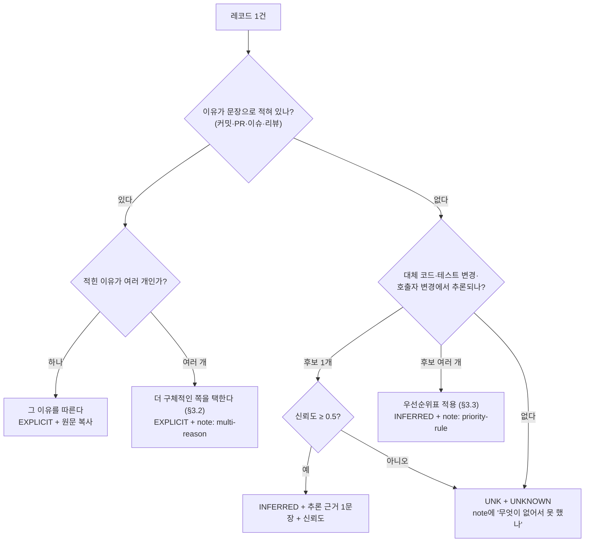

# 이유 라벨링 가이드

`guide_version: v1` · 갱신: 2026-09-12 · 담당: 성제 (sj) · 근거: CHARTER.md §4.2 ③, §4.4, §10.2, §11, ADR-004, ADR-005

> **이 문서의 목적은 정의를 나열하는 것이 아니다.** 세 사람이 같은 삭제 레코드를 보고 같은 라벨을 붙이게 만드는 것이다.
> §10.2의 목표는 라벨 일치도 kappa ≥ 0.7이고, 그 수치를 만드는 건 분류기가 아니라 이 문서다.
> 그래서 이 문서는 "판정이 갈릴 때 답을 주는" 형태로 쓰였다. 정의만 읽고 라벨하지 말고, §3 판정 순서와 §5 헷갈리는 쌍 표를 옆에 띄워 두고 라벨한다.

> **`[팀 확정 필요]` 표시**는 CHARTER.md에 근거가 없어 v1에서 임시로 정한 것이다. 라벨링 킥오프에서 확정한다. 전체 목록은 §11에 모아 두었다. 확정 전에도 라벨링은 시작할 수 있다 — 다만 그 건들은 `note`에 태그를 남겨 두므로, 규칙이 바뀌면 되짚을 수 있다.

**목차**

1. [목적과 사용 시점](#1-목적과-사용-시점)
2. [라벨링 단위와 라벨러가 보는 정보](#2-라벨링-단위와-라벨러가-보는-정보)
3. [판정 순서](#3-판정-순서-이-문서의-핵심)
4. [이유 8종 상세](#4-이유-8종-상세)
5. [헷갈리는 쌍 판정 규칙](#5-헷갈리는-쌍-판정-규칙)
6. [근거 등급 판정 규칙](#6-근거-등급-판정-규칙)
7. [라벨 기록 형식](#7-라벨-기록-형식)
8. [라벨링 절차](#8-라벨링-절차)
9. [하지 말 것](#9-하지-말-것)
10. [한계와 다음 버전](#10-한계와-다음-버전)
11. [팀 확정 필요 목록](#11-팀-확정-필요-목록)

---

## 1. 목적과 사용 시점

**누가.** 3인 전원(성제 sj / 재헌 jh / 희수 hs). 라벨링은 사람이 한다. LLM은 후보 제안과 근거 문장 작성까지만 (ADR-005).

**언제.**

| 시점 | 무엇 | 1차 목적 | 근거 |
|---|---|---|---|
| 2주차 | 예비 **200건** (#7에서 추출) | **이유 회수율** = EXPLICIT+INFERRED 비율 측정 → **게이트 1** 판정 | §9 2주차, §15 |
| 5주차 | 본 라벨 **500건** (학습 300 / 검증 100 / 테스트 100) | 분류기 정확도 측정용 정답 + kappa 보고 | §10.2, §9 5주차 |

200건과 500건의 목적이 다르다는 점이 중요하다. **200건은 "이유를 회수할 수 있는 데이터인가"를 재는 것이지, 분류기 정확도를 재는 것이 아니다.** 그래서 200건에서는 UNKNOWN이 많이 나오는 것이 실패가 아니라 측정 결과다 (게이트 1: ≥ 60% 진행 / 40~60% 저장소 기준 강화 / < 40% 축 이동).

**무엇을 산출하는지.**
- 레코드마다: 이유 1종(8종 중) + 근거 등급 1종(3종 중) + 근거 텍스트 + 출처 + 신뢰도
- 파일: `datasets/labels/{labeler}_{batch}.jsonl` (개인 라벨) → 병합 → `datasets/labeled_500.jsonl` (§7)
- 숫자: 이유 회수율, 라벨 일치도(kappa), 이유 분포 → `docs/evaluation.md`에 누적

---

## 2. 라벨링 단위와 라벨러가 보는 정보

**단위: `DeletionRecord` 1건** (§4.4). 함수 전체 삭제(`deletion_kind = FULL_FUNCTION`)가 1차 대상이다 (ADR-003). 레코드 1건 = 라벨 1개. 한 커밋에서 함수 3개가 삭제되면 레코드 3건이고, 라벨도 3개다 — 커밋 하나에 하나로 뭉치지 않는다.

같은 커밋의 다른 레코드를 참고하는 것은 허용한다(같은 이유일 가능성이 높다). 다만 **각 레코드의 근거는 각자 적는다.** "위와 같음"으로 적지 않는다.

### 2.1 라벨러에게 제시되는 필드

#7의 추출 스크립트는 아래 필드만 담은 라벨링 파일을 만든다.

| 필드 | 왜 보여주는가 |
|---|---|
| `record_id` | 라벨과 레코드를 연결하는 키 |
| `repo`, `file_path`, `function_name`, `function_signature` | 무엇이 삭제됐는지 식별 |
| `deleted_body` | 판정의 1차 재료 |
| `replacement.code`, `replacement.match_method` | INFERRED의 핵심 근거 (§6) |
| `context.commit_message` | EXPLICIT의 1차 출처 |
| `context.pr_title`, `context.pr_body` | EXPLICIT의 2차 출처 |
| `context.issue_titles` (+ 있으면 이슈 본문) | 왜 고쳤는지가 여기에만 있는 경우가 많다 |
| `context.review_comments` | 리뷰에서 "이거 왜 지웠나요"에 답이 달려 있는 경우 |
| `is_test_code` | 테스트 코드 삭제는 판정 기준이 다르다 (§5 특례) |
| `source_url` | GitHub 원본 확인용 (§2.3 규칙 있음) |

맥락이 **비어 있는 것도 정상이다.** #6 측정(`docs/evaluation.md`, 2026-09-12)에서 커밋에 맥락이 하나라도 붙는 비율은 194건 중 84.0%였고, 이슈 본문은 25.8%뿐이었다. sqlalchemy는 PR 회수 0%(Gerrit으로 리뷰), django는 이슈 회수 0%(`#번호`가 Trac 티켓)다. **맥락이 없는 건은 UNKNOWN이 정답일 수 있다.** 없는 맥락을 상상해서 채우지 않는다.

### 2.2 라벨러가 보면 안 되는 것

- **`reason.*` 전체** — `reason.label`, `reason.evidence_grade`, `reason.evidence_text`, `reason.confidence`, `reason.classifier_version`. 분류기·기준선·LLM의 출력이 들어가는 자리다. 보면 라벨이 그쪽으로 끌려가고(anchoring), 그 라벨로 분류기를 평가하면 §10.2가 무의미해진다. #7 스크립트는 이 필드들을 **비운 채로** 파일을 만든다 (#7 완료 조건).
- **다른 라벨러의 라벨** — 확정 토론(§8.3) 전까지. 2인 독립 라벨의 "독립"이 이것이다.
- **`filter_status` 외의 파이프라인 판단** — 필터 결과는 보여도 되지만(어떤 노이즈로 분류됐는지), 그것을 이유 판정의 근거로 쓰지 않는다.

### 2.3 GitHub 원본을 열어보는 것에 대해

`source_url`로 GitHub을 열어 후속 커밋이나 이슈 토론을 더 읽는 것은 **허용한다.** 더 정확한 라벨이 낫다.

단, 파이프라인이 수집하지 않은 정보로 판정했다면 `note`에 `off-record-evidence` 태그를 남긴다. **이유: 분류기는 수집된 맥락만 본다.** 라벨이 분류기가 볼 수 없는 정보에 의존하면 §10.2의 정확도 비교가 분류기에 불리해지고, "왜 못 맞혔나"를 분석할 수 없다. 태그가 있으면 그 건들을 뺀 정확도를 따로 낼 수 있다. `[팀 확정 필요]`

---

## 3. 판정 순서 (이 문서의 핵심)



렌더링이 안 될 때를 위한 같은 절차:

1. **(a) 명시된 이유가 있는가?** 커밋 메시지·PR 제목/본문·연결 이슈·리뷰 코멘트 중 어디든 **삭제 이유가 문장으로** 있으면 그 이유를 따른다 → 근거 등급 **EXPLICIT**, `evidence_text`에 원문 그대로 복사 (§6.1).
   - "문장으로 있다"의 기준: 읽고 나서 8종 중 하나를 고를 수 있는가. `fix: cleanup`, `refactor`, `address review comments`처럼 **키워드만 있고 무엇이 왜 잘못됐는지가 없으면 명시가 아니다** → (b)로 간다.
2. **(b) 명시가 없으면 추론한다.** 근거는 세 곳이다 → 근거 등급 **INFERRED**, 추론 근거를 **직접 한 문장으로** 쓰고 신뢰도 0~1을 적는다 (§6.2).
   - **대체 코드**: 삭제 자리(또는 호출자)에 무엇이 들어왔나 (`replacement.code`)
   - **테스트 변경**: 같은 커밋에서 테스트가 추가·수정됐나 (버그의 강한 신호)
   - **호출자 변경**: 삭제 함수를 부르던 곳이 사라졌나, 다른 것을 부르게 됐나
3. **(c) 둘 다 없으면 `UNK` + `UNKNOWN`.** 부끄러운 결과가 아니다 (§6.3).

**순서를 지켜야 하는 이유.** (b)부터 보면 대체 코드가 눈에 먼저 들어와 명시된 이유를 덮어쓴다. 예를 들어 대체 코드가 `json.loads` 호출이면 LIB로 보이지만, PR 본문에 "our parser crashed on trailing commas"가 있으면 그건 BUG다. **명시가 추론을 항상 이긴다.**

### 3.2 명시된 이유가 여러 개일 때: 더 구체적인 쪽

같은 문장에 두 이유가 겹치면 **더 구체적인(= 더 좁은 주장을 하는) 쪽**을 택한다.

| 적힌 문장 | 라벨 | 왜 |
|---|---|---|
| "refactor to fix race condition on close" | **BUG** | `refactor`는 수단, `race condition`이 이유. DESIGN이 아니다 |
| "remove insecure md5 fallback and simplify hashing" | **SEC** | `simplify`는 결과, `insecure`가 이유 |
| "replace hand-rolled retry with tenacity, also much faster" | **LIB** | 교체가 주행위, 속도는 부수 효과. PERF는 "느려서 바꿨다"일 때 |
| "drop unused helper as part of the v3 API cleanup" | **DEAD** | `unused`가 삭제 사유. API 정리는 이 삭제가 일어난 배경 |
| "remove Python 3.8 shims (unused after dropping 3.8)" | **FEAT** | `unused`는 FEAT의 결과. 지원 종료가 원인 |

판단 규칙 두 개로 요약한다.
- **수단 vs 이유**: "A해서 B했다"에서 라벨은 **A**(이유)다. `refactor`, `cleanup`, `simplify`, `move`는 대개 수단·결과 쪽 단어다.
- **원인 vs 결과**: 한쪽이 다른 쪽 때문에 생겼으면 **원인** 쪽을 택한다 (표의 마지막 두 행).

어느 쪽이 구체적인지 정말 모르겠으면 라벨을 찍지 말고 `note`에 `needs-discussion` 태그를 달고 후보 두 개를 적는다. 확정 토론(§8.3)에서 다룬다. 이런 건이 많으면 §5 표에 규칙을 추가하는 것이 가이드 개정의 기본 경로다.

### 3.3 추론뿐이고 후보가 여러 개일 때: 우선순위표 (v1 제안)

**`[팀 확정 필요]` — CHARTER.md에 우선순위가 정의된 바 없다. 아래는 v1에서 성제(sj)가 제안하는 것이고, 라벨링 킥오프에서 확정한다. 확정된 규칙이 아니다.**

**적용 조건이 좁다.** 이 표는 **(1) 명시된 이유가 전혀 없고, (2) 추론 후보가 2개 이상이며, (3) 어느 쪽도 신뢰도가 더 높다고 말할 수 없을 때**만 쓴다. 명시가 있으면 §3.2를, 후보 하나가 더 강하면 그 후보를 쓴다.

| 순위 | 라벨 | 이 순위인 이유 (v1 근거) |
|---|---|---|
| 1 | **SEC** | 삭제 코드에 위험 패턴(`eval`, `pickle.loads`, `shell=True`, MD5/SHA1 비밀번호, SQL 문자열 결합)이 실제로 있으면 diff만으로 확인된다. 놓쳤을 때 가장 아까운 정보다 |
| 2 | **LIB** | `import` 추가 + 대체 코드가 라이브러리 호출 = diff로 거의 증명된다 |
| 3 | **DEAD** | 호출자 부재는 코드베이스에서 확인 가능한 사실이다 |
| 4 | **FEAT** | 공개 표면(CLI 플래그, 공개 API, 문서·CHANGELOG 항목)에서 함께 사라졌으면 확인 가능하다 |
| 5 | **BUG** | 테스트 추가·조건문 변경은 강한 정황이지만 정황이다 |
| 6 | **PERF** | 알고리즘·복잡도 개선은 읽어서 판단해야 한다 |
| 7 | **DESIGN** | 가장 넓다. 잔여 범주로 쓰이기 쉬워 마지막에 둔다 |
| 8 | **UNK** | 위 어느 것도 근거를 못 대면 |

**정렬 원칙: diff만으로 확인 가능한 신호를 정황 신호보다 앞에, 좁은 범주를 넓은 범주보다 앞에.** 추론만 있을 때 틀린 BUG·PERF 라벨은 데이터셋 신뢰를 직접 깎는다. 확인 가능한 쪽을 먼저 소진하는 편이 안전하다.

**이 표를 쓴 건은 반드시 `note`에 `priority-rule` 태그를 남긴다.** 그러면 나중에 "우선순위표가 정확도에 어떤 영향을 줬나"를 측정할 수 있고, 킥오프에서 순위를 바꿨을 때 되짚어야 할 건이 특정된다.

**관찰 지표.** `DESIGN + UNK`가 전체의 절반을 넘으면 라벨러를 의심하기 전에 이 가이드를 의심한다. 경계 규칙이 부족하다는 신호다. `[팀 확정 필요]` (수치는 임의)

---

## 4. 이유 8종 상세

§4.2 ③의 8종을 **그대로** 쓴다. 새 라벨을 만들지 않는다. 8종이 부족하다고 판단되면 §13 절차(이슈 → 회의 → ADR → CHARTER 갱신)이고, 이미 라벨한 데이터의 재라벨 비용을 함께 계산한다.

> **예시는 전부 손으로 만든 가상 예시다.** 파이프라인(#4·#5)이 아직 실행 전이라 실제 수집 레코드가 없다. 게이트 1 샘플이 나오면 실제 레코드로 교체하고 v2로 올린다 (§10).

### BUG — 버그 수정

- **한 줄 정의**: 코드가 **잘못된 동작**을 해서 제거했다.
- **포함**: 잘못된 결과·크래시·예외 미처리·경계 조건 실패·경쟁 조건·잘못된 상태 관리. 버그를 만들던 장치(잘못된 캐시·잘못된 최적화) 자체를 걷어낸 경우도 포함.
- **포함되지 않음**: 느린 것(PERF), 취약한 것(SEC), 안 쓰이는 것(DEAD), 동작은 맞지만 구조가 나쁜 것(DESIGN). `fix`라는 단어가 있다는 것만으로 BUG가 아니다 — **무엇이 잘못됐는지**가 기준이다.
- **텍스트 단서**: `fix`, `bug`, `broken`, `incorrect`, `wrong`, `crash`, `raises`, `regression`, `race`, `off-by-one`, `edge case`, 이슈 참조(`fixes #`, `closes #`)
- **diff 단서**: 같은 커밋에 **테스트 추가·수정**(가장 강한 신호). 대체 코드가 원본과 거의 같으면서 조건문·경계·예외 처리만 다름. 호출자는 그대로.

```diff
# 예시 A — BUG 맞음 (가상)
# commit: "fix: parse_headers raised IndexError on empty header list (#812)"
- def _first_header(headers):
-     return headers[0].split(":", 1)[1].strip()
+ def _first_header(headers):
+     if not headers:
+         return None
+     return headers[0].split(":", 1)[1].strip()
# + tests/test_headers.py: test_parse_headers_empty 추가
```
→ `BUG` / `EXPLICIT` / `evidence_text`: "parse_headers raised IndexError on empty header list" / `evidence_source`: commit

```diff
# 예시 B — 헷갈리지만 PERF (가상)
# commit: "fix slow retry loop: replace linear scan with dict lookup"
- def _find_pending(queue, task_id):
-     for t in queue:            # O(n), 큐가 커지면 초당 수만 번
-         if t.id == task_id:
-             return t
+ def _find_pending(index, task_id):
+     return index.get(task_id)
```
→ `PERF`. `fix`가 있지만 고친 것은 **잘못된 동작이 아니라 속도**다. 결과는 전후가 같다. §5의 `BUG vs PERF` 규칙.

### PERF — 성능

- **한 줄 정의**: **느리거나 자원을 많이 써서** 같은 일을 더 싸게 하는 것으로 교체했다.
- **포함**: 알고리즘 복잡도 개선, 불필요한 복사·재계산 제거, 메모리 사용 감소, 캐시 도입으로 대체.
- **포함되지 않음**: 결과가 달라지는 변경(BUG 또는 FEAT). 성능 장치를 **틀렸기 때문에** 제거한 경우(BUG). "코드가 간결해졌다"만인 경우(DESIGN).
- **텍스트 단서**: `perf`, `performance`, `slow`, `speed up`, `Nx faster`, `optimize`, `memory`, `allocations`, 벤치마크 수치·`asv`·`pytest-benchmark` 언급
- **diff 단서**: 대체 코드가 **같은 입출력을 유지**하면서 자료구조·순회 방식만 다름. 루프 → 해시/벡터화/배치. 같은 커밋에 벤치마크 파일 변경.

```diff
# 예시 A — PERF 맞음 (가상)
# PR body: "startup spent 1.2s deep-copying the default config on every import.
#           The default is immutable, so we can share it. Startup: 1.2s -> 0.4s."
- def _deep_copy_defaults():
-     return copy.deepcopy(_DEFAULT_CONFIG)
+ # 호출자들이 _DEFAULT_CONFIG(frozen)를 직접 참조
```
→ `PERF` / `EXPLICIT` / `evidence_source`: pr / `evidence_locator`: `pr:#1043#body`

```diff
# 예시 B — 헷갈리지만 BUG (가상)
# commit: "remove permission memoization — returned stale rows after role change"
- @lru_cache(maxsize=1024)
- def get_permissions(user_id):
-     return _query_permissions(user_id)
+ def get_permissions(user_id):
+     return _query_permissions(user_id)
```
→ `BUG`. **성능 장치를 지웠지만 이유는 잘못된 결과**다. 이 커밋은 성능을 오히려 포기했다. §5의 `BUG vs PERF` 규칙.

### SEC — 보안

- **한 줄 정의**: **취약점 또는 위험한 패턴 자체**를 제거했다.
- **포함**: CVE·보안 권고 대응, 신뢰할 수 없는 입력의 역직렬화·실행(`eval`, `exec`, `pickle.loads`, `yaml.load`), 명령 주입(`shell=True` + 문자열 결합), SQL 문자열 결합, 취약한 암호(MD5/SHA1 비밀번호, ECB), 비밀값 로깅·하드코딩, 경로 탈출, 인증·권한 우회.
- **포함되지 않음**: 보안 관련 코드를 만졌지만 이유가 오동작인 경우(BUG). 보안 기능을 **기능으로서** 없앤 경우(FEAT). 취약 여부가 명시되지 않았고 삭제 코드에 위험 패턴도 없는데 "보안일 것 같다"로 찍는 것.
- **텍스트 단서**: `security`, `vulnerability`, `CVE-`, `GHSA-`, `injection`, `XSS`, `CSRF`, `SSRF`, `sanitize`, `escape`, `untrusted`, `arbitrary code`, `privilege`, `advisory`
- **diff 단서**: 삭제 코드에 위 위험 패턴이 실제로 존재. 대체 코드가 검증·이스케이프·파라미터 바인딩·안전한 파서를 추가. 보안 수정은 별도 릴리스·백포트를 동반하는 경우가 많다.

```diff
# 예시 A — SEC 맞음 (가상)
# issue title: "Session cookie is unpickled without verification (RCE)"
- def load_session(cookie: bytes):
-     return pickle.loads(base64.b64decode(cookie))
+ def load_session(cookie: bytes):
+     return json.loads(_verify_signature(base64.b64decode(cookie)))
```
→ `SEC` / `EXPLICIT` / `evidence_source`: issue / `evidence_locator`: `issue:#233#title`

```diff
# 예시 B — 헷갈리지만 BUG (가상)
# commit: "fix: validate_token ran the check twice and rejected valid tokens"
- def validate_token(tok):
-     _check(tok)
-     return _check(tok)   # 두 번째 호출에서 nonce가 이미 소비됨
+ def validate_token(tok):
+     return _check(tok)
```
→ `BUG`. **보안 코드를 만졌지만 취약점을 고친 게 아니다** — 정상 토큰을 거부하던 오동작이다. §5의 `BUG vs SEC` 규칙.

### LIB — 라이브러리 교체

- **한 줄 정의**: **직접 구현을 외부/표준 라이브러리로 대체**했다.
- **포함**: 자체 구현 → stdlib(`functools`, `dataclasses`, `pathlib`, `itertools`) 또는 서드파티 패키지 호출. 언어·런타임 버전이 올라 표준 기능으로 대체된 경우(예: 자체 `cached_property` 제거)도 포함.
- **포함되지 않음**: 라이브러리 교체가 **과거에 이미 끝났고** 남은 미사용 함수를 치우는 것(DEAD). 외부 라이브러리를 쓰지만 목적이 구조·경계 재설계인 것(DESIGN). 라이브러리 A → 라이브러리 B 교체는 **LIB로 본다** `[팀 확정 필요]` (v1 제안: 직접 구현이 아니어도 "구현을 남의 것으로 바꿨다"는 점이 같다).
- **텍스트 단서**: `use X instead of`, `replace with`, `switch to`, `drop our own`, `hand-rolled`, `reinvent`, `stdlib`, `now that we require Python 3.x`
- **diff 단서**: `import` 추가 + 대체 코드가 **라이브러리 호출 한두 줄**. 삭제 본문이 길고 대체가 짧다. `pyproject.toml`·`requirements`에 의존성 추가.

```diff
# 예시 A — LIB 맞음 (가상)
# commit: "use functools.cached_property now that we require Python 3.8+"
+ from functools import cached_property
- class _CachedProperty:
-     def __init__(self, fn): ...
-     def __get__(self, obj, cls): ...   # 20줄
```
→ `LIB` / `EXPLICIT` / `evidence_source`: commit

```diff
# 예시 B — 헷갈리지만 DEAD (가상)
# commit: "remove _json_encode — unused since we moved to orjson in #812"
- def _json_encode(obj):
-     return json.dumps(obj, default=_default).encode()
# 대체 코드 없음. 호출자도 없음 (#812에서 이미 사라졌다)
```
→ `DEAD`. 라이브러리 교체는 **이전 커밋(#812)의 일**이고, 이 삭제의 이유는 "안 쓰인다"다. **이 삭제 커밋에서 교체가 일어났는지**가 갈림길이다. §5의 `LIB vs DEAD` 규칙.

### DEAD — 죽은 코드

- **한 줄 정의**: **호출되지 않아서** 제거했다.
- **포함**: 호출자 0인 함수, 도달 불가 분기, 주석 처리된 채 남아 있던 구현, 이전 마이그레이션의 잔재.
- **포함되지 않음**: 기능을 없애면서 그 구현이 함께 사라진 것(FEAT — 원인이 기능 제거다). 구조를 바꿔 호출 경로가 옮겨간 것(DESIGN). "지금은 안 쓰지만 틀렸어서 지웠다"(BUG).
- **텍스트 단서**: `unused`, `dead code`, `no longer used`, `not referenced`, `leftover`, `vestigial`, `cleanup`(단독이면 약함), `remove obsolete`
- **diff 단서**: **대체 코드 없음**(`replacement.match_method = NONE`). 호출자 변경 없음(부르던 곳이 애초에 없다). 여러 무관한 함수가 한 커밋에서 함께 삭제됨. 테스트 변경 없음, 또는 그 함수의 테스트만 함께 삭제.

```diff
# 예시 A — DEAD 맞음 (가상)
# commit: "remove unused _legacy_path_resolver (no callers since 2.0)"
- def _legacy_path_resolver(name):
-     ...   # 15줄
# 대체 없음, 호출자 없음, 다른 파일 변경 없음
```
→ `DEAD` / `EXPLICIT` / `evidence_source`: commit

```diff
# 예시 B — 헷갈리지만 FEAT (가상)
# commit: "remove --legacy-config flag"
# docs/cli.md, CHANGELOG.md 함께 변경
- def _handle_legacy_config(args): ...
- parser.add_argument("--legacy-config", ...)
```
→ `FEAT`. 호출자가 사라진 게 아니라 **기능을 없애서** 호출자까지 같이 지웠다. 공개 표면(CLI 플래그)과 문서가 함께 바뀐 것이 신호다. §5의 `DEAD vs FEAT` 규칙.

### DESIGN — 설계 변경

- **한 줄 정의**: **구조·추상화를 바꾸면서** 이 코드가 그 구조에 더 이상 맞지 않아 제거했다.
- **포함**: 계층 분리·병합, 책임 이동, 인터페이스 재정의, 클래스 재구성, 같은 기능을 다른 API 모양으로 제공.
- **포함되지 않음**: 기능 자체가 없어진 것(FEAT — 사용자가 할 수 있던 일이 사라졌나로 구분). 순수 이동·리네임(필터가 `NOISE_MOVE`·`NOISE_RENAME`로 걸러야 한다. 라벨링 단계에서 만났으면 `note`에 `filter-miss` 태그를 남기고 재헌에게 알린다). `refactor` 단어만 있고 더 구체적인 이유가 적혀 있는 것(그 이유를 따른다, §3.2).
- **텍스트 단서**: `refactor`, `restructure`, `extract`, `consolidate`, `unify`, `simplify the design`, `split out`, `move ... into`, `layer`, `abstraction`
- **diff 단서**: **여러 파일 동시 변경**. 삭제 함수의 일이 다른 이름·다른 모듈·다른 클래스에서 계속됨. 외부에서 보이는 동작은 동일. 테스트가 추가되기보다 **재배치**된다.

```diff
# 예시 A — DESIGN 맞음 (가상)
# PR title: "Extract transport layer; Connection no longer owns the socket"
# 변경 파일: connection.py, transport.py, pool.py, tests/test_transport.py
- class Connection:
-     def send_raw(self, data): ...   # 소켓 직접 조작
+ class Transport:
+     def send(self, data): ...       # Connection이 Transport에 위임
```
→ `DESIGN` / `EXPLICIT` / `evidence_source`: pr

```diff
# 예시 B — 헷갈리지만 BUG (가상)
# commit: "refactor connection pool to fix race condition on close"
- def _release(self, conn):
-     self._free.append(conn)          # 락 없이 append
+ def _release(self, conn):
+     with self._lock:
+         self._free.append(conn)
```
→ `BUG`. `refactor`는 **수단**이고 `race condition`이 이유다. §3.2의 "더 구체적인 쪽".

### FEAT — 기능 제거

- **한 줄 정의**: **기능 자체를 없앴다** (폐기, 지원 종료).
- **포함**: deprecation 주기를 마친 API 제거, 플랫폼·버전 지원 종료(`drop Python 3.8`), 옵션·플래그·설정 항목 제거, 실험 기능 철수.
- **포함되지 않음**: 같은 기능이 다른 API로 계속 제공되는 것(DESIGN). 안 쓰여서 치우는 것(DEAD — 사용자가 쓸 수 있던 기능이었나로 구분). 보안 때문에 기능을 막은 것(SEC).
- **텍스트 단서**: `deprecate`, `deprecated since`, `remove support for`, `drop support`, `EOL`, `sunset`, `no longer supported`, `BREAKING CHANGE`, 마이그레이션 안내
- **diff 단서**: **문서·CHANGELOG·`pyproject.toml`(classifiers, python_requires) 동반 변경**. 공개 표면(공개 클래스·함수·CLI 옵션)이 줄어듦. 대체 코드 없음, 또는 "이제 X를 쓰세요" 안내만.

```diff
# 예시 A — FEAT 맞음 (가상)
# commit: "drop Python 3.8 support (EOL 2024-10); remove compat shims"
# 변경: pyproject.toml(python_requires), docs/install.md, CHANGELOG.md
- def _py38_typing_shim(tp): ...
```
→ `FEAT` / `EXPLICIT` / `evidence_source`: commit

```diff
# 예시 B — 헷갈리지만 DESIGN (가상)
# commit: "remove Response.json_body; callers use Response.json()"
- @property
- def json_body(self):
-     return json.loads(self.content)
# Response.json() 이 같은 일을 한다 (이 커밋 이전부터 존재)
```
→ `DESIGN`. **기능은 그대로 있고 접근 방법만 하나로 줄었다.** 사용자가 할 수 있는 일이 사라지지 않았다. §5의 `DESIGN vs FEAT` 규칙.

### UNK — 불명

- **한 줄 정의**: 8종 중 어느 것으로도 **근거를 댈 수 없다.**
- **포함**: 맥락이 비었거나 무의미하고(`cleanup`, `wip`, `address review`, 빈 메시지), 대체 코드도 호출자 변경도 없어 추론 근거가 없는 건. 추론 후보가 있어도 신뢰도가 0.5 미만인 건 (§6.2).
- **포함되지 않음**: **귀찮아서 찍는 UNK.** 대체 코드를 안 읽고 찍은 UNK는 §9 위반이다. 추론 근거를 한 문장으로 쓸 수 있으면 그건 INFERRED다.
- **UNK는 항상 `UNKNOWN` 등급과 함께 간다** — 이유를 모르는데 근거 등급이 EXPLICIT·INFERRED일 수 없다.

```text
# 예시 A — UNK 맞음 (가상)
commit_message: "cleanup"
pr_number: null          # sqlalchemy 계열: Gerrit으로 리뷰해 PR이 없다
issue_titles: []
replacement.code: null   # match_method = NONE
삭제된 함수: _fmt(x)  (3줄 문자열 포매팅 헬퍼)
호출자 변경: 없음 (원래 호출자를 찾을 수 없다)
```
→ `UNK` / `UNKNOWN` / `confidence`: 0.0 / `note`: `no-context vague-message no-replacement`

```text
# 예시 B — 헷갈리지만 DEAD (가상)
commit_message: "cleanup"
같은 커밋: _fmt() 의 유일한 호출자였던 render_row() 가 함께 삭제됨
replacement.code: null
```
→ `DEAD` / `INFERRED` / `confidence`: 0.7 / `evidence_text`(직접 작성): "유일한 호출자 render_row가 같은 커밋에서 함께 삭제되어 호출자가 0이 된다" / `evidence_source`: diff.
**메시지가 같아도 diff가 근거를 준다.** 메시지가 빈약하다는 이유만으로 UNK를 찍지 않는다.

---

## 5. 헷갈리는 쌍 판정 규칙

**한 줄 규칙만 본다.** 여기서 답이 안 나오면 `note`에 `needs-discussion`을 달고 확정 토론으로 넘긴다.

| 쌍 | 갈림길 한 줄 | 무엇을 보나 |
|---|---|---|
| **BUG vs SEC** | 신뢰할 수 없는 입력으로 **권한·기밀·무결성**이 깨지면 SEC, 그 외 잘못된 동작은 BUG. 취약점이 명시돼 있지 않고 삭제 코드에 위험 패턴도 없으면 SEC를 찍지 않는다 | 명시 우선, 추론이면 위험 패턴 존재 여부 |
| **BUG vs PERF** | **결과가 달라졌나.** 전후 결과가 같고 비용만 줄었으면 PERF, 결과가 바뀌었으면 BUG. `fix slow...`는 PERF, `remove cache — stale results`는 BUG | 결과 변화 |
| **LIB vs DESIGN** | **이 커밋에서** 삭제 코드의 일을 외부·표준 라이브러리가 그대로 이어받으면 LIB, 우리 코드의 다른 자리(다른 클래스·모듈)가 이어받으면 DESIGN | 대체 코드의 주인이 누구인가 |
| **LIB vs DEAD** | 교체가 **이 커밋에서** 일어났으면 LIB, 교체는 이미 끝났고 잔재만 치우면 DEAD. 근거는 `replacement.match_method`(NONE이면 DEAD 쪽) | 교체 시점 |
| **DEAD vs FEAT** | **사용자가 쓸 수 있던 기능인가.** 공개 표면(공개 API·CLI·설정)에서 사라지고 문서·CHANGELOG가 함께 바뀌면 FEAT, 내부 함수가 호출자를 잃은 것이면 DEAD | 공개 표면 변화 |
| **DESIGN vs FEAT** | **할 수 있던 일이 사라졌나.** 같은 일을 다른 API로 계속 할 수 있으면 DESIGN, 아예 못 하게 됐으면 FEAT | 기능 소멸 여부 |
| **PERF vs DESIGN** | 삭제 이유가 **비용**(시간·메모리)이면 PERF, **구조**(책임·경계·가독성)이면 DESIGN. 수치·벤치마크 언급이 있으면 PERF로 기운다 | 비용 언급 유무 |
| **무엇이든 vs UNK** | 근거를 **한 문장으로 쓸 수 있으면** UNK가 아니다(INFERRED). 쓰려는데 "아마", "~일 것 같다"밖에 안 나오면 신뢰도가 0.5 미만이라는 뜻이고 UNK다 | 근거 문장 작성 가능 여부 |
| **BUG vs DESIGN** | `refactor to fix X`는 BUG (§3.2 수단 vs 이유). 구조 변경 과정에서 버그가 **부수적으로** 없어진 것이면 DESIGN | 명시된 이유의 구체성 |
| **DEAD vs DESIGN** | 호출자가 **없어서** 지웠으면 DEAD, 호출 경로를 **옮겨서** 지웠으면 DESIGN. 후자는 대체 코드가 존재한다 | 대체 코드 존재 여부 |

**테스트 코드 삭제(`is_test_code = true`)의 특례** `[팀 확정 필요]`: 테스트는 제외되지 않고 플래그로만 구분된다(§4.2 ②). v1 제안은 **테스트가 검증하던 대상의 이유를 따른다** — 기능이 없어져 테스트도 지웠으면 FEAT, 구조 변경으로 테스트가 재배치됐으면 DESIGN, 테스트 자체가 틀려서(flaky·잘못된 단정) 지웠으면 BUG. 테스트만 단독으로 지워졌고 이유가 없으면 UNK.

---

## 6. 근거 등급 판정 규칙

근거 등급은 **모든 레코드에 필수**다 (§4.2 ③). ADR-004의 이유: 100% 이유 회수는 불가능하므로 **정직한 표시**가 필수이고, 불명을 숨기지 않는다.

### 6.1 EXPLICIT — 이유가 문장으로 존재

- **조건**: 커밋 메시지·PR 제목/본문·이슈 제목/본문·리뷰 코멘트 중 어디든, 읽고 나서 8종 중 하나를 고를 수 있는 문장이 있다.
- **`evidence_text`: 원문을 그대로 복사한다. 요약 금지, 번역 금지, 다듬기 금지.**
  - 이유: (1) 나중에 원문과 대조해 라벨을 검증할 수 있어야 한다. (2) 요약하는 순간 라벨러의 해석이 섞여 EXPLICIT과 INFERRED의 구분이 무너진다. (3) 분류기가 같은 텍스트를 입력으로 받으므로, 라벨 근거와 분류기 입력이 같은 문자열이어야 오류 분석이 가능하다.
  - 길이: 이유가 담긴 문장 단위로 자른다. 목표 500자 이내, 앞뒤를 자를 때는 `…`로 표시. 여러 곳에 나뉘어 있으면 가장 구체적인 한 곳을 `evidence_text`에, 나머지는 `note`에. `[팀 확정 필요]` (길이 상한은 임의)
  - 영어 원문은 영어 그대로 둔다. 한국어로 옮기지 않는다.
- **`evidence_source`**: `commit` | `pr` | `issue` | `review` (EXPLICIT에서 `diff`는 쓰지 않는다 — diff는 문장이 아니다)
- **`evidence_locator`**: 출처 위치를 문자열로. `commit:message` / `pr:#1043#title` / `pr:#1043#body` / `issue:#233#body` / `review:comment_1234567`
- **`confidence`: EXPLICIT이면 1.0으로 고정한다.** 이유 문장이 있는데도 어느 라벨인지 애매하다면 그것은 EXPLICIT이 아니라 INFERRED다. 이 규칙이 등급의 경계를 지킨다. `[팀 확정 필요]`

### 6.2 INFERRED — 추론

- **조건**: 명시된 이유는 없지만 대체 코드·테스트 변경·호출자 변경에서 이유를 댈 수 있다.
- **`evidence_text`: 라벨러가 추론 근거를 한 문장으로 직접 쓴다.** 무엇을 보고 그렇게 판단했는지가 들어가야 한다.
  - 좋은 예: "삭제 함수 자리에 `tenacity.retry` 데코레이터 호출이 들어와 재시도 로직을 라이브러리가 이어받는다"
  - 나쁜 예: "라이브러리로 바꾼 것 같다" (무엇을 봤는지가 없다)
- **`evidence_source`**: 대개 `diff`. 근거가 대체 코드가 아니라 리뷰 코멘트의 정황이면 `review`.
- **신뢰도 구간** `[팀 확정 필요]` (구간 경계는 임의):

| 구간 | 뜻 | 판단 기준 | 예 |
|---|---|---|---|
| **0.8 ~ 1.0** | 대체 코드가 이유를 **거의 증명**한다 | 삭제된 일을 무엇이 이어받았는지 diff에서 특정된다. 다른 설명을 대기 어렵다 | 삭제 자리에 `json.loads` 호출이 들어옴 → LIB 0.9 |
| **0.5 ~ 0.8** | 정황이 한 방향으로 **일치**하지만 다른 설명도 가능하다 | 신호가 있으나 간접적. 테스트 추가, 호출자 소멸 등 | 유일한 호출자가 같은 커밋에서 삭제 → DEAD 0.7 |
| **0.5 미만** | **INFERRED를 쓰지 않는다.** `UNK` + `UNKNOWN`으로 기록한다 | 근거 문장이 "아마", "~같다"로만 써진다 | — |

- 신뢰도는 **라벨러의 확신도가 아니라 근거의 강도**다. "나는 확실하다"가 아니라 "diff가 이만큼 말해준다"를 적는다.

### 6.3 UNKNOWN — 판단 불가

- **조건**: 명시도 없고, 추론 근거도 0.5에 못 미친다.
- `reason_label` = `UNK`, `evidence_text` = `null`, `confidence` = `0.0`.
- **`note`에 "무엇이 없어서 판단하지 못했는가"를 반드시 한 줄 적는다.** 아래 태그를 쓰면 집계할 수 있다.
  - `no-context` (PR·이슈가 안 붙음) / `vague-message` (메시지가 `cleanup` 류) / `no-replacement` (대체 코드 없음) / `no-caller-info` (호출자 변화를 알 수 없음)
  - 이 태그 분포가 §11 최대 리스크의 **원인**을 가리킨다. "회수율이 낮다"보다 "맥락이 안 붙어서 낮다"와 "맥락은 붙는데 이유를 안 써서 낮다"는 대응이 다르다 (전자는 저장소 재선정, 후자는 대체 코드 중심으로 축 이동).

**UNKNOWN을 부끄러워하지 말라.** §11의 최대 리스크는 **이유 회수율 저조**이고, 그것은 UNKNOWN을 다른 라벨로 채우면 **측정 자체가 무의미해진다.** 게이트 1은 "우리가 얼마나 잘 라벨했나"를 재는 게 아니라 "이 데이터에 이유가 있나"를 재는 지점이다. 회수율 45%는 나쁜 소식이지만 대응할 수 있는 소식이고(저장소 기준 강화 또는 축 이동), UNKNOWN을 DESIGN으로 채워 만든 회수율 85%는 6주차 게이트 2에서 분류 정확도로 되돌아와 프로젝트를 잘못된 방향으로 끌고 간다.

---

## 7. 라벨 기록 형식

### 7.1 파일 두 층

라벨링 중에 세 사람이 같은 파일을 편집하면 충돌한다. 그래서 두 층으로 나눈다.

| 층 | 파일 | 1줄 = | 누가 쓰나 |
|---|---|---|---|
| 개인 라벨 | `datasets/labels/{labeler}_{batch}.jsonl` | 라벨러 1인의 라벨 1건 | 각자 (§7.2) |
| 병합·확정 | `datasets/labeled_500.jsonl` | 레코드 1건 (개별 라벨 전부 + 확정 라벨) | 병합 스크립트 (#7) |

`batch`는 `pre200`(2주차 예비), `main500`(5주차 본 라벨). 예: `datasets/labels/sj_pre200.jsonl`.

### 7.2 개인 라벨 1줄 (플랫)

```json
{
  "record_id": "9f1c2f3e-4b5a-4c6d-8e7f-0a1b2c3d4e5f",
  "labeler": "sj",
  "reason_label": "BUG",
  "evidence_grade": "EXPLICIT",
  "evidence_text": "parse_headers raised IndexError on empty header list",
  "evidence_source": "commit",
  "evidence_locator": "commit:message",
  "confidence": 1.0,
  "note": "",
  "labeled_at": "2026-09-22T14:03:11+09:00",
  "guide_version": "v1"
}
```

| 필드 | 타입 | 규칙 |
|---|---|---|
| `record_id` | str (uuid) | `DeletionRecord.id` (§4.4). 레코드와 연결하는 유일 키 |
| `labeler` | enum | `sj` \| `jh` \| `hs` |
| `reason_label` | enum | `BUG`\|`PERF`\|`SEC`\|`LIB`\|`DEAD`\|`DESIGN`\|`FEAT`\|`UNK` (§4.2 ③ 그대로) |
| `evidence_grade` | enum | `EXPLICIT`\|`INFERRED`\|`UNKNOWN` |
| `evidence_text` | str \| null | EXPLICIT: 원문 그대로. INFERRED: 직접 쓴 한 문장. UNKNOWN: `null` (§6) |
| `evidence_source` | enum \| null | `commit`\|`pr`\|`issue`\|`review`\|`diff`. UNKNOWN이면 `null` |
| `evidence_locator` | str \| null | 출처 위치. `commit:message`, `pr:#1043#body`, `issue:#233#title`, `review:comment_1234567`, `diff:replacement` |
| `confidence` | float 0~1 | EXPLICIT 1.0 고정 / INFERRED 0.5~1.0 / UNKNOWN 0.0 (§6) |
| `note` | str | 태그 + 자유 서술. 태그: `needs-discussion` `multi-reason` `priority-rule` `off-record-evidence` `filter-miss` `anchored` `no-context` `vague-message` `no-replacement` `no-caller-info` |
| `labeled_at` | str (ISO 8601) | 타임존 포함 |
| `guide_version` | str | 이 건을 라벨할 때 본 가이드 버전. 규칙이 바뀌었을 때 재검토 범위를 특정하는 근거 (§10.3) |

### 7.3 병합·확정 파일 1줄 (`datasets/labeled_500.jsonl`)

**레코드 1건 = 1줄.** 개별 라벨은 `labels[]`에 그대로 보존하고, 확정 라벨은 `final`에 **별도 필드**로 넣는다. 개별 라벨은 확정 후에도 지우지 않는다 (kappa 재계산과 불일치 분석에 필요하다).

```json
{
  "record_id": "9f1c2f3e-4b5a-4c6d-8e7f-0a1b2c3d4e5f",
  "batch": "main500",
  "split": "train",
  "labels": [
    { "labeler": "sj", "reason_label": "BUG", "evidence_grade": "EXPLICIT", "evidence_text": "parse_headers raised IndexError on empty header list", "evidence_source": "commit", "evidence_locator": "commit:message", "confidence": 1.0, "note": "", "labeled_at": "2026-09-22T14:03:11+09:00", "guide_version": "v1" },
    { "labeler": "jh", "reason_label": "DESIGN", "evidence_grade": "INFERRED", "evidence_text": "대체 코드가 조건 분기를 추가하며 함수 형태가 바뀐다", "evidence_source": "diff", "evidence_locator": "diff:replacement", "confidence": 0.6, "note": "", "labeled_at": "2026-09-22T16:40:02+09:00", "guide_version": "v1" }
  ],
  "final": {
    "reason_label": "BUG",
    "evidence_grade": "EXPLICIT",
    "evidence_text": "parse_headers raised IndexError on empty header list",
    "evidence_source": "commit",
    "evidence_locator": "commit:message",
    "confidence": 1.0,
    "method": "DISCUSSED",
    "adjudicated_by": ["sj", "jh"],
    "adjudicated_at": "2026-09-23T20:10:00+09:00",
    "note": "jh가 커밋 메시지를 보지 않고 diff만 봤다. §3 (a)를 먼저 본다는 규칙 재확인"
  },
  "guide_version": "v1"
}
```

- `split`: `train` \| `val` \| `test` (300/100/100, §10.2). 예비 200건은 `batch = "pre200"`, `split = null`.
- `final.method`: `AGREED` (2인 라벨 일치) \| `DISCUSSED` (불일치 → 토론 확정) \| `THIRD_PARTY` (2인이 합의 못 해 3인이 판정).
- `final.note`: 토론 확정 건은 **왜 그렇게 정했는지 한 줄**을 남긴다. 이것이 §5 표의 다음 행이 된다. 가이드 개정의 재료다.
- 최상위 `guide_version`은 `final`을 정할 때 본 가이드 버전이다. `labels[].guide_version`과 다를 수 있다.

**왜 1줄 = 레코드인가.** (1) `DeletionRecord`와 1:1이라 학습·평가에서 결합이 단순하다. (2) 확정 라벨을 "별도 필드"로 두면서 개별 라벨을 보존할 수 있다. (3) §10.2의 300/100/100 분할을 줄 단위로 할 수 있다. 개인 라벨을 플랫하게 쓰는 이유는 편집 충돌 회피이고, 병합은 기계가 한다.

**#7 의존.** 이 스키마는 #7(희수)의 샘플 추출·병합·회수율 계산 스크립트가 맞춰야 하는 계약이다. 이 문서 머지 후 **#7 이슈 본문에 코멘트로 남긴다.** 스키마를 바꾸려면 이 문서의 버전을 올리고 #7에 다시 알린다. `[팀 확정 필요]` (파일 경로·필드명 확정)

> 이 스키마는 §4.4 `DeletionRecord` 스키마를 **바꾸지 않는다.** 라벨 파일은 별도 산출물이고, 사람 라벨을 `reason.*`에 직접 쓰지 않는다 — 그 자리는 분류기 출력용이다. 확정 라벨을 DB에 반영할지는 6주차 분류기 작업에서 결정한다 (`[팀 확정 필요]`).

---

## 8. 라벨링 절차

### 8.1 배분 — 1건당 2인 독립 라벨

§10.2가 "각 건 2인 이상 라벨"을 요구하므로 **전건 2인**이 기본이다. 3인이 쌍을 돌려 맡으면 **쌍별 kappa 3개**를 모두 얻을 수 있다.

| 블록 | 200건 (예비) | 500건 (본) | 라벨러 쌍 |
|---|---|---|---|
| A | 67건 | 167건 | sj + jh |
| B | 67건 | 167건 | jh + hs |
| C | 66건 | 166건 | hs + sj |
| 1인당 | **약 133건** | **약 333건** | 2개 블록 담당 |

블록은 #7의 층화 샘플링(저장소별) 결과를 순서대로 3등분한다. 시드 고정으로 재현 가능해야 한다 (#7 완료 조건).

**소요 시간 추정과 그 함의** `[팀 확정 필요]`:
- 목표 **1건당 3분** (EXPLICIT은 1~2분, INFERRED는 더 걸린다)
- **상한 5분.** 5분을 넘기면 `note`에 `needs-discussion`을 달고 다음 건으로 간다. 한 건에 15분 쓰는 것이 전체를 망치는 가장 흔한 방식이다
- 200건: 133건 × 3분 ≈ **1인 6.7시간** (2주차 내)
- 500건: 333건 × 3분 ≈ **1인 16.7시간** (2주차~5주차 분산)

**이 숫자는 크다.** §9 일정에서 500건 라벨링은 "5주차 작업 한 줄"로 적혀 있지만 실제로는 3인 합계 50시간이다. 코드 작업과 같은 주에 몰면 둘 다 못 끝난다. 2주차 예비 200건이 끝나면 실제 소요 시간을 재서 §9를 조정해야 한다. 줄이는 방법은 두 가지뿐이고 둘 다 비용이 있다: 건수를 줄인다(§10.2의 500건 근거가 흔들린다) / 2인 전건을 일부 겹침으로 바꾼다(§10.2 "각 건 2인 이상" 위반). **어느 쪽도 이 문서가 혼자 정하지 않는다** — 킥오프 안건이다.

### 8.2 순서

1. `git pull --rebase` 후 자기 배분 파일을 받는다 (`datasets/labels/{labeler}_{batch}.jsonl`의 빈 틀)
2. 한 건씩 §3 판정 순서대로. **(a) 명시 → (b) 추론 → (c) UNK.** 순서를 건너뛰지 않는다
3. 헷갈리면 §5 표. 표에 없으면 `needs-discussion`
4. 라벨 완료 후 커밋. 브랜치는 `exp/{이슈번호}-label-{batch}-{이니셜}` `[팀 확정 필요]`
5. 라벨링 중에는 **상대의 파일을 열지 않는다** (§2.2)

### 8.3 불일치 확정

1. 병합 스크립트가 `labels[]`의 `reason_label`이 다른 건을 뽑는다 (근거 등급 불일치도 따로 뽑는다)
2. 두 라벨러가 **각자의 근거를 먼저 말하고** 나서 조정한다. 순서가 중요하다 — 먼저 "뭐로 했어?"를 물으면 한쪽이 그냥 따라간다
3. 합의되면 `final.method = "DISCUSSED"`, **왜 그렇게 정했는지 `final.note`에 한 줄**
4. 합의 못 하면 3인이 판정 (`THIRD_PARTY`). 그래도 안 되면 그 건은 `UNK` + `note: needs-discussion`으로 두고, **§5에 규칙이 없는 쌍이라는 뜻**이므로 가이드 개정 목록에 올린다
5. **개별 라벨은 수정하지 않는다.** 확정은 `final`에만 쓴다. 개별 라벨을 고치면 kappa를 다시 계산할 수 없다

### 8.4 Cohen's kappa

**계산 대상**: 확정 **전**의 개별 라벨. 두 가지를 따로 낸다.
- `reason_label` (8클래스)
- `evidence_grade` (3클래스) — 이유가 갈려도 "명시냐 추론이냐"는 맞아야 한다. 이쪽이 낮으면 §6의 문제다

**계산 방법**: 쌍별로 Cohen's kappa를 낸다 (블록 A → sj·jh, B → jh·hs, C → hs·sj). 보고는 **쌍별 3개 + 단순 평균**.

```
κ = (p_o − p_e) / (1 − p_e)

p_o = 두 라벨러가 일치한 건 수 / 전체 건 수
p_e = Σ_i  P_A(i) × P_B(i)        # i = 8종 각 라벨, P_A(i) = A가 i를 쓴 비율
```

**계산 시점**
- 2주차 200건 완료 직후 (게이트 1 판정과 함께 보고)
- 500건은 블록당 **처음 50건**을 먼저 라벨하고 중간 점검한다. 333건 다 하고 나서 kappa 0.4를 발견하면 되돌릴 수 없다
- 5주차 500건 완료 시 최종 (§9 5주차 "라벨 일치도(kappa) 보고")

**해석과 대응**

| kappa | 판정 | 대응 |
|---|---|---|
| ≥ 0.7 | 목표 충족 (§10.1·§10.2) | 계속. 불일치 상위 쌍만 §5에 추가 |
| 0.6 ~ 0.7 | 경고 | 불일치 상위 3개 쌍을 §5에 규칙으로 추가 → 가이드 버전 올림 → 해당 쌍의 건만 재검토 |
| **< 0.6** | **§11 라벨 품질 리스크 발동** | (1) 가이드 개정(§5 보강, 예시를 실제 레코드로 교체) (2) **애매 클래스 병합 검토** — §11이 명시한 후보는 DESIGN/FEAT. 병합은 분류 체계 변경이므로 §13 절차(이슈 → 회의 → ADR → CHARTER 갱신)이고 재라벨 비용을 함께 계산한다 |

**kappa 하나만 보지 않는다.** 8클래스에서 한 라벨(예: UNK 또는 DESIGN)이 과반이면 `p_e`가 커져 kappa가 실제 일치 수준보다 낮게 나온다. 그래서 함께 보고한다: **단순 일치율(`p_o`), 클래스별 일치율, 혼동 쌍 상위 3개.** 개정의 재료는 kappa 숫자가 아니라 혼동 쌍이다.

계산 스크립트는 #7(희수)의 회수율 계산 스크립트와 같은 자리에 둔다. 이 문서는 명세만 정한다.

---

## 9. 하지 말 것

1. **LLM에게 라벨을 물어보고 그 답을 그대로 적기.** ADR-005 위반이다. LLM은 후보 제안과 근거 문장 **초안**까지만. 후보를 받았다면 diff와 맥락을 직접 읽어 확인하고, `note`에 LLM 후보를 썼다고 남긴다. 이유: LLM 출력을 정답으로 쓰면 §10.2의 기준선 B(LLM 직접 질의)와 우리 라벨이 같은 것이 되어 **평가가 자기 참조로 무너진다.**
2. **커밋 메시지 키워드만 보고 본문·대체 코드를 안 읽기.** 그것이 **기준선 A**(키워드 규칙)이고, §10.2에서 우리가 이겨야 하는 대상이다. 키워드만으로 라벨하면 우리 라벨이 기준선 A와 같아지고 "기준선 대비 +10%p"를 측정할 수 없다. `fix`가 붙은 PERF 건(§4 BUG 예시 B)을 BUG로 찍는 순간 우리는 기준선 A가 된다.
3. **애매한 걸 UNK 대신 아무 라벨로 채우기.** 특히 DESIGN에 던지는 습관. §11 최대 리스크(이유 회수율 저조)를 숨기면 게이트 1이 거짓 통과하고, 문제는 6주차 게이트 2에 더 큰 비용으로 돌아온다.
4. **`reason.*` 필드(분류기·LLM 출력)를 보고 라벨하기.** §2.2. 보고 나서 라벨했으면 `note: anchored`를 남기고 그 건을 kappa 계산에서 뺀다.
5. **확정 토론 전에 상대 라벨을 보기.** "독립"이 무너지면 kappa는 의미 없는 숫자가 된다.
6. **`evidence_text`를 요약·번역·다듬기.** §6.1. 원문 복사다.
7. **확정 후 개별 라벨을 고치기.** §8.3-5.
8. **8종 밖의 라벨을 만들기.** `MOVE`, `CLEANUP`, `OTHER` 같은 것. 필요하면 §13 절차다.
9. **한 건에 5분 넘게 쓰기.** §8.1. `needs-discussion`으로 넘긴다.

---

## 10. 한계와 다음 버전

### 10.1 v1의 한계

- **예시 16개가 전부 손으로 만든 가상 예시다.** 실제 수집 레코드가 아니다. 파이프라인(#4 파서 인터페이스, #5 클론·순회·헝크 추출)이 아직 실행 전이라 라벨할 실물이 없다. 가상 예시는 경계를 설명하기엔 충분하지만 **실제 데이터의 애매함을 과소평가한다** — 진짜 커밋 메시지는 이 예시들보다 훨씬 짧고 모호하다.
- **§3.3 우선순위표가 검증되지 않았다.** 정렬 원칙("확인 가능한 신호 우선")은 논증이지 측정 결과가 아니다. `priority-rule` 태그로 사용 건을 추적해 2주차 후 검증한다.
- **§6.2 신뢰도 구간(0.8 / 0.5)의 경계가 임의다.** 200건에서 신뢰도 분포를 보고 조정한다.
- **§8.1 소요 시간(3분)이 추정이다.** 실측 전이다.
- **테스트 코드 삭제(§5 특례)를 얕게 다뤘다.** 부분 삭제(`deletion_kind = PARTIAL`)는 ADR-003에서 확장으로 밀렸으므로 v1 범위 밖이다.

### 10.2 v2로 올리는 조건

**게이트 1 샘플(2주차 200건)이 나오면 실제 레코드로 예시를 교체하고 v2로 올린다.** 구체적으로:
1. 8종 × (맞는 예 1 + 헷갈리는 예 1)을 **실제 `record_id`로 교체**. 가상 예시는 지우지 않고 "합성 예시"로 표시해 남긴다 — 실물이 없는 라벨(SEC 등)이 있을 수 있다
2. 200건의 혼동 쌍 상위 3개를 §5 표에 규칙으로 추가
3. `note` 태그 분포로 §6.3 UNKNOWN 원인 분석을 채운다
4. §3.3 우선순위표를 킥오프 확정 결과로 교체하고 `[팀 확정 필요]` 표시를 제거
5. §8.1 소요 시간을 실측치로 교체

### 10.3 버전 규칙과 재검토 범위

문서 상단의 `guide_version`을 올리고, 아래 표에 따라 **이전 버전으로 라벨한 건의 재검토 범위**를 정한다. 모든 라벨 줄이 `guide_version`을 들고 있어서 범위를 특정할 수 있다 (§7.2).

| 변경의 종류 | 버전 | 재검토 범위 | 예 |
|---|---|---|---|
| 예시 추가·교체, 문구 명확화, 오타 | `v1` → `v1.1` | **없음.** 기존 라벨 유효 | 가상 예시를 실제 레코드로 교체 |
| 경계 규칙 변경 (§5 행 추가·수정), §3.3 우선순위 확정, §6.2 신뢰도 구간 조정 | `v1.x` → `v2` | **영향받는 건만.** 해당 쌍에 속한 라벨 + `UNK` 전건 + 관련 태그가 붙은 건(`priority-rule`, `needs-discussion`) | `LIB vs DEAD` 규칙을 뒤집음 → 두 라벨이 붙은 건 전부 재검토 |
| 이유 8종 체계 변경, 근거 등급 정의 변경, 라벨 스키마(§7) 변경 | `v2` → `v3` | **전건 재라벨** | DESIGN/FEAT 병합 (§11 대응) |

- 세 번째 종류는 분류 체계 변경이므로 **§13 절차**(이슈 → 회의 → ADR → CHARTER.md §4.2 ③ 갱신)를 먼저 거친다. 이 문서만 고쳐서 되는 일이 아니다.
- 버전을 올릴 때 아래 변경 이력에 **재검토 범위와 실제 재검토 건수**를 기록한다. "규칙을 바꿨는데 재라벨을 안 했다"가 나중에 정확도 이상의 원인이 된다.
- 재검토 대상인데 아직 재검토하지 않은 건은 `note`에 `stale-{이전버전}` 태그를 붙여 둔다. 집계에서 제외할 수 있다.

---

## 11. 팀 확정 필요 목록

CHARTER.md에 근거가 없어 v1에서 임시로 정한 것들. **라벨링 킥오프에서 확정한다.** 확정 결과에 따라 이 문서의 버전을 올린다 (§10.3).

| # | 항목 | v1 제안 | 위치 | 확정 안 하면 |
|---|---|---|---|---|
| 1 | 추론뿐이고 후보가 여러 개일 때 **우선순위** | SEC > LIB > DEAD > FEAT > BUG > PERF > DESIGN > UNK | §3.3 | 사람마다 다른 순서를 써서 kappa가 떨어진다 |
| 2 | INFERRED **신뢰도 구간** 경계 | 0.8+ / 0.5~0.8 / 0.5 미만은 UNKNOWN | §6.2 | 회수율(EXPLICIT+INFERRED)이 사람에 따라 달라진다 — 게이트 1 숫자가 흔들린다 |
| 3 | EXPLICIT의 `confidence` | 1.0 고정 | §6.1 | 등급 경계가 무너진다 |
| 4 | `evidence_text` 길이 상한 | 500자, 자를 때 `…` | §6.1 | 판정에는 영향 없음 (형식 문제) |
| 5 | **라벨 파일 경로·필드명** | `datasets/labels/{labeler}_{batch}.jsonl` → `datasets/labeled_500.jsonl` | §7 | **#7이 막힌다.** 가장 먼저 확정할 항목 |
| 6 | 확정 라벨을 DB `reason.*`에 반영할지 | 6주차 분류기 작업에서 결정 | §7.3 | 지금은 영향 없음 |
| 7 | **배분 방식** (전건 2인 vs 일부 겹침) | 전건 2인, 블록 3개로 쌍 순환 | §8.1 | §10.2 요구와 일정 사이의 충돌이 5주차에 터진다 |
| 8 | **1건당 목표 시간·상한** | 3분 / 5분 | §8.1 | 한 건에 15분 쓰는 사람이 나온다 |
| 9 | kappa 계산 단위 | `reason_label`(8) + `evidence_grade`(3) 따로, 쌍별 3개 + 평균 | §8.4 | 보고 시점에 계산 방식을 두고 다툰다 |
| 10 | 라벨링 브랜치 이름 규칙 | `exp/{이슈번호}-label-{batch}-{이니셜}` | §8.2 | §8.2 브랜치 규칙과 어긋난다 |
| 11 | GitHub 원본 추가 열람 허용 여부 | 허용 + `off-record-evidence` 태그 | §2.3 | §10.2 정확도 비교의 공정성이 불분명해진다 |
| 12 | 라벨러에게 **이슈 본문·PR 라벨**도 보여줄지 | 보여준다 (#6 구현이 이미 수집한다. §4.4 `context`에는 없는 필드) | §2.1 | 이슈 본문에만 이유가 있는 건을 놓친다 |
| 13 | 테스트 코드 삭제 특례 | 검증 대상의 이유를 따른다 | §5 | `is_test_code` 건에서 라벨이 갈린다 |
| 14 | 라이브러리 A → B 교체 | LIB로 본다 | §4 LIB | LIB vs DESIGN에서 갈린다 |
| 15 | `DESIGN + UNK` 과반 관찰 지표 | 절반을 넘으면 가이드를 의심 | §3.3 | 판정에는 영향 없음 (점검용) |
| 16 | 예비 200건을 본 500건에 **포함할지** | 포함한다. 단 v2 이후면 §10.3 재검토 범위 적용 | §1 | 500건 중 200건을 다시 라벨하는 낭비, 또는 버전이 섞인 데이터셋 |

---

## 변경 이력

| 버전 | 날짜 | 변경 | 재검토 범위 | 작성 |
|---|---|---|---|---|
| v0 | 2026-09-09 | 골격 (작성할 내용 목록) | — | 성제 |
| v1 | 2026-09-12 | 판정 순서·8종 상세·헷갈리는 쌍 표·근거 등급 규칙·라벨 스키마·절차·kappa 방법 작성 (#2). 예시는 전부 가상 | — (첫 라벨링 전) | 성제 |
